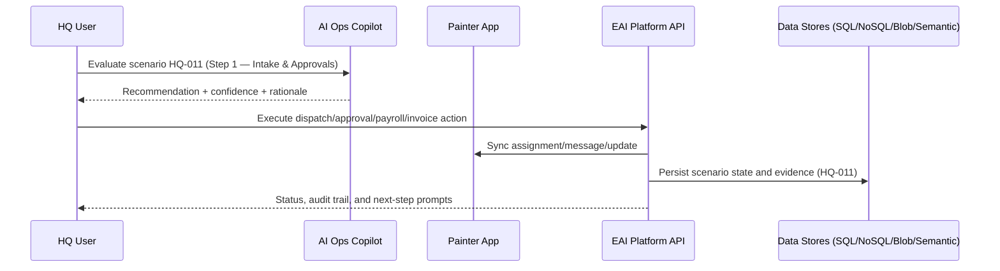
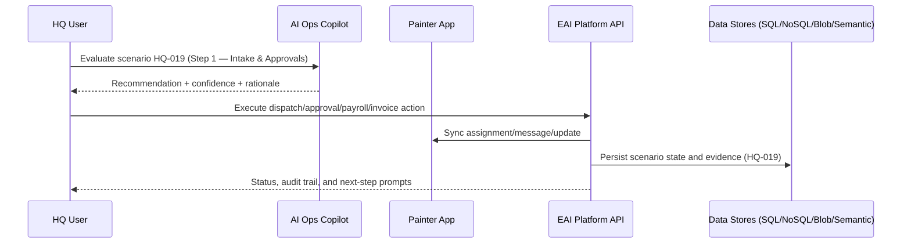

# HQ Business Scenarios — Detailed (100)

Each scenario includes: process step, participants/agents, AI augmentation, EAI platform interaction, storage/schema targets, and a Mermaid sequence diagram.

## Legend
- **People**: HQ Dispatcher, Operations Manager, Painter, Customer
- **Agents**: AI Operations Copilot
- **Platform**: EAI App APIs, workflow orchestration, messaging, resource store

## HQ-001 — New job request arrives with complete details.

- **Process step:** Step 1 — Intake & Approvals
- **People & agents involved:** HQ Dispatcher, Operations Manager, Painter, Customer, AI Operations Copilot
- **AI augmentation point:** AI ranks urgency, predicts margin risk, and proposes approval path with policy checks.
- **EAI platform interaction:** EAI workflow for intake triage, approval orchestration, policy rules, and audit trail creation.
- **Data schema targets:**
  - **SQL:** jobs, quotes, approvals, customer_accounts
  - **NoSQL:** approval_events, policy_decisions
  - **Blob/File:** site-attachments, compliance-documents
  - **Semantic search index:** quote-notes-index, compliance-evidence-index


## HQ-002 — New job request arrives with missing site contact.

- **Process step:** Step 1 — Intake & Approvals
- **People & agents involved:** HQ Dispatcher, Operations Manager, Painter, Customer, AI Operations Copilot
- **AI augmentation point:** AI ranks urgency, predicts margin risk, and proposes approval path with policy checks.
- **EAI platform interaction:** EAI workflow for intake triage, approval orchestration, policy rules, and audit trail creation.
- **Data schema targets:**
  - **SQL:** jobs, quotes, approvals, customer_accounts
  - **NoSQL:** approval_events, policy_decisions
  - **Blob/File:** site-attachments, compliance-documents
  - **Semantic search index:** quote-notes-index, compliance-evidence-index


## HQ-003 — New job request flagged as urgent same-day.

- **Process step:** Step 1 — Intake & Approvals
- **People & agents involved:** HQ Dispatcher, Operations Manager, Painter, Customer, AI Operations Copilot
- **AI augmentation point:** AI ranks urgency, predicts margin risk, and proposes approval path with policy checks.
- **EAI platform interaction:** EAI workflow for intake triage, approval orchestration, policy rules, and audit trail creation.
- **Data schema targets:**
  - **SQL:** jobs, quotes, approvals, customer_accounts
  - **NoSQL:** approval_events, policy_decisions
  - **Blob/File:** site-attachments, compliance-documents
  - **Semantic search index:** quote-notes-index, compliance-evidence-index


## HQ-004 — Repeat client job auto-matches prior pricing.

- **Process step:** Step 1 — Intake & Approvals
- **People & agents involved:** HQ Dispatcher, Operations Manager, Painter, Customer, AI Operations Copilot
- **AI augmentation point:** AI ranks urgency, predicts margin risk, and proposes approval path with policy checks.
- **EAI platform interaction:** EAI workflow for intake triage, approval orchestration, policy rules, and audit trail creation.
- **Data schema targets:**
  - **SQL:** jobs, quotes, approvals, customer_accounts
  - **NoSQL:** approval_events, policy_decisions
  - **Blob/File:** site-attachments, compliance-documents
  - **Semantic search index:** quote-notes-index, compliance-evidence-index


## HQ-005 — Multi-room quote requires supervisor approval.

- **Process step:** Step 1 — Intake & Approvals
- **People & agents involved:** HQ Dispatcher, Operations Manager, Painter, Customer, AI Operations Copilot
- **AI augmentation point:** AI ranks urgency, predicts margin risk, and proposes approval path with policy checks.
- **EAI platform interaction:** EAI workflow for intake triage, approval orchestration, policy rules, and audit trail creation.
- **Data schema targets:**
  - **SQL:** jobs, quotes, approvals, customer_accounts
  - **NoSQL:** approval_events, policy_decisions
  - **Blob/File:** site-attachments, compliance-documents
  - **Semantic search index:** quote-notes-index, compliance-evidence-index


## HQ-006 — Variation request submitted before job start.

- **Process step:** Step 1 — Intake & Approvals
- **People & agents involved:** HQ Dispatcher, Operations Manager, Painter, Customer, AI Operations Copilot
- **AI augmentation point:** AI ranks urgency, predicts margin risk, and proposes approval path with policy checks.
- **EAI platform interaction:** EAI workflow for intake triage, approval orchestration, policy rules, and audit trail creation.
- **Data schema targets:**
  - **SQL:** jobs, quotes, approvals, customer_accounts
  - **NoSQL:** approval_events, policy_decisions
  - **Blob/File:** site-attachments, compliance-documents
  - **Semantic search index:** quote-notes-index, compliance-evidence-index


## HQ-007 — Variation request submitted after partial completion.

- **Process step:** Step 1 — Intake & Approvals
- **People & agents involved:** HQ Dispatcher, Operations Manager, Painter, Customer, AI Operations Copilot
- **AI augmentation point:** AI ranks urgency, predicts margin risk, and proposes approval path with policy checks.
- **EAI platform interaction:** EAI workflow for intake triage, approval orchestration, policy rules, and audit trail creation.
- **Data schema targets:**
  - **SQL:** jobs, quotes, approvals, customer_accounts
  - **NoSQL:** approval_events, policy_decisions
  - **Blob/File:** site-attachments, compliance-documents
  - **Semantic search index:** quote-notes-index, compliance-evidence-index


## HQ-008 — Job requires hazardous-material compliance review.

- **Process step:** Step 1 — Intake & Approvals
- **People & agents involved:** HQ Dispatcher, Operations Manager, Painter, Customer, AI Operations Copilot
- **AI augmentation point:** AI ranks urgency, predicts margin risk, and proposes approval path with policy checks.
- **EAI platform interaction:** EAI workflow for intake triage, approval orchestration, policy rules, and audit trail creation.
- **Data schema targets:**
  - **SQL:** jobs, quotes, approvals, customer_accounts
  - **NoSQL:** approval_events, policy_decisions
  - **Blob/File:** site-attachments, compliance-documents
  - **Semantic search index:** quote-notes-index, compliance-evidence-index


## HQ-009 — Job has access restrictions and permit timing.

- **Process step:** Step 1 — Intake & Approvals
- **People & agents involved:** HQ Dispatcher, Operations Manager, Painter, Customer, AI Operations Copilot
- **AI augmentation point:** AI ranks urgency, predicts margin risk, and proposes approval path with policy checks.
- **EAI platform interaction:** EAI workflow for intake triage, approval orchestration, policy rules, and audit trail creation.
- **Data schema targets:**
  - **SQL:** jobs, quotes, approvals, customer_accounts
  - **NoSQL:** approval_events, policy_decisions
  - **Blob/File:** site-attachments, compliance-documents
  - **Semantic search index:** quote-notes-index, compliance-evidence-index


## HQ-010 — Job has customer-supplied paint constraint.

- **Process step:** Step 1 — Intake & Approvals
- **People & agents involved:** HQ Dispatcher, Operations Manager, Painter, Customer, AI Operations Copilot
- **AI augmentation point:** AI ranks urgency, predicts margin risk, and proposes approval path with policy checks.
- **EAI platform interaction:** EAI workflow for intake triage, approval orchestration, policy rules, and audit trail creation.
- **Data schema targets:**
  - **SQL:** jobs, quotes, approvals, customer_accounts
  - **NoSQL:** approval_events, policy_decisions
  - **Blob/File:** site-attachments, compliance-documents
  - **Semantic search index:** quote-notes-index, compliance-evidence-index


## HQ-011 — Job scope exceeds single-painter capacity.

- **Process step:** Step 1 — Intake & Approvals
- **People & agents involved:** HQ Dispatcher, Operations Manager, Painter, Customer, AI Operations Copilot
- **AI augmentation point:** AI ranks urgency, predicts margin risk, and proposes approval path with policy checks.
- **EAI platform interaction:** EAI workflow for intake triage, approval orchestration, policy rules, and audit trail creation.
- **Data schema targets:**
  - **SQL:** jobs, quotes, approvals, customer_accounts
  - **NoSQL:** approval_events, policy_decisions
  - **Blob/File:** site-attachments, compliance-documents
  - **Semantic search index:** quote-notes-index, compliance-evidence-index



## HQ-012 — Job requires specialist finish capability.

- **Process step:** Step 1 — Intake & Approvals
- **People & agents involved:** HQ Dispatcher, Operations Manager, Painter, Customer, AI Operations Copilot
- **AI augmentation point:** AI ranks urgency, predicts margin risk, and proposes approval path with policy checks.
- **EAI platform interaction:** EAI workflow for intake triage, approval orchestration, policy rules, and audit trail creation.
- **Data schema targets:**
  - **SQL:** jobs, quotes, approvals, customer_accounts
  - **NoSQL:** approval_events, policy_decisions
  - **Blob/File:** site-attachments, compliance-documents
  - **Semantic search index:** quote-notes-index, compliance-evidence-index


## HQ-013 — Job margin below threshold triggers alert.

- **Process step:** Step 1 — Intake & Approvals
- **People & agents involved:** HQ Dispatcher, Operations Manager, Painter, Customer, AI Operations Copilot
- **AI augmentation point:** AI ranks urgency, predicts margin risk, and proposes approval path with policy checks.
- **EAI platform interaction:** EAI workflow for intake triage, approval orchestration, policy rules, and audit trail creation.
- **Data schema targets:**
  - **SQL:** jobs, quotes, approvals, customer_accounts
  - **NoSQL:** approval_events, policy_decisions
  - **Blob/File:** site-attachments, compliance-documents
  - **Semantic search index:** quote-notes-index, compliance-evidence-index


## HQ-014 — Duplicate job requests detected and merged.

- **Process step:** Step 1 — Intake & Approvals
- **People & agents involved:** HQ Dispatcher, Operations Manager, Painter, Customer, AI Operations Copilot
- **AI augmentation point:** AI ranks urgency, predicts margin risk, and proposes approval path with policy checks.
- **EAI platform interaction:** EAI workflow for intake triage, approval orchestration, policy rules, and audit trail creation.
- **Data schema targets:**
  - **SQL:** jobs, quotes, approvals, customer_accounts
  - **NoSQL:** approval_events, policy_decisions
  - **Blob/File:** site-attachments, compliance-documents
  - **Semantic search index:** quote-notes-index, compliance-evidence-index


## HQ-015 — Cancellation request received before approval.

- **Process step:** Step 1 — Intake & Approvals
- **People & agents involved:** HQ Dispatcher, Operations Manager, Painter, Customer, AI Operations Copilot
- **AI augmentation point:** AI ranks urgency, predicts margin risk, and proposes approval path with policy checks.
- **EAI platform interaction:** EAI workflow for intake triage, approval orchestration, policy rules, and audit trail creation.
- **Data schema targets:**
  - **SQL:** jobs, quotes, approvals, customer_accounts
  - **NoSQL:** approval_events, policy_decisions
  - **Blob/File:** site-attachments, compliance-documents
  - **Semantic search index:** quote-notes-index, compliance-evidence-index


## HQ-016 — Customer requests reschedule during approval.

- **Process step:** Step 1 — Intake & Approvals
- **People & agents involved:** HQ Dispatcher, Operations Manager, Painter, Customer, AI Operations Copilot
- **AI augmentation point:** AI ranks urgency, predicts margin risk, and proposes approval path with policy checks.
- **EAI platform interaction:** EAI workflow for intake triage, approval orchestration, policy rules, and audit trail creation.
- **Data schema targets:**
  - **SQL:** jobs, quotes, approvals, customer_accounts
  - **NoSQL:** approval_events, policy_decisions
  - **Blob/File:** site-attachments, compliance-documents
  - **Semantic search index:** quote-notes-index, compliance-evidence-index


## HQ-017 — Site photos are unclear and need recapture.

- **Process step:** Step 1 — Intake & Approvals
- **People & agents involved:** HQ Dispatcher, Operations Manager, Painter, Customer, AI Operations Copilot
- **AI augmentation point:** AI ranks urgency, predicts margin risk, and proposes approval path with policy checks.
- **EAI platform interaction:** EAI workflow for intake triage, approval orchestration, policy rules, and audit trail creation.
- **Data schema targets:**
  - **SQL:** jobs, quotes, approvals, customer_accounts
  - **NoSQL:** approval_events, policy_decisions
  - **Blob/File:** site-attachments, compliance-documents
  - **Semantic search index:** quote-notes-index, compliance-evidence-index


## HQ-018 — Quote has outlier labor hours estimate.

- **Process step:** Step 1 — Intake & Approvals
- **People & agents involved:** HQ Dispatcher, Operations Manager, Painter, Customer, AI Operations Copilot
- **AI augmentation point:** AI ranks urgency, predicts margin risk, and proposes approval path with policy checks.
- **EAI platform interaction:** EAI workflow for intake triage, approval orchestration, policy rules, and audit trail creation.
- **Data schema targets:**
  - **SQL:** jobs, quotes, approvals, customer_accounts
  - **NoSQL:** approval_events, policy_decisions
  - **Blob/File:** site-attachments, compliance-documents
  - **Semantic search index:** quote-notes-index, compliance-evidence-index


## HQ-019 — Material estimate conflicts with room dimensions.

- **Process step:** Step 1 — Intake & Approvals
- **People & agents involved:** HQ Dispatcher, Operations Manager, Painter, Customer, AI Operations Copilot
- **AI augmentation point:** AI ranks urgency, predicts margin risk, and proposes approval path with policy checks.
- **EAI platform interaction:** EAI workflow for intake triage, approval orchestration, policy rules, and audit trail creation.
- **Data schema targets:**
  - **SQL:** jobs, quotes, approvals, customer_accounts
  - **NoSQL:** approval_events, policy_decisions
  - **Blob/File:** site-attachments, compliance-documents
  - **Semantic search index:** quote-notes-index, compliance-evidence-index



## HQ-020 — Job requires subcontractor coordination.

- **Process step:** Step 1 — Intake & Approvals
- **People & agents involved:** HQ Dispatcher, Operations Manager, Painter, Customer, AI Operations Copilot
- **AI augmentation point:** AI ranks urgency, predicts margin risk, and proposes approval path with policy checks.
- **EAI platform interaction:** EAI workflow for intake triage, approval orchestration, policy rules, and audit trail creation.
- **Data schema targets:**
  - **SQL:** jobs, quotes, approvals, customer_accounts
  - **NoSQL:** approval_events, policy_decisions
  - **Blob/File:** site-attachments, compliance-documents
  - **Semantic search index:** quote-notes-index, compliance-evidence-index


## HQ-021 — Approval delegated to backup manager.

- **Process step:** Step 1 — Intake & Approvals
- **People & agents involved:** HQ Dispatcher, Operations Manager, Painter, Customer, AI Operations Copilot
- **AI augmentation point:** AI ranks urgency, predicts margin risk, and proposes approval path with policy checks.
- **EAI platform interaction:** EAI workflow for intake triage, approval orchestration, policy rules, and audit trail creation.
- **Data schema targets:**
  - **SQL:** jobs, quotes, approvals, customer_accounts
  - **NoSQL:** approval_events, policy_decisions
  - **Blob/File:** site-attachments, compliance-documents
  - **Semantic search index:** quote-notes-index, compliance-evidence-index

```mermaid
sequenceDiagram
    participant HQ as HQ User
    participant AI as AI Ops Copilot
    participant P as Painter App
    participant EAI as EAI Platform API
    participant DS as Data Stores (SQL/NoSQL/Blob/Semantic)
    HQ->>AI: Evaluate scenario HQ-021 (Step 1 — Intake & Approvals)
    AI-->>HQ: Recommendation + confidence + rationale
    HQ->>EAI: Execute dispatch/approval/payroll/invoice action
    EAI->>P: Sync assignment/message/update
    EAI->>DS: Persist scenario state and evidence (HQ-021)
    EAI-->>HQ: Status, audit trail, and next-step prompts
```

## HQ-022 — Approval blocked by missing insurance attachment.

- **Process step:** Step 1 — Intake & Approvals
- **People & agents involved:** HQ Dispatcher, Operations Manager, Painter, Customer, AI Operations Copilot
- **AI augmentation point:** AI ranks urgency, predicts margin risk, and proposes approval path with policy checks.
- **EAI platform interaction:** EAI workflow for intake triage, approval orchestration, policy rules, and audit trail creation.
- **Data schema targets:**
  - **SQL:** jobs, quotes, approvals, customer_accounts
  - **NoSQL:** approval_events, policy_decisions
  - **Blob/File:** site-attachments, compliance-documents
  - **Semantic search index:** quote-notes-index, compliance-evidence-index

```mermaid
sequenceDiagram
    participant HQ as HQ User
    participant AI as AI Ops Copilot
    participant P as Painter App
    participant EAI as EAI Platform API
    participant DS as Data Stores (SQL/NoSQL/Blob/Semantic)
    HQ->>AI: Evaluate scenario HQ-022 (Step 1 — Intake & Approvals)
    AI-->>HQ: Recommendation + confidence + rationale
    HQ->>EAI: Execute dispatch/approval/payroll/invoice action
    EAI->>P: Sync assignment/message/update
    EAI->>DS: Persist scenario state and evidence (HQ-022)
    EAI-->>HQ: Status, audit trail, and next-step prompts
```

## HQ-023 — Priority conflict between two urgent jobs.

- **Process step:** Step 1 — Intake & Approvals
- **People & agents involved:** HQ Dispatcher, Operations Manager, Painter, Customer, AI Operations Copilot
- **AI augmentation point:** AI ranks urgency, predicts margin risk, and proposes approval path with policy checks.
- **EAI platform interaction:** EAI workflow for intake triage, approval orchestration, policy rules, and audit trail creation.
- **Data schema targets:**
  - **SQL:** jobs, quotes, approvals, customer_accounts
  - **NoSQL:** approval_events, policy_decisions
  - **Blob/File:** site-attachments, compliance-documents
  - **Semantic search index:** quote-notes-index, compliance-evidence-index

```mermaid
sequenceDiagram
    participant HQ as HQ User
    participant AI as AI Ops Copilot
    participant P as Painter App
    participant EAI as EAI Platform API
    participant DS as Data Stores (SQL/NoSQL/Blob/Semantic)
    HQ->>AI: Evaluate scenario HQ-023 (Step 1 — Intake & Approvals)
    AI-->>HQ: Recommendation + confidence + rationale
    HQ->>EAI: Execute dispatch/approval/payroll/invoice action
    EAI->>P: Sync assignment/message/update
    EAI->>DS: Persist scenario state and evidence (HQ-023)
    EAI-->>HQ: Status, audit trail, and next-step prompts
```

## HQ-024 — Approval completed with audit note.

- **Process step:** Step 1 — Intake & Approvals
- **People & agents involved:** HQ Dispatcher, Operations Manager, Painter, Customer, AI Operations Copilot
- **AI augmentation point:** AI ranks urgency, predicts margin risk, and proposes approval path with policy checks.
- **EAI platform interaction:** EAI workflow for intake triage, approval orchestration, policy rules, and audit trail creation.
- **Data schema targets:**
  - **SQL:** jobs, quotes, approvals, customer_accounts
  - **NoSQL:** approval_events, policy_decisions
  - **Blob/File:** site-attachments, compliance-documents
  - **Semantic search index:** quote-notes-index, compliance-evidence-index

```mermaid
sequenceDiagram
    participant HQ as HQ User
    participant AI as AI Ops Copilot
    participant P as Painter App
    participant EAI as EAI Platform API
    participant DS as Data Stores (SQL/NoSQL/Blob/Semantic)
    HQ->>AI: Evaluate scenario HQ-024 (Step 1 — Intake & Approvals)
    AI-->>HQ: Recommendation + confidence + rationale
    HQ->>EAI: Execute dispatch/approval/payroll/invoice action
    EAI->>P: Sync assignment/message/update
    EAI->>DS: Persist scenario state and evidence (HQ-024)
    EAI-->>HQ: Status, audit trail, and next-step prompts
```

## HQ-025 — Approval rejected with reason and rework task.

- **Process step:** Step 1 — Intake & Approvals
- **People & agents involved:** HQ Dispatcher, Operations Manager, Painter, Customer, AI Operations Copilot
- **AI augmentation point:** AI ranks urgency, predicts margin risk, and proposes approval path with policy checks.
- **EAI platform interaction:** EAI workflow for intake triage, approval orchestration, policy rules, and audit trail creation.
- **Data schema targets:**
  - **SQL:** jobs, quotes, approvals, customer_accounts
  - **NoSQL:** approval_events, policy_decisions
  - **Blob/File:** site-attachments, compliance-documents
  - **Semantic search index:** quote-notes-index, compliance-evidence-index

```mermaid
sequenceDiagram
    participant HQ as HQ User
    participant AI as AI Ops Copilot
    participant P as Painter App
    participant EAI as EAI Platform API
    participant DS as Data Stores (SQL/NoSQL/Blob/Semantic)
    HQ->>AI: Evaluate scenario HQ-025 (Step 1 — Intake & Approvals)
    AI-->>HQ: Recommendation + confidence + rationale
    HQ->>EAI: Execute dispatch/approval/payroll/invoice action
    EAI->>P: Sync assignment/message/update
    EAI->>DS: Persist scenario state and evidence (HQ-025)
    EAI-->>HQ: Status, audit trail, and next-step prompts
```

## HQ-026 — Assign nearest available painter by GPS.

- **Process step:** Step 2 — Dispatch / Map / Message / Reassign
- **People & agents involved:** HQ Dispatcher, Operations Manager, Painter, Customer, AI Operations Copilot
- **AI augmentation point:** AI suggests dispatch/reassign options using live GPS, load balancing, and SLA risk predictions.
- **EAI platform interaction:** EAI messaging, route decision support, assignment workflow, and escalation triggers.
- **Data schema targets:**
  - **SQL:** assignments, routes, message_threads, dispatch_actions
  - **NoSQL:** location_pings, dispatch_event_stream
  - **Blob/File:** route-attachments, access-instructions
  - **Semantic search index:** dispatch-conversation-index, incident-index

```mermaid
sequenceDiagram
    participant HQ as HQ User
    participant AI as AI Ops Copilot
    participant P as Painter App
    participant EAI as EAI Platform API
    participant DS as Data Stores (SQL/NoSQL/Blob/Semantic)
    HQ->>AI: Evaluate scenario HQ-026 (Step 2 — Dispatch / Map / Message / Reassign)
    AI-->>HQ: Recommendation + confidence + rationale
    HQ->>EAI: Execute dispatch/approval/payroll/invoice action
    EAI->>P: Sync assignment/message/update
    EAI->>DS: Persist scenario state and evidence (HQ-026)
    EAI-->>HQ: Status, audit trail, and next-step prompts
```

## HQ-027 — Assign painter with required skill tag.

- **Process step:** Step 2 — Dispatch / Map / Message / Reassign
- **People & agents involved:** HQ Dispatcher, Operations Manager, Painter, Customer, AI Operations Copilot
- **AI augmentation point:** AI suggests dispatch/reassign options using live GPS, load balancing, and SLA risk predictions.
- **EAI platform interaction:** EAI messaging, route decision support, assignment workflow, and escalation triggers.
- **Data schema targets:**
  - **SQL:** assignments, routes, message_threads, dispatch_actions
  - **NoSQL:** location_pings, dispatch_event_stream
  - **Blob/File:** route-attachments, access-instructions
  - **Semantic search index:** dispatch-conversation-index, incident-index

```mermaid
sequenceDiagram
    participant HQ as HQ User
    participant AI as AI Ops Copilot
    participant P as Painter App
    participant EAI as EAI Platform API
    participant DS as Data Stores (SQL/NoSQL/Blob/Semantic)
    HQ->>AI: Evaluate scenario HQ-027 (Step 2 — Dispatch / Map / Message / Reassign)
    AI-->>HQ: Recommendation + confidence + rationale
    HQ->>EAI: Execute dispatch/approval/payroll/invoice action
    EAI->>P: Sync assignment/message/update
    EAI->>DS: Persist scenario state and evidence (HQ-027)
    EAI-->>HQ: Status, audit trail, and next-step prompts
```

## HQ-028 — Reassign due to traffic delay risk.

- **Process step:** Step 2 — Dispatch / Map / Message / Reassign
- **People & agents involved:** HQ Dispatcher, Operations Manager, Painter, Customer, AI Operations Copilot
- **AI augmentation point:** AI suggests dispatch/reassign options using live GPS, load balancing, and SLA risk predictions.
- **EAI platform interaction:** EAI messaging, route decision support, assignment workflow, and escalation triggers.
- **Data schema targets:**
  - **SQL:** assignments, routes, message_threads, dispatch_actions
  - **NoSQL:** location_pings, dispatch_event_stream
  - **Blob/File:** route-attachments, access-instructions
  - **Semantic search index:** dispatch-conversation-index, incident-index

```mermaid
sequenceDiagram
    participant HQ as HQ User
    participant AI as AI Ops Copilot
    participant P as Painter App
    participant EAI as EAI Platform API
    participant DS as Data Stores (SQL/NoSQL/Blob/Semantic)
    HQ->>AI: Evaluate scenario HQ-028 (Step 2 — Dispatch / Map / Message / Reassign)
    AI-->>HQ: Recommendation + confidence + rationale
    HQ->>EAI: Execute dispatch/approval/payroll/invoice action
    EAI->>P: Sync assignment/message/update
    EAI->>DS: Persist scenario state and evidence (HQ-028)
    EAI-->>HQ: Status, audit trail, and next-step prompts
```

## HQ-029 — Reassign due to painter sickness.

- **Process step:** Step 2 — Dispatch / Map / Message / Reassign
- **People & agents involved:** HQ Dispatcher, Operations Manager, Painter, Customer, AI Operations Copilot
- **AI augmentation point:** AI suggests dispatch/reassign options using live GPS, load balancing, and SLA risk predictions.
- **EAI platform interaction:** EAI messaging, route decision support, assignment workflow, and escalation triggers.
- **Data schema targets:**
  - **SQL:** assignments, routes, message_threads, dispatch_actions
  - **NoSQL:** location_pings, dispatch_event_stream
  - **Blob/File:** route-attachments, access-instructions
  - **Semantic search index:** dispatch-conversation-index, incident-index

```mermaid
sequenceDiagram
    participant HQ as HQ User
    participant AI as AI Ops Copilot
    participant P as Painter App
    participant EAI as EAI Platform API
    participant DS as Data Stores (SQL/NoSQL/Blob/Semantic)
    HQ->>AI: Evaluate scenario HQ-029 (Step 2 — Dispatch / Map / Message / Reassign)
    AI-->>HQ: Recommendation + confidence + rationale
    HQ->>EAI: Execute dispatch/approval/payroll/invoice action
    EAI->>P: Sync assignment/message/update
    EAI->>DS: Persist scenario state and evidence (HQ-029)
    EAI-->>HQ: Status, audit trail, and next-step prompts
```

## HQ-030 — Message painter with updated access code.

- **Process step:** Step 2 — Dispatch / Map / Message / Reassign
- **People & agents involved:** HQ Dispatcher, Operations Manager, Painter, Customer, AI Operations Copilot
- **AI augmentation point:** AI suggests dispatch/reassign options using live GPS, load balancing, and SLA risk predictions.
- **EAI platform interaction:** EAI messaging, route decision support, assignment workflow, and escalation triggers.
- **Data schema targets:**
  - **SQL:** assignments, routes, message_threads, dispatch_actions
  - **NoSQL:** location_pings, dispatch_event_stream
  - **Blob/File:** route-attachments, access-instructions
  - **Semantic search index:** dispatch-conversation-index, incident-index

```mermaid
sequenceDiagram
    participant HQ as HQ User
    participant AI as AI Ops Copilot
    participant P as Painter App
    participant EAI as EAI Platform API
    participant DS as Data Stores (SQL/NoSQL/Blob/Semantic)
    HQ->>AI: Evaluate scenario HQ-030 (Step 2 — Dispatch / Map / Message / Reassign)
    AI-->>HQ: Recommendation + confidence + rationale
    HQ->>EAI: Execute dispatch/approval/payroll/invoice action
    EAI->>P: Sync assignment/message/update
    EAI->>DS: Persist scenario state and evidence (HQ-030)
    EAI-->>HQ: Status, audit trail, and next-step prompts
```

## HQ-031 — Message painter with variation change summary.

- **Process step:** Step 2 — Dispatch / Map / Message / Reassign
- **People & agents involved:** HQ Dispatcher, Operations Manager, Painter, Customer, AI Operations Copilot
- **AI augmentation point:** AI suggests dispatch/reassign options using live GPS, load balancing, and SLA risk predictions.
- **EAI platform interaction:** EAI messaging, route decision support, assignment workflow, and escalation triggers.
- **Data schema targets:**
  - **SQL:** assignments, routes, message_threads, dispatch_actions
  - **NoSQL:** location_pings, dispatch_event_stream
  - **Blob/File:** route-attachments, access-instructions
  - **Semantic search index:** dispatch-conversation-index, incident-index

```mermaid
sequenceDiagram
    participant HQ as HQ User
    participant AI as AI Ops Copilot
    participant P as Painter App
    participant EAI as EAI Platform API
    participant DS as Data Stores (SQL/NoSQL/Blob/Semantic)
    HQ->>AI: Evaluate scenario HQ-031 (Step 2 — Dispatch / Map / Message / Reassign)
    AI-->>HQ: Recommendation + confidence + rationale
    HQ->>EAI: Execute dispatch/approval/payroll/invoice action
    EAI->>P: Sync assignment/message/update
    EAI->>DS: Persist scenario state and evidence (HQ-031)
    EAI-->>HQ: Status, audit trail, and next-step prompts
```

## HQ-032 — Dispatch two painters to one large job.

- **Process step:** Step 2 — Dispatch / Map / Message / Reassign
- **People & agents involved:** HQ Dispatcher, Operations Manager, Painter, Customer, AI Operations Copilot
- **AI augmentation point:** AI suggests dispatch/reassign options using live GPS, load balancing, and SLA risk predictions.
- **EAI platform interaction:** EAI messaging, route decision support, assignment workflow, and escalation triggers.
- **Data schema targets:**
  - **SQL:** assignments, routes, message_threads, dispatch_actions
  - **NoSQL:** location_pings, dispatch_event_stream
  - **Blob/File:** route-attachments, access-instructions
  - **Semantic search index:** dispatch-conversation-index, incident-index

```mermaid
sequenceDiagram
    participant HQ as HQ User
    participant AI as AI Ops Copilot
    participant P as Painter App
    participant EAI as EAI Platform API
    participant DS as Data Stores (SQL/NoSQL/Blob/Semantic)
    HQ->>AI: Evaluate scenario HQ-032 (Step 2 — Dispatch / Map / Message / Reassign)
    AI-->>HQ: Recommendation + confidence + rationale
    HQ->>EAI: Execute dispatch/approval/payroll/invoice action
    EAI->>P: Sync assignment/message/update
    EAI->>DS: Persist scenario state and evidence (HQ-032)
    EAI-->>HQ: Status, audit trail, and next-step prompts
```

## HQ-033 — Dispatch swap between adjacent jobs.

- **Process step:** Step 2 — Dispatch / Map / Message / Reassign
- **People & agents involved:** HQ Dispatcher, Operations Manager, Painter, Customer, AI Operations Copilot
- **AI augmentation point:** AI suggests dispatch/reassign options using live GPS, load balancing, and SLA risk predictions.
- **EAI platform interaction:** EAI messaging, route decision support, assignment workflow, and escalation triggers.
- **Data schema targets:**
  - **SQL:** assignments, routes, message_threads, dispatch_actions
  - **NoSQL:** location_pings, dispatch_event_stream
  - **Blob/File:** route-attachments, access-instructions
  - **Semantic search index:** dispatch-conversation-index, incident-index

```mermaid
sequenceDiagram
    participant HQ as HQ User
    participant AI as AI Ops Copilot
    participant P as Painter App
    participant EAI as EAI Platform API
    participant DS as Data Stores (SQL/NoSQL/Blob/Semantic)
    HQ->>AI: Evaluate scenario HQ-033 (Step 2 — Dispatch / Map / Message / Reassign)
    AI-->>HQ: Recommendation + confidence + rationale
    HQ->>EAI: Execute dispatch/approval/payroll/invoice action
    EAI->>P: Sync assignment/message/update
    EAI->>DS: Persist scenario state and evidence (HQ-033)
    EAI-->>HQ: Status, audit trail, and next-step prompts
```

## HQ-034 — Route optimization for three job sequence.

- **Process step:** Step 2 — Dispatch / Map / Message / Reassign
- **People & agents involved:** HQ Dispatcher, Operations Manager, Painter, Customer, AI Operations Copilot
- **AI augmentation point:** AI suggests dispatch/reassign options using live GPS, load balancing, and SLA risk predictions.
- **EAI platform interaction:** EAI messaging, route decision support, assignment workflow, and escalation triggers.
- **Data schema targets:**
  - **SQL:** assignments, routes, message_threads, dispatch_actions
  - **NoSQL:** location_pings, dispatch_event_stream
  - **Blob/File:** route-attachments, access-instructions
  - **Semantic search index:** dispatch-conversation-index, incident-index

```mermaid
sequenceDiagram
    participant HQ as HQ User
    participant AI as AI Ops Copilot
    participant P as Painter App
    participant EAI as EAI Platform API
    participant DS as Data Stores (SQL/NoSQL/Blob/Semantic)
    HQ->>AI: Evaluate scenario HQ-034 (Step 2 — Dispatch / Map / Message / Reassign)
    AI-->>HQ: Recommendation + confidence + rationale
    HQ->>EAI: Execute dispatch/approval/payroll/invoice action
    EAI->>P: Sync assignment/message/update
    EAI->>DS: Persist scenario state and evidence (HQ-034)
    EAI-->>HQ: Status, audit trail, and next-step prompts
```

## HQ-035 — Painter confirms arrival late by 20 minutes.

- **Process step:** Step 2 — Dispatch / Map / Message / Reassign
- **People & agents involved:** HQ Dispatcher, Operations Manager, Painter, Customer, AI Operations Copilot
- **AI augmentation point:** AI suggests dispatch/reassign options using live GPS, load balancing, and SLA risk predictions.
- **EAI platform interaction:** EAI messaging, route decision support, assignment workflow, and escalation triggers.
- **Data schema targets:**
  - **SQL:** assignments, routes, message_threads, dispatch_actions
  - **NoSQL:** location_pings, dispatch_event_stream
  - **Blob/File:** route-attachments, access-instructions
  - **Semantic search index:** dispatch-conversation-index, incident-index

```mermaid
sequenceDiagram
    participant HQ as HQ User
    participant AI as AI Ops Copilot
    participant P as Painter App
    participant EAI as EAI Platform API
    participant DS as Data Stores (SQL/NoSQL/Blob/Semantic)
    HQ->>AI: Evaluate scenario HQ-035 (Step 2 — Dispatch / Map / Message / Reassign)
    AI-->>HQ: Recommendation + confidence + rationale
    HQ->>EAI: Execute dispatch/approval/payroll/invoice action
    EAI->>P: Sync assignment/message/update
    EAI->>DS: Persist scenario state and evidence (HQ-035)
    EAI-->>HQ: Status, audit trail, and next-step prompts
```

## HQ-036 — Painter loses connectivity; fallback SMS trigger.

- **Process step:** Step 2 — Dispatch / Map / Message / Reassign
- **People & agents involved:** HQ Dispatcher, Operations Manager, Painter, Customer, AI Operations Copilot
- **AI augmentation point:** AI suggests dispatch/reassign options using live GPS, load balancing, and SLA risk predictions.
- **EAI platform interaction:** EAI messaging, route decision support, assignment workflow, and escalation triggers.
- **Data schema targets:**
  - **SQL:** assignments, routes, message_threads, dispatch_actions
  - **NoSQL:** location_pings, dispatch_event_stream
  - **Blob/File:** route-attachments, access-instructions
  - **Semantic search index:** dispatch-conversation-index, incident-index

```mermaid
sequenceDiagram
    participant HQ as HQ User
    participant AI as AI Ops Copilot
    participant P as Painter App
    participant EAI as EAI Platform API
    participant DS as Data Stores (SQL/NoSQL/Blob/Semantic)
    HQ->>AI: Evaluate scenario HQ-036 (Step 2 — Dispatch / Map / Message / Reassign)
    AI-->>HQ: Recommendation + confidence + rationale
    HQ->>EAI: Execute dispatch/approval/payroll/invoice action
    EAI->>P: Sync assignment/message/update
    EAI->>DS: Persist scenario state and evidence (HQ-036)
    EAI-->>HQ: Status, audit trail, and next-step prompts
```

## HQ-037 — HQ sends safety reminder before start.

- **Process step:** Step 2 — Dispatch / Map / Message / Reassign
- **People & agents involved:** HQ Dispatcher, Operations Manager, Painter, Customer, AI Operations Copilot
- **AI augmentation point:** AI suggests dispatch/reassign options using live GPS, load balancing, and SLA risk predictions.
- **EAI platform interaction:** EAI messaging, route decision support, assignment workflow, and escalation triggers.
- **Data schema targets:**
  - **SQL:** assignments, routes, message_threads, dispatch_actions
  - **NoSQL:** location_pings, dispatch_event_stream
  - **Blob/File:** route-attachments, access-instructions
  - **Semantic search index:** dispatch-conversation-index, incident-index

```mermaid
sequenceDiagram
    participant HQ as HQ User
    participant AI as AI Ops Copilot
    participant P as Painter App
    participant EAI as EAI Platform API
    participant DS as Data Stores (SQL/NoSQL/Blob/Semantic)
    HQ->>AI: Evaluate scenario HQ-037 (Step 2 — Dispatch / Map / Message / Reassign)
    AI-->>HQ: Recommendation + confidence + rationale
    HQ->>EAI: Execute dispatch/approval/payroll/invoice action
    EAI->>P: Sync assignment/message/update
    EAI->>DS: Persist scenario state and evidence (HQ-037)
    EAI-->>HQ: Status, audit trail, and next-step prompts
```

## HQ-038 — Site closed on arrival; redeploy painter.

- **Process step:** Step 2 — Dispatch / Map / Message / Reassign
- **People & agents involved:** HQ Dispatcher, Operations Manager, Painter, Customer, AI Operations Copilot
- **AI augmentation point:** AI suggests dispatch/reassign options using live GPS, load balancing, and SLA risk predictions.
- **EAI platform interaction:** EAI messaging, route decision support, assignment workflow, and escalation triggers.
- **Data schema targets:**
  - **SQL:** assignments, routes, message_threads, dispatch_actions
  - **NoSQL:** location_pings, dispatch_event_stream
  - **Blob/File:** route-attachments, access-instructions
  - **Semantic search index:** dispatch-conversation-index, incident-index

```mermaid
sequenceDiagram
    participant HQ as HQ User
    participant AI as AI Ops Copilot
    participant P as Painter App
    participant EAI as EAI Platform API
    participant DS as Data Stores (SQL/NoSQL/Blob/Semantic)
    HQ->>AI: Evaluate scenario HQ-038 (Step 2 — Dispatch / Map / Message / Reassign)
    AI-->>HQ: Recommendation + confidence + rationale
    HQ->>EAI: Execute dispatch/approval/payroll/invoice action
    EAI->>P: Sync assignment/message/update
    EAI->>DS: Persist scenario state and evidence (HQ-038)
    EAI-->>HQ: Status, audit trail, and next-step prompts
```

## HQ-039 — Customer no-show; convert to standby task.

- **Process step:** Step 2 — Dispatch / Map / Message / Reassign
- **People & agents involved:** HQ Dispatcher, Operations Manager, Painter, Customer, AI Operations Copilot
- **AI augmentation point:** AI suggests dispatch/reassign options using live GPS, load balancing, and SLA risk predictions.
- **EAI platform interaction:** EAI messaging, route decision support, assignment workflow, and escalation triggers.
- **Data schema targets:**
  - **SQL:** assignments, routes, message_threads, dispatch_actions
  - **NoSQL:** location_pings, dispatch_event_stream
  - **Blob/File:** route-attachments, access-instructions
  - **Semantic search index:** dispatch-conversation-index, incident-index

```mermaid
sequenceDiagram
    participant HQ as HQ User
    participant AI as AI Ops Copilot
    participant P as Painter App
    participant EAI as EAI Platform API
    participant DS as Data Stores (SQL/NoSQL/Blob/Semantic)
    HQ->>AI: Evaluate scenario HQ-039 (Step 2 — Dispatch / Map / Message / Reassign)
    AI-->>HQ: Recommendation + confidence + rationale
    HQ->>EAI: Execute dispatch/approval/payroll/invoice action
    EAI->>P: Sync assignment/message/update
    EAI->>DS: Persist scenario state and evidence (HQ-039)
    EAI-->>HQ: Status, audit trail, and next-step prompts
```

## HQ-040 — Urgent callback inserted into schedule.

- **Process step:** Step 2 — Dispatch / Map / Message / Reassign
- **People & agents involved:** HQ Dispatcher, Operations Manager, Painter, Customer, AI Operations Copilot
- **AI augmentation point:** AI suggests dispatch/reassign options using live GPS, load balancing, and SLA risk predictions.
- **EAI platform interaction:** EAI messaging, route decision support, assignment workflow, and escalation triggers.
- **Data schema targets:**
  - **SQL:** assignments, routes, message_threads, dispatch_actions
  - **NoSQL:** location_pings, dispatch_event_stream
  - **Blob/File:** route-attachments, access-instructions
  - **Semantic search index:** dispatch-conversation-index, incident-index

```mermaid
sequenceDiagram
    participant HQ as HQ User
    participant AI as AI Ops Copilot
    participant P as Painter App
    participant EAI as EAI Platform API
    participant DS as Data Stores (SQL/NoSQL/Blob/Semantic)
    HQ->>AI: Evaluate scenario HQ-040 (Step 2 — Dispatch / Map / Message / Reassign)
    AI-->>HQ: Recommendation + confidence + rationale
    HQ->>EAI: Execute dispatch/approval/payroll/invoice action
    EAI->>P: Sync assignment/message/update
    EAI->>DS: Persist scenario state and evidence (HQ-040)
    EAI-->>HQ: Status, audit trail, and next-step prompts
```

## HQ-041 — Nearby painter reassigned for quick assist.

- **Process step:** Step 2 — Dispatch / Map / Message / Reassign
- **People & agents involved:** HQ Dispatcher, Operations Manager, Painter, Customer, AI Operations Copilot
- **AI augmentation point:** AI suggests dispatch/reassign options using live GPS, load balancing, and SLA risk predictions.
- **EAI platform interaction:** EAI messaging, route decision support, assignment workflow, and escalation triggers.
- **Data schema targets:**
  - **SQL:** assignments, routes, message_threads, dispatch_actions
  - **NoSQL:** location_pings, dispatch_event_stream
  - **Blob/File:** route-attachments, access-instructions
  - **Semantic search index:** dispatch-conversation-index, incident-index

```mermaid
sequenceDiagram
    participant HQ as HQ User
    participant AI as AI Ops Copilot
    participant P as Painter App
    participant EAI as EAI Platform API
    participant DS as Data Stores (SQL/NoSQL/Blob/Semantic)
    HQ->>AI: Evaluate scenario HQ-041 (Step 2 — Dispatch / Map / Message / Reassign)
    AI-->>HQ: Recommendation + confidence + rationale
    HQ->>EAI: Execute dispatch/approval/payroll/invoice action
    EAI->>P: Sync assignment/message/update
    EAI->>DS: Persist scenario state and evidence (HQ-041)
    EAI-->>HQ: Status, audit trail, and next-step prompts
```

## HQ-042 — Wrong paint loaded; dispatch warehouse pickup.

- **Process step:** Step 2 — Dispatch / Map / Message / Reassign
- **People & agents involved:** HQ Dispatcher, Operations Manager, Painter, Customer, AI Operations Copilot
- **AI augmentation point:** AI suggests dispatch/reassign options using live GPS, load balancing, and SLA risk predictions.
- **EAI platform interaction:** EAI messaging, route decision support, assignment workflow, and escalation triggers.
- **Data schema targets:**
  - **SQL:** assignments, routes, message_threads, dispatch_actions
  - **NoSQL:** location_pings, dispatch_event_stream
  - **Blob/File:** route-attachments, access-instructions
  - **Semantic search index:** dispatch-conversation-index, incident-index

```mermaid
sequenceDiagram
    participant HQ as HQ User
    participant AI as AI Ops Copilot
    participant P as Painter App
    participant EAI as EAI Platform API
    participant DS as Data Stores (SQL/NoSQL/Blob/Semantic)
    HQ->>AI: Evaluate scenario HQ-042 (Step 2 — Dispatch / Map / Message / Reassign)
    AI-->>HQ: Recommendation + confidence + rationale
    HQ->>EAI: Execute dispatch/approval/payroll/invoice action
    EAI->>P: Sync assignment/message/update
    EAI->>DS: Persist scenario state and evidence (HQ-042)
    EAI-->>HQ: Status, audit trail, and next-step prompts
```

## HQ-043 — Weather disruption requires outdoor job swap.

- **Process step:** Step 2 — Dispatch / Map / Message / Reassign
- **People & agents involved:** HQ Dispatcher, Operations Manager, Painter, Customer, AI Operations Copilot
- **AI augmentation point:** AI suggests dispatch/reassign options using live GPS, load balancing, and SLA risk predictions.
- **EAI platform interaction:** EAI messaging, route decision support, assignment workflow, and escalation triggers.
- **Data schema targets:**
  - **SQL:** assignments, routes, message_threads, dispatch_actions
  - **NoSQL:** location_pings, dispatch_event_stream
  - **Blob/File:** route-attachments, access-instructions
  - **Semantic search index:** dispatch-conversation-index, incident-index

```mermaid
sequenceDiagram
    participant HQ as HQ User
    participant AI as AI Ops Copilot
    participant P as Painter App
    participant EAI as EAI Platform API
    participant DS as Data Stores (SQL/NoSQL/Blob/Semantic)
    HQ->>AI: Evaluate scenario HQ-043 (Step 2 — Dispatch / Map / Message / Reassign)
    AI-->>HQ: Recommendation + confidence + rationale
    HQ->>EAI: Execute dispatch/approval/payroll/invoice action
    EAI->>P: Sync assignment/message/update
    EAI->>DS: Persist scenario state and evidence (HQ-043)
    EAI-->>HQ: Status, audit trail, and next-step prompts
```

## HQ-044 — Map pin mismatch corrected by HQ.

- **Process step:** Step 2 — Dispatch / Map / Message / Reassign
- **People & agents involved:** HQ Dispatcher, Operations Manager, Painter, Customer, AI Operations Copilot
- **AI augmentation point:** AI suggests dispatch/reassign options using live GPS, load balancing, and SLA risk predictions.
- **EAI platform interaction:** EAI messaging, route decision support, assignment workflow, and escalation triggers.
- **Data schema targets:**
  - **SQL:** assignments, routes, message_threads, dispatch_actions
  - **NoSQL:** location_pings, dispatch_event_stream
  - **Blob/File:** route-attachments, access-instructions
  - **Semantic search index:** dispatch-conversation-index, incident-index

```mermaid
sequenceDiagram
    participant HQ as HQ User
    participant AI as AI Ops Copilot
    participant P as Painter App
    participant EAI as EAI Platform API
    participant DS as Data Stores (SQL/NoSQL/Blob/Semantic)
    HQ->>AI: Evaluate scenario HQ-044 (Step 2 — Dispatch / Map / Message / Reassign)
    AI-->>HQ: Recommendation + confidence + rationale
    HQ->>EAI: Execute dispatch/approval/payroll/invoice action
    EAI->>P: Sync assignment/message/update
    EAI->>DS: Persist scenario state and evidence (HQ-044)
    EAI-->>HQ: Status, audit trail, and next-step prompts
```

## HQ-045 — Multi-tenant building requires staged entry windows.

- **Process step:** Step 2 — Dispatch / Map / Message / Reassign
- **People & agents involved:** HQ Dispatcher, Operations Manager, Painter, Customer, AI Operations Copilot
- **AI augmentation point:** AI suggests dispatch/reassign options using live GPS, load balancing, and SLA risk predictions.
- **EAI platform interaction:** EAI messaging, route decision support, assignment workflow, and escalation triggers.
- **Data schema targets:**
  - **SQL:** assignments, routes, message_threads, dispatch_actions
  - **NoSQL:** location_pings, dispatch_event_stream
  - **Blob/File:** route-attachments, access-instructions
  - **Semantic search index:** dispatch-conversation-index, incident-index

```mermaid
sequenceDiagram
    participant HQ as HQ User
    participant AI as AI Ops Copilot
    participant P as Painter App
    participant EAI as EAI Platform API
    participant DS as Data Stores (SQL/NoSQL/Blob/Semantic)
    HQ->>AI: Evaluate scenario HQ-045 (Step 2 — Dispatch / Map / Message / Reassign)
    AI-->>HQ: Recommendation + confidence + rationale
    HQ->>EAI: Execute dispatch/approval/payroll/invoice action
    EAI->>P: Sync assignment/message/update
    EAI->>DS: Persist scenario state and evidence (HQ-045)
    EAI-->>HQ: Status, audit trail, and next-step prompts
```

## HQ-046 — Painter requests extra labor support.

- **Process step:** Step 2 — Dispatch / Map / Message / Reassign
- **People & agents involved:** HQ Dispatcher, Operations Manager, Painter, Customer, AI Operations Copilot
- **AI augmentation point:** AI suggests dispatch/reassign options using live GPS, load balancing, and SLA risk predictions.
- **EAI platform interaction:** EAI messaging, route decision support, assignment workflow, and escalation triggers.
- **Data schema targets:**
  - **SQL:** assignments, routes, message_threads, dispatch_actions
  - **NoSQL:** location_pings, dispatch_event_stream
  - **Blob/File:** route-attachments, access-instructions
  - **Semantic search index:** dispatch-conversation-index, incident-index

```mermaid
sequenceDiagram
    participant HQ as HQ User
    participant AI as AI Ops Copilot
    participant P as Painter App
    participant EAI as EAI Platform API
    participant DS as Data Stores (SQL/NoSQL/Blob/Semantic)
    HQ->>AI: Evaluate scenario HQ-046 (Step 2 — Dispatch / Map / Message / Reassign)
    AI-->>HQ: Recommendation + confidence + rationale
    HQ->>EAI: Execute dispatch/approval/payroll/invoice action
    EAI->>P: Sync assignment/message/update
    EAI->>DS: Persist scenario state and evidence (HQ-046)
    EAI-->>HQ: Status, audit trail, and next-step prompts
```

## HQ-047 — HQ broadcasts bulk message to all active painters.

- **Process step:** Step 2 — Dispatch / Map / Message / Reassign
- **People & agents involved:** HQ Dispatcher, Operations Manager, Painter, Customer, AI Operations Copilot
- **AI augmentation point:** AI suggests dispatch/reassign options using live GPS, load balancing, and SLA risk predictions.
- **EAI platform interaction:** EAI messaging, route decision support, assignment workflow, and escalation triggers.
- **Data schema targets:**
  - **SQL:** assignments, routes, message_threads, dispatch_actions
  - **NoSQL:** location_pings, dispatch_event_stream
  - **Blob/File:** route-attachments, access-instructions
  - **Semantic search index:** dispatch-conversation-index, incident-index

```mermaid
sequenceDiagram
    participant HQ as HQ User
    participant AI as AI Ops Copilot
    participant P as Painter App
    participant EAI as EAI Platform API
    participant DS as Data Stores (SQL/NoSQL/Blob/Semantic)
    HQ->>AI: Evaluate scenario HQ-047 (Step 2 — Dispatch / Map / Message / Reassign)
    AI-->>HQ: Recommendation + confidence + rationale
    HQ->>EAI: Execute dispatch/approval/payroll/invoice action
    EAI->>P: Sync assignment/message/update
    EAI->>DS: Persist scenario state and evidence (HQ-047)
    EAI-->>HQ: Status, audit trail, and next-step prompts
```

## HQ-048 — HQ pauses dispatch to review capacity.

- **Process step:** Step 2 — Dispatch / Map / Message / Reassign
- **People & agents involved:** HQ Dispatcher, Operations Manager, Painter, Customer, AI Operations Copilot
- **AI augmentation point:** AI suggests dispatch/reassign options using live GPS, load balancing, and SLA risk predictions.
- **EAI platform interaction:** EAI messaging, route decision support, assignment workflow, and escalation triggers.
- **Data schema targets:**
  - **SQL:** assignments, routes, message_threads, dispatch_actions
  - **NoSQL:** location_pings, dispatch_event_stream
  - **Blob/File:** route-attachments, access-instructions
  - **Semantic search index:** dispatch-conversation-index, incident-index

```mermaid
sequenceDiagram
    participant HQ as HQ User
    participant AI as AI Ops Copilot
    participant P as Painter App
    participant EAI as EAI Platform API
    participant DS as Data Stores (SQL/NoSQL/Blob/Semantic)
    HQ->>AI: Evaluate scenario HQ-048 (Step 2 — Dispatch / Map / Message / Reassign)
    AI-->>HQ: Recommendation + confidence + rationale
    HQ->>EAI: Execute dispatch/approval/payroll/invoice action
    EAI->>P: Sync assignment/message/update
    EAI->>DS: Persist scenario state and evidence (HQ-048)
    EAI-->>HQ: Status, audit trail, and next-step prompts
```

## HQ-049 — HQ escalates unresolved message thread.

- **Process step:** Step 2 — Dispatch / Map / Message / Reassign
- **People & agents involved:** HQ Dispatcher, Operations Manager, Painter, Customer, AI Operations Copilot
- **AI augmentation point:** AI suggests dispatch/reassign options using live GPS, load balancing, and SLA risk predictions.
- **EAI platform interaction:** EAI messaging, route decision support, assignment workflow, and escalation triggers.
- **Data schema targets:**
  - **SQL:** assignments, routes, message_threads, dispatch_actions
  - **NoSQL:** location_pings, dispatch_event_stream
  - **Blob/File:** route-attachments, access-instructions
  - **Semantic search index:** dispatch-conversation-index, incident-index

```mermaid
sequenceDiagram
    participant HQ as HQ User
    participant AI as AI Ops Copilot
    participant P as Painter App
    participant EAI as EAI Platform API
    participant DS as Data Stores (SQL/NoSQL/Blob/Semantic)
    HQ->>AI: Evaluate scenario HQ-049 (Step 2 — Dispatch / Map / Message / Reassign)
    AI-->>HQ: Recommendation + confidence + rationale
    HQ->>EAI: Execute dispatch/approval/payroll/invoice action
    EAI->>P: Sync assignment/message/update
    EAI->>DS: Persist scenario state and evidence (HQ-049)
    EAI-->>HQ: Status, audit trail, and next-step prompts
```

## HQ-050 — Dispatch completion logged with assignment audit trail.

- **Process step:** Step 2 — Dispatch / Map / Message / Reassign
- **People & agents involved:** HQ Dispatcher, Operations Manager, Painter, Customer, AI Operations Copilot
- **AI augmentation point:** AI suggests dispatch/reassign options using live GPS, load balancing, and SLA risk predictions.
- **EAI platform interaction:** EAI messaging, route decision support, assignment workflow, and escalation triggers.
- **Data schema targets:**
  - **SQL:** assignments, routes, message_threads, dispatch_actions
  - **NoSQL:** location_pings, dispatch_event_stream
  - **Blob/File:** route-attachments, access-instructions
  - **Semantic search index:** dispatch-conversation-index, incident-index

```mermaid
sequenceDiagram
    participant HQ as HQ User
    participant AI as AI Ops Copilot
    participant P as Painter App
    participant EAI as EAI Platform API
    participant DS as Data Stores (SQL/NoSQL/Blob/Semantic)
    HQ->>AI: Evaluate scenario HQ-050 (Step 2 — Dispatch / Map / Message / Reassign)
    AI-->>HQ: Recommendation + confidence + rationale
    HQ->>EAI: Execute dispatch/approval/payroll/invoice action
    EAI->>P: Sync assignment/message/update
    EAI->>DS: Persist scenario state and evidence (HQ-050)
    EAI-->>HQ: Status, audit trail, and next-step prompts
```

## HQ-051 — Painter starts timer on job arrival.

- **Process step:** Step 3 — Monitor Progress + Timesheets/Payroll
- **People & agents involved:** HQ Dispatcher, Operations Manager, Painter, Customer, AI Operations Copilot
- **AI augmentation point:** AI detects anomalies in labor/expense patterns and recommends payroll exceptions handling.
- **EAI platform interaction:** EAI timesheet validation workflow, payroll readiness checks, and compliance reporting.
- **Data schema targets:**
  - **SQL:** timesheets, payroll_rates, expenses, job_progress
  - **NoSQL:** timesheet_events, anomaly_flags
  - **Blob/File:** receipt-images, compliance-exports
  - **Semantic search index:** timesheet-notes-index, exception-rationale-index

```mermaid
sequenceDiagram
    participant HQ as HQ User
    participant AI as AI Ops Copilot
    participant P as Painter App
    participant EAI as EAI Platform API
    participant DS as Data Stores (SQL/NoSQL/Blob/Semantic)
    HQ->>AI: Evaluate scenario HQ-051 (Step 3 — Monitor Progress + Timesheets/Payroll)
    AI-->>HQ: Recommendation + confidence + rationale
    HQ->>EAI: Execute dispatch/approval/payroll/invoice action
    EAI->>P: Sync assignment/message/update
    EAI->>DS: Persist scenario state and evidence (HQ-051)
    EAI-->>HQ: Status, audit trail, and next-step prompts
```

## HQ-052 — Painter forgets to start timer; AI prompt appears.

- **Process step:** Step 3 — Monitor Progress + Timesheets/Payroll
- **People & agents involved:** HQ Dispatcher, Operations Manager, Painter, Customer, AI Operations Copilot
- **AI augmentation point:** AI detects anomalies in labor/expense patterns and recommends payroll exceptions handling.
- **EAI platform interaction:** EAI timesheet validation workflow, payroll readiness checks, and compliance reporting.
- **Data schema targets:**
  - **SQL:** timesheets, payroll_rates, expenses, job_progress
  - **NoSQL:** timesheet_events, anomaly_flags
  - **Blob/File:** receipt-images, compliance-exports
  - **Semantic search index:** timesheet-notes-index, exception-rationale-index

```mermaid
sequenceDiagram
    participant HQ as HQ User
    participant AI as AI Ops Copilot
    participant P as Painter App
    participant EAI as EAI Platform API
    participant DS as Data Stores (SQL/NoSQL/Blob/Semantic)
    HQ->>AI: Evaluate scenario HQ-052 (Step 3 — Monitor Progress + Timesheets/Payroll)
    AI-->>HQ: Recommendation + confidence + rationale
    HQ->>EAI: Execute dispatch/approval/payroll/invoice action
    EAI->>P: Sync assignment/message/update
    EAI->>DS: Persist scenario state and evidence (HQ-052)
    EAI-->>HQ: Status, audit trail, and next-step prompts
```

## HQ-053 — Break duration exceeds policy threshold.

- **Process step:** Step 3 — Monitor Progress + Timesheets/Payroll
- **People & agents involved:** HQ Dispatcher, Operations Manager, Painter, Customer, AI Operations Copilot
- **AI augmentation point:** AI detects anomalies in labor/expense patterns and recommends payroll exceptions handling.
- **EAI platform interaction:** EAI timesheet validation workflow, payroll readiness checks, and compliance reporting.
- **Data schema targets:**
  - **SQL:** timesheets, payroll_rates, expenses, job_progress
  - **NoSQL:** timesheet_events, anomaly_flags
  - **Blob/File:** receipt-images, compliance-exports
  - **Semantic search index:** timesheet-notes-index, exception-rationale-index

```mermaid
sequenceDiagram
    participant HQ as HQ User
    participant AI as AI Ops Copilot
    participant P as Painter App
    participant EAI as EAI Platform API
    participant DS as Data Stores (SQL/NoSQL/Blob/Semantic)
    HQ->>AI: Evaluate scenario HQ-053 (Step 3 — Monitor Progress + Timesheets/Payroll)
    AI-->>HQ: Recommendation + confidence + rationale
    HQ->>EAI: Execute dispatch/approval/payroll/invoice action
    EAI->>P: Sync assignment/message/update
    EAI->>DS: Persist scenario state and evidence (HQ-053)
    EAI-->>HQ: Status, audit trail, and next-step prompts
```

## HQ-054 — Overtime predicted before shift end.

- **Process step:** Step 3 — Monitor Progress + Timesheets/Payroll
- **People & agents involved:** HQ Dispatcher, Operations Manager, Painter, Customer, AI Operations Copilot
- **AI augmentation point:** AI detects anomalies in labor/expense patterns and recommends payroll exceptions handling.
- **EAI platform interaction:** EAI timesheet validation workflow, payroll readiness checks, and compliance reporting.
- **Data schema targets:**
  - **SQL:** timesheets, payroll_rates, expenses, job_progress
  - **NoSQL:** timesheet_events, anomaly_flags
  - **Blob/File:** receipt-images, compliance-exports
  - **Semantic search index:** timesheet-notes-index, exception-rationale-index

```mermaid
sequenceDiagram
    participant HQ as HQ User
    participant AI as AI Ops Copilot
    participant P as Painter App
    participant EAI as EAI Platform API
    participant DS as Data Stores (SQL/NoSQL/Blob/Semantic)
    HQ->>AI: Evaluate scenario HQ-054 (Step 3 — Monitor Progress + Timesheets/Payroll)
    AI-->>HQ: Recommendation + confidence + rationale
    HQ->>EAI: Execute dispatch/approval/payroll/invoice action
    EAI->>P: Sync assignment/message/update
    EAI->>DS: Persist scenario state and evidence (HQ-054)
    EAI-->>HQ: Status, audit trail, and next-step prompts
```

## HQ-055 — Expense receipt uploaded and auto-categorized.

- **Process step:** Step 3 — Monitor Progress + Timesheets/Payroll
- **People & agents involved:** HQ Dispatcher, Operations Manager, Painter, Customer, AI Operations Copilot
- **AI augmentation point:** AI detects anomalies in labor/expense patterns and recommends payroll exceptions handling.
- **EAI platform interaction:** EAI timesheet validation workflow, payroll readiness checks, and compliance reporting.
- **Data schema targets:**
  - **SQL:** timesheets, payroll_rates, expenses, job_progress
  - **NoSQL:** timesheet_events, anomaly_flags
  - **Blob/File:** receipt-images, compliance-exports
  - **Semantic search index:** timesheet-notes-index, exception-rationale-index

```mermaid
sequenceDiagram
    participant HQ as HQ User
    participant AI as AI Ops Copilot
    participant P as Painter App
    participant EAI as EAI Platform API
    participant DS as Data Stores (SQL/NoSQL/Blob/Semantic)
    HQ->>AI: Evaluate scenario HQ-055 (Step 3 — Monitor Progress + Timesheets/Payroll)
    AI-->>HQ: Recommendation + confidence + rationale
    HQ->>EAI: Execute dispatch/approval/payroll/invoice action
    EAI->>P: Sync assignment/message/update
    EAI->>DS: Persist scenario state and evidence (HQ-055)
    EAI-->>HQ: Status, audit trail, and next-step prompts
```

## HQ-056 — Expense missing tax component flagged.

- **Process step:** Step 3 — Monitor Progress + Timesheets/Payroll
- **People & agents involved:** HQ Dispatcher, Operations Manager, Painter, Customer, AI Operations Copilot
- **AI augmentation point:** AI detects anomalies in labor/expense patterns and recommends payroll exceptions handling.
- **EAI platform interaction:** EAI timesheet validation workflow, payroll readiness checks, and compliance reporting.
- **Data schema targets:**
  - **SQL:** timesheets, payroll_rates, expenses, job_progress
  - **NoSQL:** timesheet_events, anomaly_flags
  - **Blob/File:** receipt-images, compliance-exports
  - **Semantic search index:** timesheet-notes-index, exception-rationale-index

```mermaid
sequenceDiagram
    participant HQ as HQ User
    participant AI as AI Ops Copilot
    participant P as Painter App
    participant EAI as EAI Platform API
    participant DS as Data Stores (SQL/NoSQL/Blob/Semantic)
    HQ->>AI: Evaluate scenario HQ-056 (Step 3 — Monitor Progress + Timesheets/Payroll)
    AI-->>HQ: Recommendation + confidence + rationale
    HQ->>EAI: Execute dispatch/approval/payroll/invoice action
    EAI->>P: Sync assignment/message/update
    EAI->>DS: Persist scenario state and evidence (HQ-056)
    EAI-->>HQ: Status, audit trail, and next-step prompts
```

## HQ-057 — Material usage exceeds estimate by 15%.

- **Process step:** Step 3 — Monitor Progress + Timesheets/Payroll
- **People & agents involved:** HQ Dispatcher, Operations Manager, Painter, Customer, AI Operations Copilot
- **AI augmentation point:** AI detects anomalies in labor/expense patterns and recommends payroll exceptions handling.
- **EAI platform interaction:** EAI timesheet validation workflow, payroll readiness checks, and compliance reporting.
- **Data schema targets:**
  - **SQL:** timesheets, payroll_rates, expenses, job_progress
  - **NoSQL:** timesheet_events, anomaly_flags
  - **Blob/File:** receipt-images, compliance-exports
  - **Semantic search index:** timesheet-notes-index, exception-rationale-index

```mermaid
sequenceDiagram
    participant HQ as HQ User
    participant AI as AI Ops Copilot
    participant P as Painter App
    participant EAI as EAI Platform API
    participant DS as Data Stores (SQL/NoSQL/Blob/Semantic)
    HQ->>AI: Evaluate scenario HQ-057 (Step 3 — Monitor Progress + Timesheets/Payroll)
    AI-->>HQ: Recommendation + confidence + rationale
    HQ->>EAI: Execute dispatch/approval/payroll/invoice action
    EAI->>P: Sync assignment/message/update
    EAI->>DS: Persist scenario state and evidence (HQ-057)
    EAI-->>HQ: Status, audit trail, and next-step prompts
```

## HQ-058 — Material return logged at day end.

- **Process step:** Step 3 — Monitor Progress + Timesheets/Payroll
- **People & agents involved:** HQ Dispatcher, Operations Manager, Painter, Customer, AI Operations Copilot
- **AI augmentation point:** AI detects anomalies in labor/expense patterns and recommends payroll exceptions handling.
- **EAI platform interaction:** EAI timesheet validation workflow, payroll readiness checks, and compliance reporting.
- **Data schema targets:**
  - **SQL:** timesheets, payroll_rates, expenses, job_progress
  - **NoSQL:** timesheet_events, anomaly_flags
  - **Blob/File:** receipt-images, compliance-exports
  - **Semantic search index:** timesheet-notes-index, exception-rationale-index

```mermaid
sequenceDiagram
    participant HQ as HQ User
    participant AI as AI Ops Copilot
    participant P as Painter App
    participant EAI as EAI Platform API
    participant DS as Data Stores (SQL/NoSQL/Blob/Semantic)
    HQ->>AI: Evaluate scenario HQ-058 (Step 3 — Monitor Progress + Timesheets/Payroll)
    AI-->>HQ: Recommendation + confidence + rationale
    HQ->>EAI: Execute dispatch/approval/payroll/invoice action
    EAI->>P: Sync assignment/message/update
    EAI->>DS: Persist scenario state and evidence (HQ-058)
    EAI-->>HQ: Status, audit trail, and next-step prompts
```

## HQ-059 — Variation approved mid-job updates expected hours.

- **Process step:** Step 3 — Monitor Progress + Timesheets/Payroll
- **People & agents involved:** HQ Dispatcher, Operations Manager, Painter, Customer, AI Operations Copilot
- **AI augmentation point:** AI detects anomalies in labor/expense patterns and recommends payroll exceptions handling.
- **EAI platform interaction:** EAI timesheet validation workflow, payroll readiness checks, and compliance reporting.
- **Data schema targets:**
  - **SQL:** timesheets, payroll_rates, expenses, job_progress
  - **NoSQL:** timesheet_events, anomaly_flags
  - **Blob/File:** receipt-images, compliance-exports
  - **Semantic search index:** timesheet-notes-index, exception-rationale-index

```mermaid
sequenceDiagram
    participant HQ as HQ User
    participant AI as AI Ops Copilot
    participant P as Painter App
    participant EAI as EAI Platform API
    participant DS as Data Stores (SQL/NoSQL/Blob/Semantic)
    HQ->>AI: Evaluate scenario HQ-059 (Step 3 — Monitor Progress + Timesheets/Payroll)
    AI-->>HQ: Recommendation + confidence + rationale
    HQ->>EAI: Execute dispatch/approval/payroll/invoice action
    EAI->>P: Sync assignment/message/update
    EAI->>DS: Persist scenario state and evidence (HQ-059)
    EAI-->>HQ: Status, audit trail, and next-step prompts
```

## HQ-060 — Painter idle gap detected between tasks.

- **Process step:** Step 3 — Monitor Progress + Timesheets/Payroll
- **People & agents involved:** HQ Dispatcher, Operations Manager, Painter, Customer, AI Operations Copilot
- **AI augmentation point:** AI detects anomalies in labor/expense patterns and recommends payroll exceptions handling.
- **EAI platform interaction:** EAI timesheet validation workflow, payroll readiness checks, and compliance reporting.
- **Data schema targets:**
  - **SQL:** timesheets, payroll_rates, expenses, job_progress
  - **NoSQL:** timesheet_events, anomaly_flags
  - **Blob/File:** receipt-images, compliance-exports
  - **Semantic search index:** timesheet-notes-index, exception-rationale-index

```mermaid
sequenceDiagram
    participant HQ as HQ User
    participant AI as AI Ops Copilot
    participant P as Painter App
    participant EAI as EAI Platform API
    participant DS as Data Stores (SQL/NoSQL/Blob/Semantic)
    HQ->>AI: Evaluate scenario HQ-060 (Step 3 — Monitor Progress + Timesheets/Payroll)
    AI-->>HQ: Recommendation + confidence + rationale
    HQ->>EAI: Execute dispatch/approval/payroll/invoice action
    EAI->>P: Sync assignment/message/update
    EAI->>DS: Persist scenario state and evidence (HQ-060)
    EAI-->>HQ: Status, audit trail, and next-step prompts
```

## HQ-061 — Unexpected travel segment identified.

- **Process step:** Step 3 — Monitor Progress + Timesheets/Payroll
- **People & agents involved:** HQ Dispatcher, Operations Manager, Painter, Customer, AI Operations Copilot
- **AI augmentation point:** AI detects anomalies in labor/expense patterns and recommends payroll exceptions handling.
- **EAI platform interaction:** EAI timesheet validation workflow, payroll readiness checks, and compliance reporting.
- **Data schema targets:**
  - **SQL:** timesheets, payroll_rates, expenses, job_progress
  - **NoSQL:** timesheet_events, anomaly_flags
  - **Blob/File:** receipt-images, compliance-exports
  - **Semantic search index:** timesheet-notes-index, exception-rationale-index

```mermaid
sequenceDiagram
    participant HQ as HQ User
    participant AI as AI Ops Copilot
    participant P as Painter App
    participant EAI as EAI Platform API
    participant DS as Data Stores (SQL/NoSQL/Blob/Semantic)
    HQ->>AI: Evaluate scenario HQ-061 (Step 3 — Monitor Progress + Timesheets/Payroll)
    AI-->>HQ: Recommendation + confidence + rationale
    HQ->>EAI: Execute dispatch/approval/payroll/invoice action
    EAI->>P: Sync assignment/message/update
    EAI->>DS: Persist scenario state and evidence (HQ-061)
    EAI-->>HQ: Status, audit trail, and next-step prompts
```

## HQ-062 — Duplicate timesheet entry detected.

- **Process step:** Step 3 — Monitor Progress + Timesheets/Payroll
- **People & agents involved:** HQ Dispatcher, Operations Manager, Painter, Customer, AI Operations Copilot
- **AI augmentation point:** AI detects anomalies in labor/expense patterns and recommends payroll exceptions handling.
- **EAI platform interaction:** EAI timesheet validation workflow, payroll readiness checks, and compliance reporting.
- **Data schema targets:**
  - **SQL:** timesheets, payroll_rates, expenses, job_progress
  - **NoSQL:** timesheet_events, anomaly_flags
  - **Blob/File:** receipt-images, compliance-exports
  - **Semantic search index:** timesheet-notes-index, exception-rationale-index

```mermaid
sequenceDiagram
    participant HQ as HQ User
    participant AI as AI Ops Copilot
    participant P as Painter App
    participant EAI as EAI Platform API
    participant DS as Data Stores (SQL/NoSQL/Blob/Semantic)
    HQ->>AI: Evaluate scenario HQ-062 (Step 3 — Monitor Progress + Timesheets/Payroll)
    AI-->>HQ: Recommendation + confidence + rationale
    HQ->>EAI: Execute dispatch/approval/payroll/invoice action
    EAI->>P: Sync assignment/message/update
    EAI->>DS: Persist scenario state and evidence (HQ-062)
    EAI-->>HQ: Status, audit trail, and next-step prompts
```

## HQ-063 — Timesheet submitted without job notes.

- **Process step:** Step 3 — Monitor Progress + Timesheets/Payroll
- **People & agents involved:** HQ Dispatcher, Operations Manager, Painter, Customer, AI Operations Copilot
- **AI augmentation point:** AI detects anomalies in labor/expense patterns and recommends payroll exceptions handling.
- **EAI platform interaction:** EAI timesheet validation workflow, payroll readiness checks, and compliance reporting.
- **Data schema targets:**
  - **SQL:** timesheets, payroll_rates, expenses, job_progress
  - **NoSQL:** timesheet_events, anomaly_flags
  - **Blob/File:** receipt-images, compliance-exports
  - **Semantic search index:** timesheet-notes-index, exception-rationale-index

```mermaid
sequenceDiagram
    participant HQ as HQ User
    participant AI as AI Ops Copilot
    participant P as Painter App
    participant EAI as EAI Platform API
    participant DS as Data Stores (SQL/NoSQL/Blob/Semantic)
    HQ->>AI: Evaluate scenario HQ-063 (Step 3 — Monitor Progress + Timesheets/Payroll)
    AI-->>HQ: Recommendation + confidence + rationale
    HQ->>EAI: Execute dispatch/approval/payroll/invoice action
    EAI->>P: Sync assignment/message/update
    EAI->>DS: Persist scenario state and evidence (HQ-063)
    EAI-->>HQ: Status, audit trail, and next-step prompts
```

## HQ-064 — Payroll rate mismatch against role.

- **Process step:** Step 3 — Monitor Progress + Timesheets/Payroll
- **People & agents involved:** HQ Dispatcher, Operations Manager, Painter, Customer, AI Operations Copilot
- **AI augmentation point:** AI detects anomalies in labor/expense patterns and recommends payroll exceptions handling.
- **EAI platform interaction:** EAI timesheet validation workflow, payroll readiness checks, and compliance reporting.
- **Data schema targets:**
  - **SQL:** timesheets, payroll_rates, expenses, job_progress
  - **NoSQL:** timesheet_events, anomaly_flags
  - **Blob/File:** receipt-images, compliance-exports
  - **Semantic search index:** timesheet-notes-index, exception-rationale-index

```mermaid
sequenceDiagram
    participant HQ as HQ User
    participant AI as AI Ops Copilot
    participant P as Painter App
    participant EAI as EAI Platform API
    participant DS as Data Stores (SQL/NoSQL/Blob/Semantic)
    HQ->>AI: Evaluate scenario HQ-064 (Step 3 — Monitor Progress + Timesheets/Payroll)
    AI-->>HQ: Recommendation + confidence + rationale
    HQ->>EAI: Execute dispatch/approval/payroll/invoice action
    EAI->>P: Sync assignment/message/update
    EAI->>DS: Persist scenario state and evidence (HQ-064)
    EAI-->>HQ: Status, audit trail, and next-step prompts
```

## HQ-065 — Weekend rate auto-applied for approved overtime.

- **Process step:** Step 3 — Monitor Progress + Timesheets/Payroll
- **People & agents involved:** HQ Dispatcher, Operations Manager, Painter, Customer, AI Operations Copilot
- **AI augmentation point:** AI detects anomalies in labor/expense patterns and recommends payroll exceptions handling.
- **EAI platform interaction:** EAI timesheet validation workflow, payroll readiness checks, and compliance reporting.
- **Data schema targets:**
  - **SQL:** timesheets, payroll_rates, expenses, job_progress
  - **NoSQL:** timesheet_events, anomaly_flags
  - **Blob/File:** receipt-images, compliance-exports
  - **Semantic search index:** timesheet-notes-index, exception-rationale-index

```mermaid
sequenceDiagram
    participant HQ as HQ User
    participant AI as AI Ops Copilot
    participant P as Painter App
    participant EAI as EAI Platform API
    participant DS as Data Stores (SQL/NoSQL/Blob/Semantic)
    HQ->>AI: Evaluate scenario HQ-065 (Step 3 — Monitor Progress + Timesheets/Payroll)
    AI-->>HQ: Recommendation + confidence + rationale
    HQ->>EAI: Execute dispatch/approval/payroll/invoice action
    EAI->>P: Sync assignment/message/update
    EAI->>DS: Persist scenario state and evidence (HQ-065)
    EAI-->>HQ: Status, audit trail, and next-step prompts
```

## HQ-066 — Public holiday loading check.

- **Process step:** Step 3 — Monitor Progress + Timesheets/Payroll
- **People & agents involved:** HQ Dispatcher, Operations Manager, Painter, Customer, AI Operations Copilot
- **AI augmentation point:** AI detects anomalies in labor/expense patterns and recommends payroll exceptions handling.
- **EAI platform interaction:** EAI timesheet validation workflow, payroll readiness checks, and compliance reporting.
- **Data schema targets:**
  - **SQL:** timesheets, payroll_rates, expenses, job_progress
  - **NoSQL:** timesheet_events, anomaly_flags
  - **Blob/File:** receipt-images, compliance-exports
  - **Semantic search index:** timesheet-notes-index, exception-rationale-index

```mermaid
sequenceDiagram
    participant HQ as HQ User
    participant AI as AI Ops Copilot
    participant P as Painter App
    participant EAI as EAI Platform API
    participant DS as Data Stores (SQL/NoSQL/Blob/Semantic)
    HQ->>AI: Evaluate scenario HQ-066 (Step 3 — Monitor Progress + Timesheets/Payroll)
    AI-->>HQ: Recommendation + confidence + rationale
    HQ->>EAI: Execute dispatch/approval/payroll/invoice action
    EAI->>P: Sync assignment/message/update
    EAI->>DS: Persist scenario state and evidence (HQ-066)
    EAI-->>HQ: Status, audit trail, and next-step prompts
```

## HQ-067 — Allowance claim missing required field.

- **Process step:** Step 3 — Monitor Progress + Timesheets/Payroll
- **People & agents involved:** HQ Dispatcher, Operations Manager, Painter, Customer, AI Operations Copilot
- **AI augmentation point:** AI detects anomalies in labor/expense patterns and recommends payroll exceptions handling.
- **EAI platform interaction:** EAI timesheet validation workflow, payroll readiness checks, and compliance reporting.
- **Data schema targets:**
  - **SQL:** timesheets, payroll_rates, expenses, job_progress
  - **NoSQL:** timesheet_events, anomaly_flags
  - **Blob/File:** receipt-images, compliance-exports
  - **Semantic search index:** timesheet-notes-index, exception-rationale-index

```mermaid
sequenceDiagram
    participant HQ as HQ User
    participant AI as AI Ops Copilot
    participant P as Painter App
    participant EAI as EAI Platform API
    participant DS as Data Stores (SQL/NoSQL/Blob/Semantic)
    HQ->>AI: Evaluate scenario HQ-067 (Step 3 — Monitor Progress + Timesheets/Payroll)
    AI-->>HQ: Recommendation + confidence + rationale
    HQ->>EAI: Execute dispatch/approval/payroll/invoice action
    EAI->>P: Sync assignment/message/update
    EAI->>DS: Persist scenario state and evidence (HQ-067)
    EAI-->>HQ: Status, audit trail, and next-step prompts
```

## HQ-068 — Team job splits labor across two painters.

- **Process step:** Step 3 — Monitor Progress + Timesheets/Payroll
- **People & agents involved:** HQ Dispatcher, Operations Manager, Painter, Customer, AI Operations Copilot
- **AI augmentation point:** AI detects anomalies in labor/expense patterns and recommends payroll exceptions handling.
- **EAI platform interaction:** EAI timesheet validation workflow, payroll readiness checks, and compliance reporting.
- **Data schema targets:**
  - **SQL:** timesheets, payroll_rates, expenses, job_progress
  - **NoSQL:** timesheet_events, anomaly_flags
  - **Blob/File:** receipt-images, compliance-exports
  - **Semantic search index:** timesheet-notes-index, exception-rationale-index

```mermaid
sequenceDiagram
    participant HQ as HQ User
    participant AI as AI Ops Copilot
    participant P as Painter App
    participant EAI as EAI Platform API
    participant DS as Data Stores (SQL/NoSQL/Blob/Semantic)
    HQ->>AI: Evaluate scenario HQ-068 (Step 3 — Monitor Progress + Timesheets/Payroll)
    AI-->>HQ: Recommendation + confidence + rationale
    HQ->>EAI: Execute dispatch/approval/payroll/invoice action
    EAI->>P: Sync assignment/message/update
    EAI->>DS: Persist scenario state and evidence (HQ-068)
    EAI-->>HQ: Status, audit trail, and next-step prompts
```

## HQ-069 — HQ bulk-approves clean timesheets.

- **Process step:** Step 3 — Monitor Progress + Timesheets/Payroll
- **People & agents involved:** HQ Dispatcher, Operations Manager, Painter, Customer, AI Operations Copilot
- **AI augmentation point:** AI detects anomalies in labor/expense patterns and recommends payroll exceptions handling.
- **EAI platform interaction:** EAI timesheet validation workflow, payroll readiness checks, and compliance reporting.
- **Data schema targets:**
  - **SQL:** timesheets, payroll_rates, expenses, job_progress
  - **NoSQL:** timesheet_events, anomaly_flags
  - **Blob/File:** receipt-images, compliance-exports
  - **Semantic search index:** timesheet-notes-index, exception-rationale-index

```mermaid
sequenceDiagram
    participant HQ as HQ User
    participant AI as AI Ops Copilot
    participant P as Painter App
    participant EAI as EAI Platform API
    participant DS as Data Stores (SQL/NoSQL/Blob/Semantic)
    HQ->>AI: Evaluate scenario HQ-069 (Step 3 — Monitor Progress + Timesheets/Payroll)
    AI-->>HQ: Recommendation + confidence + rationale
    HQ->>EAI: Execute dispatch/approval/payroll/invoice action
    EAI->>P: Sync assignment/message/update
    EAI->>DS: Persist scenario state and evidence (HQ-069)
    EAI-->>HQ: Status, audit trail, and next-step prompts
```

## HQ-070 — HQ rejects timesheet with correction comment.

- **Process step:** Step 3 — Monitor Progress + Timesheets/Payroll
- **People & agents involved:** HQ Dispatcher, Operations Manager, Painter, Customer, AI Operations Copilot
- **AI augmentation point:** AI detects anomalies in labor/expense patterns and recommends payroll exceptions handling.
- **EAI platform interaction:** EAI timesheet validation workflow, payroll readiness checks, and compliance reporting.
- **Data schema targets:**
  - **SQL:** timesheets, payroll_rates, expenses, job_progress
  - **NoSQL:** timesheet_events, anomaly_flags
  - **Blob/File:** receipt-images, compliance-exports
  - **Semantic search index:** timesheet-notes-index, exception-rationale-index

```mermaid
sequenceDiagram
    participant HQ as HQ User
    participant AI as AI Ops Copilot
    participant P as Painter App
    participant EAI as EAI Platform API
    participant DS as Data Stores (SQL/NoSQL/Blob/Semantic)
    HQ->>AI: Evaluate scenario HQ-070 (Step 3 — Monitor Progress + Timesheets/Payroll)
    AI-->>HQ: Recommendation + confidence + rationale
    HQ->>EAI: Execute dispatch/approval/payroll/invoice action
    EAI->>P: Sync assignment/message/update
    EAI->>DS: Persist scenario state and evidence (HQ-070)
    EAI-->>HQ: Status, audit trail, and next-step prompts
```

## HQ-071 — AI flags anomaly in expense-to-hours ratio.

- **Process step:** Step 3 — Monitor Progress + Timesheets/Payroll
- **People & agents involved:** HQ Dispatcher, Operations Manager, Painter, Customer, AI Operations Copilot
- **AI augmentation point:** AI detects anomalies in labor/expense patterns and recommends payroll exceptions handling.
- **EAI platform interaction:** EAI timesheet validation workflow, payroll readiness checks, and compliance reporting.
- **Data schema targets:**
  - **SQL:** timesheets, payroll_rates, expenses, job_progress
  - **NoSQL:** timesheet_events, anomaly_flags
  - **Blob/File:** receipt-images, compliance-exports
  - **Semantic search index:** timesheet-notes-index, exception-rationale-index

```mermaid
sequenceDiagram
    participant HQ as HQ User
    participant AI as AI Ops Copilot
    participant P as Painter App
    participant EAI as EAI Platform API
    participant DS as Data Stores (SQL/NoSQL/Blob/Semantic)
    HQ->>AI: Evaluate scenario HQ-071 (Step 3 — Monitor Progress + Timesheets/Payroll)
    AI-->>HQ: Recommendation + confidence + rationale
    HQ->>EAI: Execute dispatch/approval/payroll/invoice action
    EAI->>P: Sync assignment/message/update
    EAI->>DS: Persist scenario state and evidence (HQ-071)
    EAI-->>HQ: Status, audit trail, and next-step prompts
```

## HQ-072 — Escalation to manager for repeated anomalies.

- **Process step:** Step 3 — Monitor Progress + Timesheets/Payroll
- **People & agents involved:** HQ Dispatcher, Operations Manager, Painter, Customer, AI Operations Copilot
- **AI augmentation point:** AI detects anomalies in labor/expense patterns and recommends payroll exceptions handling.
- **EAI platform interaction:** EAI timesheet validation workflow, payroll readiness checks, and compliance reporting.
- **Data schema targets:**
  - **SQL:** timesheets, payroll_rates, expenses, job_progress
  - **NoSQL:** timesheet_events, anomaly_flags
  - **Blob/File:** receipt-images, compliance-exports
  - **Semantic search index:** timesheet-notes-index, exception-rationale-index

```mermaid
sequenceDiagram
    participant HQ as HQ User
    participant AI as AI Ops Copilot
    participant P as Painter App
    participant EAI as EAI Platform API
    participant DS as Data Stores (SQL/NoSQL/Blob/Semantic)
    HQ->>AI: Evaluate scenario HQ-072 (Step 3 — Monitor Progress + Timesheets/Payroll)
    AI-->>HQ: Recommendation + confidence + rationale
    HQ->>EAI: Execute dispatch/approval/payroll/invoice action
    EAI->>P: Sync assignment/message/update
    EAI->>DS: Persist scenario state and evidence (HQ-072)
    EAI-->>HQ: Status, audit trail, and next-step prompts
```

## HQ-073 — End-of-day completeness dashboard check.

- **Process step:** Step 3 — Monitor Progress + Timesheets/Payroll
- **People & agents involved:** HQ Dispatcher, Operations Manager, Painter, Customer, AI Operations Copilot
- **AI augmentation point:** AI detects anomalies in labor/expense patterns and recommends payroll exceptions handling.
- **EAI platform interaction:** EAI timesheet validation workflow, payroll readiness checks, and compliance reporting.
- **Data schema targets:**
  - **SQL:** timesheets, payroll_rates, expenses, job_progress
  - **NoSQL:** timesheet_events, anomaly_flags
  - **Blob/File:** receipt-images, compliance-exports
  - **Semantic search index:** timesheet-notes-index, exception-rationale-index

```mermaid
sequenceDiagram
    participant HQ as HQ User
    participant AI as AI Ops Copilot
    participant P as Painter App
    participant EAI as EAI Platform API
    participant DS as Data Stores (SQL/NoSQL/Blob/Semantic)
    HQ->>AI: Evaluate scenario HQ-073 (Step 3 — Monitor Progress + Timesheets/Payroll)
    AI-->>HQ: Recommendation + confidence + rationale
    HQ->>EAI: Execute dispatch/approval/payroll/invoice action
    EAI->>P: Sync assignment/message/update
    EAI->>DS: Persist scenario state and evidence (HQ-073)
    EAI-->>HQ: Status, audit trail, and next-step prompts
```

## HQ-074 — Payroll-ready state reached for job batch.

- **Process step:** Step 3 — Monitor Progress + Timesheets/Payroll
- **People & agents involved:** HQ Dispatcher, Operations Manager, Painter, Customer, AI Operations Copilot
- **AI augmentation point:** AI detects anomalies in labor/expense patterns and recommends payroll exceptions handling.
- **EAI platform interaction:** EAI timesheet validation workflow, payroll readiness checks, and compliance reporting.
- **Data schema targets:**
  - **SQL:** timesheets, payroll_rates, expenses, job_progress
  - **NoSQL:** timesheet_events, anomaly_flags
  - **Blob/File:** receipt-images, compliance-exports
  - **Semantic search index:** timesheet-notes-index, exception-rationale-index

```mermaid
sequenceDiagram
    participant HQ as HQ User
    participant AI as AI Ops Copilot
    participant P as Painter App
    participant EAI as EAI Platform API
    participant DS as Data Stores (SQL/NoSQL/Blob/Semantic)
    HQ->>AI: Evaluate scenario HQ-074 (Step 3 — Monitor Progress + Timesheets/Payroll)
    AI-->>HQ: Recommendation + confidence + rationale
    HQ->>EAI: Execute dispatch/approval/payroll/invoice action
    EAI->>P: Sync assignment/message/update
    EAI->>DS: Persist scenario state and evidence (HQ-074)
    EAI-->>HQ: Status, audit trail, and next-step prompts
```

## HQ-075 — Compliance export prepared for audit.

- **Process step:** Step 3 — Monitor Progress + Timesheets/Payroll
- **People & agents involved:** HQ Dispatcher, Operations Manager, Painter, Customer, AI Operations Copilot
- **AI augmentation point:** AI detects anomalies in labor/expense patterns and recommends payroll exceptions handling.
- **EAI platform interaction:** EAI timesheet validation workflow, payroll readiness checks, and compliance reporting.
- **Data schema targets:**
  - **SQL:** timesheets, payroll_rates, expenses, job_progress
  - **NoSQL:** timesheet_events, anomaly_flags
  - **Blob/File:** receipt-images, compliance-exports
  - **Semantic search index:** timesheet-notes-index, exception-rationale-index

```mermaid
sequenceDiagram
    participant HQ as HQ User
    participant AI as AI Ops Copilot
    participant P as Painter App
    participant EAI as EAI Platform API
    participant DS as Data Stores (SQL/NoSQL/Blob/Semantic)
    HQ->>AI: Evaluate scenario HQ-075 (Step 3 — Monitor Progress + Timesheets/Payroll)
    AI-->>HQ: Recommendation + confidence + rationale
    HQ->>EAI: Execute dispatch/approval/payroll/invoice action
    EAI->>P: Sync assignment/message/update
    EAI->>DS: Persist scenario state and evidence (HQ-075)
    EAI-->>HQ: Status, audit trail, and next-step prompts
```

## HQ-076 — Generate invoice from approved base quote.

- **Process step:** Step 4 — Invoice + Analytics Closeout
- **People & agents involved:** HQ Dispatcher, Operations Manager, Painter, Customer, AI Operations Copilot
- **AI augmentation point:** AI drafts invoice line items, predicts collection risk, and summarizes operational insights.
- **EAI platform interaction:** EAI invoicing workflows, accounting export, analytics pipeline, and closeout governance.
- **Data schema targets:**
  - **SQL:** invoices, invoice_lines, payments, analytics_facts
  - **NoSQL:** invoice_status_events, collection_workflow_events
  - **Blob/File:** invoice-pdfs, closeout-packets
  - **Semantic search index:** invoice-dispute-index, weekly-ops-summary-index

```mermaid
sequenceDiagram
    participant HQ as HQ User
    participant AI as AI Ops Copilot
    participant P as Painter App
    participant EAI as EAI Platform API
    participant DS as Data Stores (SQL/NoSQL/Blob/Semantic)
    HQ->>AI: Evaluate scenario HQ-076 (Step 4 — Invoice + Analytics Closeout)
    AI-->>HQ: Recommendation + confidence + rationale
    HQ->>EAI: Execute dispatch/approval/payroll/invoice action
    EAI->>P: Sync assignment/message/update
    EAI->>DS: Persist scenario state and evidence (HQ-076)
    EAI-->>HQ: Status, audit trail, and next-step prompts
```

## HQ-077 — Include approved variation line items.

- **Process step:** Step 4 — Invoice + Analytics Closeout
- **People & agents involved:** HQ Dispatcher, Operations Manager, Painter, Customer, AI Operations Copilot
- **AI augmentation point:** AI drafts invoice line items, predicts collection risk, and summarizes operational insights.
- **EAI platform interaction:** EAI invoicing workflows, accounting export, analytics pipeline, and closeout governance.
- **Data schema targets:**
  - **SQL:** invoices, invoice_lines, payments, analytics_facts
  - **NoSQL:** invoice_status_events, collection_workflow_events
  - **Blob/File:** invoice-pdfs, closeout-packets
  - **Semantic search index:** invoice-dispute-index, weekly-ops-summary-index

```mermaid
sequenceDiagram
    participant HQ as HQ User
    participant AI as AI Ops Copilot
    participant P as Painter App
    participant EAI as EAI Platform API
    participant DS as Data Stores (SQL/NoSQL/Blob/Semantic)
    HQ->>AI: Evaluate scenario HQ-077 (Step 4 — Invoice + Analytics Closeout)
    AI-->>HQ: Recommendation + confidence + rationale
    HQ->>EAI: Execute dispatch/approval/payroll/invoice action
    EAI->>P: Sync assignment/message/update
    EAI->>DS: Persist scenario state and evidence (HQ-077)
    EAI-->>HQ: Status, audit trail, and next-step prompts
```

## HQ-078 — Include reimbursable expenses with receipts.

- **Process step:** Step 4 — Invoice + Analytics Closeout
- **People & agents involved:** HQ Dispatcher, Operations Manager, Painter, Customer, AI Operations Copilot
- **AI augmentation point:** AI drafts invoice line items, predicts collection risk, and summarizes operational insights.
- **EAI platform interaction:** EAI invoicing workflows, accounting export, analytics pipeline, and closeout governance.
- **Data schema targets:**
  - **SQL:** invoices, invoice_lines, payments, analytics_facts
  - **NoSQL:** invoice_status_events, collection_workflow_events
  - **Blob/File:** invoice-pdfs, closeout-packets
  - **Semantic search index:** invoice-dispute-index, weekly-ops-summary-index

```mermaid
sequenceDiagram
    participant HQ as HQ User
    participant AI as AI Ops Copilot
    participant P as Painter App
    participant EAI as EAI Platform API
    participant DS as Data Stores (SQL/NoSQL/Blob/Semantic)
    HQ->>AI: Evaluate scenario HQ-078 (Step 4 — Invoice + Analytics Closeout)
    AI-->>HQ: Recommendation + confidence + rationale
    HQ->>EAI: Execute dispatch/approval/payroll/invoice action
    EAI->>P: Sync assignment/message/update
    EAI->>DS: Persist scenario state and evidence (HQ-078)
    EAI-->>HQ: Status, audit trail, and next-step prompts
```

## HQ-079 — Apply contract discount schedule.

- **Process step:** Step 4 — Invoice + Analytics Closeout
- **People & agents involved:** HQ Dispatcher, Operations Manager, Painter, Customer, AI Operations Copilot
- **AI augmentation point:** AI drafts invoice line items, predicts collection risk, and summarizes operational insights.
- **EAI platform interaction:** EAI invoicing workflows, accounting export, analytics pipeline, and closeout governance.
- **Data schema targets:**
  - **SQL:** invoices, invoice_lines, payments, analytics_facts
  - **NoSQL:** invoice_status_events, collection_workflow_events
  - **Blob/File:** invoice-pdfs, closeout-packets
  - **Semantic search index:** invoice-dispute-index, weekly-ops-summary-index

```mermaid
sequenceDiagram
    participant HQ as HQ User
    participant AI as AI Ops Copilot
    participant P as Painter App
    participant EAI as EAI Platform API
    participant DS as Data Stores (SQL/NoSQL/Blob/Semantic)
    HQ->>AI: Evaluate scenario HQ-079 (Step 4 — Invoice + Analytics Closeout)
    AI-->>HQ: Recommendation + confidence + rationale
    HQ->>EAI: Execute dispatch/approval/payroll/invoice action
    EAI->>P: Sync assignment/message/update
    EAI->>DS: Persist scenario state and evidence (HQ-079)
    EAI-->>HQ: Status, audit trail, and next-step prompts
```

## HQ-080 — Tax calculation by jurisdiction.

- **Process step:** Step 4 — Invoice + Analytics Closeout
- **People & agents involved:** HQ Dispatcher, Operations Manager, Painter, Customer, AI Operations Copilot
- **AI augmentation point:** AI drafts invoice line items, predicts collection risk, and summarizes operational insights.
- **EAI platform interaction:** EAI invoicing workflows, accounting export, analytics pipeline, and closeout governance.
- **Data schema targets:**
  - **SQL:** invoices, invoice_lines, payments, analytics_facts
  - **NoSQL:** invoice_status_events, collection_workflow_events
  - **Blob/File:** invoice-pdfs, closeout-packets
  - **Semantic search index:** invoice-dispute-index, weekly-ops-summary-index

```mermaid
sequenceDiagram
    participant HQ as HQ User
    participant AI as AI Ops Copilot
    participant P as Painter App
    participant EAI as EAI Platform API
    participant DS as Data Stores (SQL/NoSQL/Blob/Semantic)
    HQ->>AI: Evaluate scenario HQ-080 (Step 4 — Invoice + Analytics Closeout)
    AI-->>HQ: Recommendation + confidence + rationale
    HQ->>EAI: Execute dispatch/approval/payroll/invoice action
    EAI->>P: Sync assignment/message/update
    EAI->>DS: Persist scenario state and evidence (HQ-080)
    EAI-->>HQ: Status, audit trail, and next-step prompts
```

## HQ-081 — Split invoice across staged milestones.

- **Process step:** Step 4 — Invoice + Analytics Closeout
- **People & agents involved:** HQ Dispatcher, Operations Manager, Painter, Customer, AI Operations Copilot
- **AI augmentation point:** AI drafts invoice line items, predicts collection risk, and summarizes operational insights.
- **EAI platform interaction:** EAI invoicing workflows, accounting export, analytics pipeline, and closeout governance.
- **Data schema targets:**
  - **SQL:** invoices, invoice_lines, payments, analytics_facts
  - **NoSQL:** invoice_status_events, collection_workflow_events
  - **Blob/File:** invoice-pdfs, closeout-packets
  - **Semantic search index:** invoice-dispute-index, weekly-ops-summary-index

```mermaid
sequenceDiagram
    participant HQ as HQ User
    participant AI as AI Ops Copilot
    participant P as Painter App
    participant EAI as EAI Platform API
    participant DS as Data Stores (SQL/NoSQL/Blob/Semantic)
    HQ->>AI: Evaluate scenario HQ-081 (Step 4 — Invoice + Analytics Closeout)
    AI-->>HQ: Recommendation + confidence + rationale
    HQ->>EAI: Execute dispatch/approval/payroll/invoice action
    EAI->>P: Sync assignment/message/update
    EAI->>DS: Persist scenario state and evidence (HQ-081)
    EAI-->>HQ: Status, audit trail, and next-step prompts
```

## HQ-082 — Customer purchase order required before send.

- **Process step:** Step 4 — Invoice + Analytics Closeout
- **People & agents involved:** HQ Dispatcher, Operations Manager, Painter, Customer, AI Operations Copilot
- **AI augmentation point:** AI drafts invoice line items, predicts collection risk, and summarizes operational insights.
- **EAI platform interaction:** EAI invoicing workflows, accounting export, analytics pipeline, and closeout governance.
- **Data schema targets:**
  - **SQL:** invoices, invoice_lines, payments, analytics_facts
  - **NoSQL:** invoice_status_events, collection_workflow_events
  - **Blob/File:** invoice-pdfs, closeout-packets
  - **Semantic search index:** invoice-dispute-index, weekly-ops-summary-index

```mermaid
sequenceDiagram
    participant HQ as HQ User
    participant AI as AI Ops Copilot
    participant P as Painter App
    participant EAI as EAI Platform API
    participant DS as Data Stores (SQL/NoSQL/Blob/Semantic)
    HQ->>AI: Evaluate scenario HQ-082 (Step 4 — Invoice + Analytics Closeout)
    AI-->>HQ: Recommendation + confidence + rationale
    HQ->>EAI: Execute dispatch/approval/payroll/invoice action
    EAI->>P: Sync assignment/message/update
    EAI->>DS: Persist scenario state and evidence (HQ-082)
    EAI-->>HQ: Status, audit trail, and next-step prompts
```

## HQ-083 — Invoice hold due to disputed variation.

- **Process step:** Step 4 — Invoice + Analytics Closeout
- **People & agents involved:** HQ Dispatcher, Operations Manager, Painter, Customer, AI Operations Copilot
- **AI augmentation point:** AI drafts invoice line items, predicts collection risk, and summarizes operational insights.
- **EAI platform interaction:** EAI invoicing workflows, accounting export, analytics pipeline, and closeout governance.
- **Data schema targets:**
  - **SQL:** invoices, invoice_lines, payments, analytics_facts
  - **NoSQL:** invoice_status_events, collection_workflow_events
  - **Blob/File:** invoice-pdfs, closeout-packets
  - **Semantic search index:** invoice-dispute-index, weekly-ops-summary-index

```mermaid
sequenceDiagram
    participant HQ as HQ User
    participant AI as AI Ops Copilot
    participant P as Painter App
    participant EAI as EAI Platform API
    participant DS as Data Stores (SQL/NoSQL/Blob/Semantic)
    HQ->>AI: Evaluate scenario HQ-083 (Step 4 — Invoice + Analytics Closeout)
    AI-->>HQ: Recommendation + confidence + rationale
    HQ->>EAI: Execute dispatch/approval/payroll/invoice action
    EAI->>P: Sync assignment/message/update
    EAI->>DS: Persist scenario state and evidence (HQ-083)
    EAI-->>HQ: Status, audit trail, and next-step prompts
```

## HQ-084 — Credit note issued for overcharge correction.

- **Process step:** Step 4 — Invoice + Analytics Closeout
- **People & agents involved:** HQ Dispatcher, Operations Manager, Painter, Customer, AI Operations Copilot
- **AI augmentation point:** AI drafts invoice line items, predicts collection risk, and summarizes operational insights.
- **EAI platform interaction:** EAI invoicing workflows, accounting export, analytics pipeline, and closeout governance.
- **Data schema targets:**
  - **SQL:** invoices, invoice_lines, payments, analytics_facts
  - **NoSQL:** invoice_status_events, collection_workflow_events
  - **Blob/File:** invoice-pdfs, closeout-packets
  - **Semantic search index:** invoice-dispute-index, weekly-ops-summary-index

```mermaid
sequenceDiagram
    participant HQ as HQ User
    participant AI as AI Ops Copilot
    participant P as Painter App
    participant EAI as EAI Platform API
    participant DS as Data Stores (SQL/NoSQL/Blob/Semantic)
    HQ->>AI: Evaluate scenario HQ-084 (Step 4 — Invoice + Analytics Closeout)
    AI-->>HQ: Recommendation + confidence + rationale
    HQ->>EAI: Execute dispatch/approval/payroll/invoice action
    EAI->>P: Sync assignment/message/update
    EAI->>DS: Persist scenario state and evidence (HQ-084)
    EAI-->>HQ: Status, audit trail, and next-step prompts
```

## HQ-085 — Payment terms customized by customer segment.

- **Process step:** Step 4 — Invoice + Analytics Closeout
- **People & agents involved:** HQ Dispatcher, Operations Manager, Painter, Customer, AI Operations Copilot
- **AI augmentation point:** AI drafts invoice line items, predicts collection risk, and summarizes operational insights.
- **EAI platform interaction:** EAI invoicing workflows, accounting export, analytics pipeline, and closeout governance.
- **Data schema targets:**
  - **SQL:** invoices, invoice_lines, payments, analytics_facts
  - **NoSQL:** invoice_status_events, collection_workflow_events
  - **Blob/File:** invoice-pdfs, closeout-packets
  - **Semantic search index:** invoice-dispute-index, weekly-ops-summary-index

```mermaid
sequenceDiagram
    participant HQ as HQ User
    participant AI as AI Ops Copilot
    participant P as Painter App
    participant EAI as EAI Platform API
    participant DS as Data Stores (SQL/NoSQL/Blob/Semantic)
    HQ->>AI: Evaluate scenario HQ-085 (Step 4 — Invoice + Analytics Closeout)
    AI-->>HQ: Recommendation + confidence + rationale
    HQ->>EAI: Execute dispatch/approval/payroll/invoice action
    EAI->>P: Sync assignment/message/update
    EAI->>DS: Persist scenario state and evidence (HQ-085)
    EAI-->>HQ: Status, audit trail, and next-step prompts
```

## HQ-086 — Batch invoice send for completed jobs.

- **Process step:** Step 4 — Invoice + Analytics Closeout
- **People & agents involved:** HQ Dispatcher, Operations Manager, Painter, Customer, AI Operations Copilot
- **AI augmentation point:** AI drafts invoice line items, predicts collection risk, and summarizes operational insights.
- **EAI platform interaction:** EAI invoicing workflows, accounting export, analytics pipeline, and closeout governance.
- **Data schema targets:**
  - **SQL:** invoices, invoice_lines, payments, analytics_facts
  - **NoSQL:** invoice_status_events, collection_workflow_events
  - **Blob/File:** invoice-pdfs, closeout-packets
  - **Semantic search index:** invoice-dispute-index, weekly-ops-summary-index

```mermaid
sequenceDiagram
    participant HQ as HQ User
    participant AI as AI Ops Copilot
    participant P as Painter App
    participant EAI as EAI Platform API
    participant DS as Data Stores (SQL/NoSQL/Blob/Semantic)
    HQ->>AI: Evaluate scenario HQ-086 (Step 4 — Invoice + Analytics Closeout)
    AI-->>HQ: Recommendation + confidence + rationale
    HQ->>EAI: Execute dispatch/approval/payroll/invoice action
    EAI->>P: Sync assignment/message/update
    EAI->>DS: Persist scenario state and evidence (HQ-086)
    EAI-->>HQ: Status, audit trail, and next-step prompts
```

## HQ-087 — Failed email delivery retries with alternate contact.

- **Process step:** Step 4 — Invoice + Analytics Closeout
- **People & agents involved:** HQ Dispatcher, Operations Manager, Painter, Customer, AI Operations Copilot
- **AI augmentation point:** AI drafts invoice line items, predicts collection risk, and summarizes operational insights.
- **EAI platform interaction:** EAI invoicing workflows, accounting export, analytics pipeline, and closeout governance.
- **Data schema targets:**
  - **SQL:** invoices, invoice_lines, payments, analytics_facts
  - **NoSQL:** invoice_status_events, collection_workflow_events
  - **Blob/File:** invoice-pdfs, closeout-packets
  - **Semantic search index:** invoice-dispute-index, weekly-ops-summary-index

```mermaid
sequenceDiagram
    participant HQ as HQ User
    participant AI as AI Ops Copilot
    participant P as Painter App
    participant EAI as EAI Platform API
    participant DS as Data Stores (SQL/NoSQL/Blob/Semantic)
    HQ->>AI: Evaluate scenario HQ-087 (Step 4 — Invoice + Analytics Closeout)
    AI-->>HQ: Recommendation + confidence + rationale
    HQ->>EAI: Execute dispatch/approval/payroll/invoice action
    EAI->>P: Sync assignment/message/update
    EAI->>DS: Persist scenario state and evidence (HQ-087)
    EAI-->>HQ: Status, audit trail, and next-step prompts
```

## HQ-088 — Invoice PDF regenerated after note update.

- **Process step:** Step 4 — Invoice + Analytics Closeout
- **People & agents involved:** HQ Dispatcher, Operations Manager, Painter, Customer, AI Operations Copilot
- **AI augmentation point:** AI drafts invoice line items, predicts collection risk, and summarizes operational insights.
- **EAI platform interaction:** EAI invoicing workflows, accounting export, analytics pipeline, and closeout governance.
- **Data schema targets:**
  - **SQL:** invoices, invoice_lines, payments, analytics_facts
  - **NoSQL:** invoice_status_events, collection_workflow_events
  - **Blob/File:** invoice-pdfs, closeout-packets
  - **Semantic search index:** invoice-dispute-index, weekly-ops-summary-index

```mermaid
sequenceDiagram
    participant HQ as HQ User
    participant AI as AI Ops Copilot
    participant P as Painter App
    participant EAI as EAI Platform API
    participant DS as Data Stores (SQL/NoSQL/Blob/Semantic)
    HQ->>AI: Evaluate scenario HQ-088 (Step 4 — Invoice + Analytics Closeout)
    AI-->>HQ: Recommendation + confidence + rationale
    HQ->>EAI: Execute dispatch/approval/payroll/invoice action
    EAI->>P: Sync assignment/message/update
    EAI->>DS: Persist scenario state and evidence (HQ-088)
    EAI-->>HQ: Status, audit trail, and next-step prompts
```

## HQ-089 — Revenue recognition date adjustment.

- **Process step:** Step 4 — Invoice + Analytics Closeout
- **People & agents involved:** HQ Dispatcher, Operations Manager, Painter, Customer, AI Operations Copilot
- **AI augmentation point:** AI drafts invoice line items, predicts collection risk, and summarizes operational insights.
- **EAI platform interaction:** EAI invoicing workflows, accounting export, analytics pipeline, and closeout governance.
- **Data schema targets:**
  - **SQL:** invoices, invoice_lines, payments, analytics_facts
  - **NoSQL:** invoice_status_events, collection_workflow_events
  - **Blob/File:** invoice-pdfs, closeout-packets
  - **Semantic search index:** invoice-dispute-index, weekly-ops-summary-index

```mermaid
sequenceDiagram
    participant HQ as HQ User
    participant AI as AI Ops Copilot
    participant P as Painter App
    participant EAI as EAI Platform API
    participant DS as Data Stores (SQL/NoSQL/Blob/Semantic)
    HQ->>AI: Evaluate scenario HQ-089 (Step 4 — Invoice + Analytics Closeout)
    AI-->>HQ: Recommendation + confidence + rationale
    HQ->>EAI: Execute dispatch/approval/payroll/invoice action
    EAI->>P: Sync assignment/message/update
    EAI->>DS: Persist scenario state and evidence (HQ-089)
    EAI-->>HQ: Status, audit trail, and next-step prompts
```

## HQ-090 — Aged receivables dashboard update.

- **Process step:** Step 4 — Invoice + Analytics Closeout
- **People & agents involved:** HQ Dispatcher, Operations Manager, Painter, Customer, AI Operations Copilot
- **AI augmentation point:** AI drafts invoice line items, predicts collection risk, and summarizes operational insights.
- **EAI platform interaction:** EAI invoicing workflows, accounting export, analytics pipeline, and closeout governance.
- **Data schema targets:**
  - **SQL:** invoices, invoice_lines, payments, analytics_facts
  - **NoSQL:** invoice_status_events, collection_workflow_events
  - **Blob/File:** invoice-pdfs, closeout-packets
  - **Semantic search index:** invoice-dispute-index, weekly-ops-summary-index

```mermaid
sequenceDiagram
    participant HQ as HQ User
    participant AI as AI Ops Copilot
    participant P as Painter App
    participant EAI as EAI Platform API
    participant DS as Data Stores (SQL/NoSQL/Blob/Semantic)
    HQ->>AI: Evaluate scenario HQ-090 (Step 4 — Invoice + Analytics Closeout)
    AI-->>HQ: Recommendation + confidence + rationale
    HQ->>EAI: Execute dispatch/approval/payroll/invoice action
    EAI->>P: Sync assignment/message/update
    EAI->>DS: Persist scenario state and evidence (HQ-090)
    EAI-->>HQ: Status, audit trail, and next-step prompts
```

## HQ-091 — Margin analytics by painter and job type.

- **Process step:** Step 4 — Invoice + Analytics Closeout
- **People & agents involved:** HQ Dispatcher, Operations Manager, Painter, Customer, AI Operations Copilot
- **AI augmentation point:** AI drafts invoice line items, predicts collection risk, and summarizes operational insights.
- **EAI platform interaction:** EAI invoicing workflows, accounting export, analytics pipeline, and closeout governance.
- **Data schema targets:**
  - **SQL:** invoices, invoice_lines, payments, analytics_facts
  - **NoSQL:** invoice_status_events, collection_workflow_events
  - **Blob/File:** invoice-pdfs, closeout-packets
  - **Semantic search index:** invoice-dispute-index, weekly-ops-summary-index

```mermaid
sequenceDiagram
    participant HQ as HQ User
    participant AI as AI Ops Copilot
    participant P as Painter App
    participant EAI as EAI Platform API
    participant DS as Data Stores (SQL/NoSQL/Blob/Semantic)
    HQ->>AI: Evaluate scenario HQ-091 (Step 4 — Invoice + Analytics Closeout)
    AI-->>HQ: Recommendation + confidence + rationale
    HQ->>EAI: Execute dispatch/approval/payroll/invoice action
    EAI->>P: Sync assignment/message/update
    EAI->>DS: Persist scenario state and evidence (HQ-091)
    EAI-->>HQ: Status, audit trail, and next-step prompts
```

## HQ-092 — Variation conversion rate analytics.

- **Process step:** Step 4 — Invoice + Analytics Closeout
- **People & agents involved:** HQ Dispatcher, Operations Manager, Painter, Customer, AI Operations Copilot
- **AI augmentation point:** AI drafts invoice line items, predicts collection risk, and summarizes operational insights.
- **EAI platform interaction:** EAI invoicing workflows, accounting export, analytics pipeline, and closeout governance.
- **Data schema targets:**
  - **SQL:** invoices, invoice_lines, payments, analytics_facts
  - **NoSQL:** invoice_status_events, collection_workflow_events
  - **Blob/File:** invoice-pdfs, closeout-packets
  - **Semantic search index:** invoice-dispute-index, weekly-ops-summary-index

```mermaid
sequenceDiagram
    participant HQ as HQ User
    participant AI as AI Ops Copilot
    participant P as Painter App
    participant EAI as EAI Platform API
    participant DS as Data Stores (SQL/NoSQL/Blob/Semantic)
    HQ->>AI: Evaluate scenario HQ-092 (Step 4 — Invoice + Analytics Closeout)
    AI-->>HQ: Recommendation + confidence + rationale
    HQ->>EAI: Execute dispatch/approval/payroll/invoice action
    EAI->>P: Sync assignment/message/update
    EAI->>DS: Persist scenario state and evidence (HQ-092)
    EAI-->>HQ: Status, audit trail, and next-step prompts
```

## HQ-093 — First-time-fix metric calculation.

- **Process step:** Step 4 — Invoice + Analytics Closeout
- **People & agents involved:** HQ Dispatcher, Operations Manager, Painter, Customer, AI Operations Copilot
- **AI augmentation point:** AI drafts invoice line items, predicts collection risk, and summarizes operational insights.
- **EAI platform interaction:** EAI invoicing workflows, accounting export, analytics pipeline, and closeout governance.
- **Data schema targets:**
  - **SQL:** invoices, invoice_lines, payments, analytics_facts
  - **NoSQL:** invoice_status_events, collection_workflow_events
  - **Blob/File:** invoice-pdfs, closeout-packets
  - **Semantic search index:** invoice-dispute-index, weekly-ops-summary-index

```mermaid
sequenceDiagram
    participant HQ as HQ User
    participant AI as AI Ops Copilot
    participant P as Painter App
    participant EAI as EAI Platform API
    participant DS as Data Stores (SQL/NoSQL/Blob/Semantic)
    HQ->>AI: Evaluate scenario HQ-093 (Step 4 — Invoice + Analytics Closeout)
    AI-->>HQ: Recommendation + confidence + rationale
    HQ->>EAI: Execute dispatch/approval/payroll/invoice action
    EAI->>P: Sync assignment/message/update
    EAI->>DS: Persist scenario state and evidence (HQ-093)
    EAI-->>HQ: Status, audit trail, and next-step prompts
```

## HQ-094 — Job cycle-time trend report generation.

- **Process step:** Step 4 — Invoice + Analytics Closeout
- **People & agents involved:** HQ Dispatcher, Operations Manager, Painter, Customer, AI Operations Copilot
- **AI augmentation point:** AI drafts invoice line items, predicts collection risk, and summarizes operational insights.
- **EAI platform interaction:** EAI invoicing workflows, accounting export, analytics pipeline, and closeout governance.
- **Data schema targets:**
  - **SQL:** invoices, invoice_lines, payments, analytics_facts
  - **NoSQL:** invoice_status_events, collection_workflow_events
  - **Blob/File:** invoice-pdfs, closeout-packets
  - **Semantic search index:** invoice-dispute-index, weekly-ops-summary-index

```mermaid
sequenceDiagram
    participant HQ as HQ User
    participant AI as AI Ops Copilot
    participant P as Painter App
    participant EAI as EAI Platform API
    participant DS as Data Stores (SQL/NoSQL/Blob/Semantic)
    HQ->>AI: Evaluate scenario HQ-094 (Step 4 — Invoice + Analytics Closeout)
    AI-->>HQ: Recommendation + confidence + rationale
    HQ->>EAI: Execute dispatch/approval/payroll/invoice action
    EAI->>P: Sync assignment/message/update
    EAI->>DS: Persist scenario state and evidence (HQ-094)
    EAI-->>HQ: Status, audit trail, and next-step prompts
```

## HQ-095 — AI summary for weekly operations review.

- **Process step:** Step 4 — Invoice + Analytics Closeout
- **People & agents involved:** HQ Dispatcher, Operations Manager, Painter, Customer, AI Operations Copilot
- **AI augmentation point:** AI drafts invoice line items, predicts collection risk, and summarizes operational insights.
- **EAI platform interaction:** EAI invoicing workflows, accounting export, analytics pipeline, and closeout governance.
- **Data schema targets:**
  - **SQL:** invoices, invoice_lines, payments, analytics_facts
  - **NoSQL:** invoice_status_events, collection_workflow_events
  - **Blob/File:** invoice-pdfs, closeout-packets
  - **Semantic search index:** invoice-dispute-index, weekly-ops-summary-index

```mermaid
sequenceDiagram
    participant HQ as HQ User
    participant AI as AI Ops Copilot
    participant P as Painter App
    participant EAI as EAI Platform API
    participant DS as Data Stores (SQL/NoSQL/Blob/Semantic)
    HQ->>AI: Evaluate scenario HQ-095 (Step 4 — Invoice + Analytics Closeout)
    AI-->>HQ: Recommendation + confidence + rationale
    HQ->>EAI: Execute dispatch/approval/payroll/invoice action
    EAI->>P: Sync assignment/message/update
    EAI->>DS: Persist scenario state and evidence (HQ-095)
    EAI-->>HQ: Status, audit trail, and next-step prompts
```

## HQ-096 — Quarterly payroll-to-revenue ratio analysis.

- **Process step:** Step 4 — Invoice + Analytics Closeout
- **People & agents involved:** HQ Dispatcher, Operations Manager, Painter, Customer, AI Operations Copilot
- **AI augmentation point:** AI drafts invoice line items, predicts collection risk, and summarizes operational insights.
- **EAI platform interaction:** EAI invoicing workflows, accounting export, analytics pipeline, and closeout governance.
- **Data schema targets:**
  - **SQL:** invoices, invoice_lines, payments, analytics_facts
  - **NoSQL:** invoice_status_events, collection_workflow_events
  - **Blob/File:** invoice-pdfs, closeout-packets
  - **Semantic search index:** invoice-dispute-index, weekly-ops-summary-index

```mermaid
sequenceDiagram
    participant HQ as HQ User
    participant AI as AI Ops Copilot
    participant P as Painter App
    participant EAI as EAI Platform API
    participant DS as Data Stores (SQL/NoSQL/Blob/Semantic)
    HQ->>AI: Evaluate scenario HQ-096 (Step 4 — Invoice + Analytics Closeout)
    AI-->>HQ: Recommendation + confidence + rationale
    HQ->>EAI: Execute dispatch/approval/payroll/invoice action
    EAI->>P: Sync assignment/message/update
    EAI->>DS: Persist scenario state and evidence (HQ-096)
    EAI-->>HQ: Status, audit trail, and next-step prompts
```

## HQ-097 — Customer satisfaction linkage to closeout speed.

- **Process step:** Step 4 — Invoice + Analytics Closeout
- **People & agents involved:** HQ Dispatcher, Operations Manager, Painter, Customer, AI Operations Copilot
- **AI augmentation point:** AI drafts invoice line items, predicts collection risk, and summarizes operational insights.
- **EAI platform interaction:** EAI invoicing workflows, accounting export, analytics pipeline, and closeout governance.
- **Data schema targets:**
  - **SQL:** invoices, invoice_lines, payments, analytics_facts
  - **NoSQL:** invoice_status_events, collection_workflow_events
  - **Blob/File:** invoice-pdfs, closeout-packets
  - **Semantic search index:** invoice-dispute-index, weekly-ops-summary-index

```mermaid
sequenceDiagram
    participant HQ as HQ User
    participant AI as AI Ops Copilot
    participant P as Painter App
    participant EAI as EAI Platform API
    participant DS as Data Stores (SQL/NoSQL/Blob/Semantic)
    HQ->>AI: Evaluate scenario HQ-097 (Step 4 — Invoice + Analytics Closeout)
    AI-->>HQ: Recommendation + confidence + rationale
    HQ->>EAI: Execute dispatch/approval/payroll/invoice action
    EAI->>P: Sync assignment/message/update
    EAI->>DS: Persist scenario state and evidence (HQ-097)
    EAI-->>HQ: Status, audit trail, and next-step prompts
```

## HQ-098 — Export accounting package to finance system.

- **Process step:** Step 4 — Invoice + Analytics Closeout
- **People & agents involved:** HQ Dispatcher, Operations Manager, Painter, Customer, AI Operations Copilot
- **AI augmentation point:** AI drafts invoice line items, predicts collection risk, and summarizes operational insights.
- **EAI platform interaction:** EAI invoicing workflows, accounting export, analytics pipeline, and closeout governance.
- **Data schema targets:**
  - **SQL:** invoices, invoice_lines, payments, analytics_facts
  - **NoSQL:** invoice_status_events, collection_workflow_events
  - **Blob/File:** invoice-pdfs, closeout-packets
  - **Semantic search index:** invoice-dispute-index, weekly-ops-summary-index

```mermaid
sequenceDiagram
    participant HQ as HQ User
    participant AI as AI Ops Copilot
    participant P as Painter App
    participant EAI as EAI Platform API
    participant DS as Data Stores (SQL/NoSQL/Blob/Semantic)
    HQ->>AI: Evaluate scenario HQ-098 (Step 4 — Invoice + Analytics Closeout)
    AI-->>HQ: Recommendation + confidence + rationale
    HQ->>EAI: Execute dispatch/approval/payroll/invoice action
    EAI->>P: Sync assignment/message/update
    EAI->>DS: Persist scenario state and evidence (HQ-098)
    EAI-->>HQ: Status, audit trail, and next-step prompts
```

## HQ-099 — Close job with full audit packet.

- **Process step:** Step 4 — Invoice + Analytics Closeout
- **People & agents involved:** HQ Dispatcher, Operations Manager, Painter, Customer, AI Operations Copilot
- **AI augmentation point:** AI drafts invoice line items, predicts collection risk, and summarizes operational insights.
- **EAI platform interaction:** EAI invoicing workflows, accounting export, analytics pipeline, and closeout governance.
- **Data schema targets:**
  - **SQL:** invoices, invoice_lines, payments, analytics_facts
  - **NoSQL:** invoice_status_events, collection_workflow_events
  - **Blob/File:** invoice-pdfs, closeout-packets
  - **Semantic search index:** invoice-dispute-index, weekly-ops-summary-index

```mermaid
sequenceDiagram
    participant HQ as HQ User
    participant AI as AI Ops Copilot
    participant P as Painter App
    participant EAI as EAI Platform API
    participant DS as Data Stores (SQL/NoSQL/Blob/Semantic)
    HQ->>AI: Evaluate scenario HQ-099 (Step 4 — Invoice + Analytics Closeout)
    AI-->>HQ: Recommendation + confidence + rationale
    HQ->>EAI: Execute dispatch/approval/payroll/invoice action
    EAI->>P: Sync assignment/message/update
    EAI->>DS: Persist scenario state and evidence (HQ-099)
    EAI-->>HQ: Status, audit trail, and next-step prompts
```

## HQ-100 — Reopen closed job for approved post-close correction.

- **Process step:** Step 4 — Invoice + Analytics Closeout
- **People & agents involved:** HQ Dispatcher, Operations Manager, Painter, Customer, AI Operations Copilot
- **AI augmentation point:** AI drafts invoice line items, predicts collection risk, and summarizes operational insights.
- **EAI platform interaction:** EAI invoicing workflows, accounting export, analytics pipeline, and closeout governance.
- **Data schema targets:**
  - **SQL:** invoices, invoice_lines, payments, analytics_facts
  - **NoSQL:** invoice_status_events, collection_workflow_events
  - **Blob/File:** invoice-pdfs, closeout-packets
  - **Semantic search index:** invoice-dispute-index, weekly-ops-summary-index

```mermaid
sequenceDiagram
    participant HQ as HQ User
    participant AI as AI Ops Copilot
    participant P as Painter App
    participant EAI as EAI Platform API
    participant DS as Data Stores (SQL/NoSQL/Blob/Semantic)
    HQ->>AI: Evaluate scenario HQ-100 (Step 4 — Invoice + Analytics Closeout)
    AI-->>HQ: Recommendation + confidence + rationale
    HQ->>EAI: Execute dispatch/approval/payroll/invoice action
    EAI->>P: Sync assignment/message/update
    EAI->>DS: Persist scenario state and evidence (HQ-100)
    EAI-->>HQ: Status, audit trail, and next-step prompts
```

