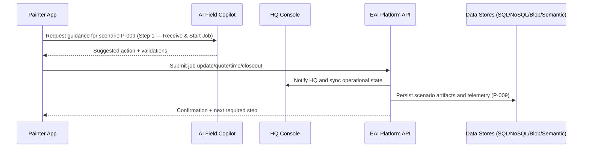
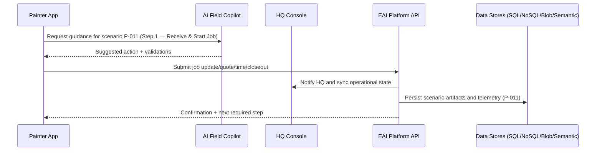
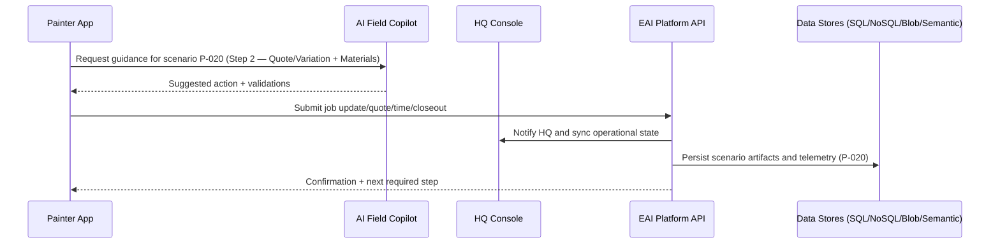

# Painter Business Scenarios — Detailed (100)

Each scenario includes: process step, participants/agents, AI augmentation, EAI platform interaction, storage/schema targets, and a Mermaid sequence diagram.

## Legend
- **People**: Painter, HQ Dispatcher, Customer
- **Agents**: AI Field Copilot
- **Platform**: EAI App APIs, GPS/messaging integration, workflow orchestration

## P-001 — Painter receives new assignment notification.

- **Process step:** Step 1 — Receive & Start Job
- **People & agents involved:** Painter, HQ Dispatcher, Customer, AI Field Copilot
- **AI augmentation point:** AI optimizes ETA, validates readiness/safety checklist, and warns about route/access risks.
- **EAI platform interaction:** EAI assignment intake, GPS tracking, messaging thread creation, and readiness workflow.
- **Data schema targets:**
  - **SQL:** jobs, assignments, readiness_checks
  - **NoSQL:** gps_pings, assignment_events
  - **Blob/File:** arrival-photos, safety-check-attachments
  - **Semantic search index:** site-access-notes-index, route-incident-index


## P-002 — Painter accepts assignment and confirms ETA.

- **Process step:** Step 1 — Receive & Start Job
- **People & agents involved:** Painter, HQ Dispatcher, Customer, AI Field Copilot
- **AI augmentation point:** AI optimizes ETA, validates readiness/safety checklist, and warns about route/access risks.
- **EAI platform interaction:** EAI assignment intake, GPS tracking, messaging thread creation, and readiness workflow.
- **Data schema targets:**
  - **SQL:** jobs, assignments, readiness_checks
  - **NoSQL:** gps_pings, assignment_events
  - **Blob/File:** arrival-photos, safety-check-attachments
  - **Semantic search index:** site-access-notes-index, route-incident-index


## P-003 — Painter requests reassignment due to distance.

- **Process step:** Step 1 — Receive & Start Job
- **People & agents involved:** Painter, HQ Dispatcher, Customer, AI Field Copilot
- **AI augmentation point:** AI optimizes ETA, validates readiness/safety checklist, and warns about route/access risks.
- **EAI platform interaction:** EAI assignment intake, GPS tracking, messaging thread creation, and readiness workflow.
- **Data schema targets:**
  - **SQL:** jobs, assignments, readiness_checks
  - **NoSQL:** gps_pings, assignment_events
  - **Blob/File:** arrival-photos, safety-check-attachments
  - **Semantic search index:** site-access-notes-index, route-incident-index


## P-004 — Painter opens map to customer site.

- **Process step:** Step 1 — Receive & Start Job
- **People & agents involved:** Painter, HQ Dispatcher, Customer, AI Field Copilot
- **AI augmentation point:** AI optimizes ETA, validates readiness/safety checklist, and warns about route/access risks.
- **EAI platform interaction:** EAI assignment intake, GPS tracking, messaging thread creation, and readiness workflow.
- **Data schema targets:**
  - **SQL:** jobs, assignments, readiness_checks
  - **NoSQL:** gps_pings, assignment_events
  - **Blob/File:** arrival-photos, safety-check-attachments
  - **Semantic search index:** site-access-notes-index, route-incident-index


## P-005 — Painter calls customer from in-app contact action.

- **Process step:** Step 1 — Receive & Start Job
- **People & agents involved:** Painter, HQ Dispatcher, Customer, AI Field Copilot
- **AI augmentation point:** AI optimizes ETA, validates readiness/safety checklist, and warns about route/access risks.
- **EAI platform interaction:** EAI assignment intake, GPS tracking, messaging thread creation, and readiness workflow.
- **Data schema targets:**
  - **SQL:** jobs, assignments, readiness_checks
  - **NoSQL:** gps_pings, assignment_events
  - **Blob/File:** arrival-photos, safety-check-attachments
  - **Semantic search index:** site-access-notes-index, route-incident-index


## P-006 — Painter checks required tools list before departure.

- **Process step:** Step 1 — Receive & Start Job
- **People & agents involved:** Painter, HQ Dispatcher, Customer, AI Field Copilot
- **AI augmentation point:** AI optimizes ETA, validates readiness/safety checklist, and warns about route/access risks.
- **EAI platform interaction:** EAI assignment intake, GPS tracking, messaging thread creation, and readiness workflow.
- **Data schema targets:**
  - **SQL:** jobs, assignments, readiness_checks
  - **NoSQL:** gps_pings, assignment_events
  - **Blob/File:** arrival-photos, safety-check-attachments
  - **Semantic search index:** site-access-notes-index, route-incident-index


## P-007 — Painter reports blocked road from map.

- **Process step:** Step 1 — Receive & Start Job
- **People & agents involved:** Painter, HQ Dispatcher, Customer, AI Field Copilot
- **AI augmentation point:** AI optimizes ETA, validates readiness/safety checklist, and warns about route/access risks.
- **EAI platform interaction:** EAI assignment intake, GPS tracking, messaging thread creation, and readiness workflow.
- **Data schema targets:**
  - **SQL:** jobs, assignments, readiness_checks
  - **NoSQL:** gps_pings, assignment_events
  - **Blob/File:** arrival-photos, safety-check-attachments
  - **Semantic search index:** site-access-notes-index, route-incident-index


## P-008 — Painter marks arrival onsite.

- **Process step:** Step 1 — Receive & Start Job
- **People & agents involved:** Painter, HQ Dispatcher, Customer, AI Field Copilot
- **AI augmentation point:** AI optimizes ETA, validates readiness/safety checklist, and warns about route/access risks.
- **EAI platform interaction:** EAI assignment intake, GPS tracking, messaging thread creation, and readiness workflow.
- **Data schema targets:**
  - **SQL:** jobs, assignments, readiness_checks
  - **NoSQL:** gps_pings, assignment_events
  - **Blob/File:** arrival-photos, safety-check-attachments
  - **Semantic search index:** site-access-notes-index, route-incident-index


## P-009 — Painter cannot access property and alerts HQ.

- **Process step:** Step 1 — Receive & Start Job
- **People & agents involved:** Painter, HQ Dispatcher, Customer, AI Field Copilot
- **AI augmentation point:** AI optimizes ETA, validates readiness/safety checklist, and warns about route/access risks.
- **EAI platform interaction:** EAI assignment intake, GPS tracking, messaging thread creation, and readiness workflow.
- **Data schema targets:**
  - **SQL:** jobs, assignments, readiness_checks
  - **NoSQL:** gps_pings, assignment_events
  - **Blob/File:** arrival-photos, safety-check-attachments
  - **Semantic search index:** site-access-notes-index, route-incident-index



## P-010 — Painter uploads site arrival photo evidence.

- **Process step:** Step 1 — Receive & Start Job
- **People & agents involved:** Painter, HQ Dispatcher, Customer, AI Field Copilot
- **AI augmentation point:** AI optimizes ETA, validates readiness/safety checklist, and warns about route/access risks.
- **EAI platform interaction:** EAI assignment intake, GPS tracking, messaging thread creation, and readiness workflow.
- **Data schema targets:**
  - **SQL:** jobs, assignments, readiness_checks
  - **NoSQL:** gps_pings, assignment_events
  - **Blob/File:** arrival-photos, safety-check-attachments
  - **Semantic search index:** site-access-notes-index, route-incident-index


## P-011 — Painter starts job timer.

- **Process step:** Step 1 — Receive & Start Job
- **People & agents involved:** Painter, HQ Dispatcher, Customer, AI Field Copilot
- **AI augmentation point:** AI optimizes ETA, validates readiness/safety checklist, and warns about route/access risks.
- **EAI platform interaction:** EAI assignment intake, GPS tracking, messaging thread creation, and readiness workflow.
- **Data schema targets:**
  - **SQL:** jobs, assignments, readiness_checks
  - **NoSQL:** gps_pings, assignment_events
  - **Blob/File:** arrival-photos, safety-check-attachments
  - **Semantic search index:** site-access-notes-index, route-incident-index



## P-012 — Painter reads AI pre-job risk checklist.

- **Process step:** Step 1 — Receive & Start Job
- **People & agents involved:** Painter, HQ Dispatcher, Customer, AI Field Copilot
- **AI augmentation point:** AI optimizes ETA, validates readiness/safety checklist, and warns about route/access risks.
- **EAI platform interaction:** EAI assignment intake, GPS tracking, messaging thread creation, and readiness workflow.
- **Data schema targets:**
  - **SQL:** jobs, assignments, readiness_checks
  - **NoSQL:** gps_pings, assignment_events
  - **Blob/File:** arrival-photos, safety-check-attachments
  - **Semantic search index:** site-access-notes-index, route-incident-index


## P-013 — Painter confirms safety and readiness checklist.

- **Process step:** Step 1 — Receive & Start Job
- **People & agents involved:** Painter, HQ Dispatcher, Customer, AI Field Copilot
- **AI augmentation point:** AI optimizes ETA, validates readiness/safety checklist, and warns about route/access risks.
- **EAI platform interaction:** EAI assignment intake, GPS tracking, messaging thread creation, and readiness workflow.
- **Data schema targets:**
  - **SQL:** jobs, assignments, readiness_checks
  - **NoSQL:** gps_pings, assignment_events
  - **Blob/File:** arrival-photos, safety-check-attachments
  - **Semantic search index:** site-access-notes-index, route-incident-index


## P-014 — Painter enters measured wall/ceiling dimensions.

- **Process step:** Step 2 — Quote/Variation + Materials
- **People & agents involved:** Painter, HQ Dispatcher, Customer, AI Field Copilot
- **AI augmentation point:** AI estimates paint/material quantities, flags estimation risk, and drafts variation rationale.
- **EAI platform interaction:** EAI quote/variation workflow, material verification, and approval handoff to HQ.
- **Data schema targets:**
  - **SQL:** quotes, variations, material_estimates, material_purchases
  - **NoSQL:** quote_events, stock_checks
  - **Blob/File:** before-photos, markup-images, material-docs
  - **Semantic search index:** scope-notes-index, variation-rationale-index


## P-015 — Painter captures before photos for quote pack.

- **Process step:** Step 2 — Quote/Variation + Materials
- **People & agents involved:** Painter, HQ Dispatcher, Customer, AI Field Copilot
- **AI augmentation point:** AI estimates paint/material quantities, flags estimation risk, and drafts variation rationale.
- **EAI platform interaction:** EAI quote/variation workflow, material verification, and approval handoff to HQ.
- **Data schema targets:**
  - **SQL:** quotes, variations, material_estimates, material_purchases
  - **NoSQL:** quote_events, stock_checks
  - **Blob/File:** before-photos, markup-images, material-docs
  - **Semantic search index:** scope-notes-index, variation-rationale-index


## P-016 — Painter selects paint type and finish.

- **Process step:** Step 2 — Quote/Variation + Materials
- **People & agents involved:** Painter, HQ Dispatcher, Customer, AI Field Copilot
- **AI augmentation point:** AI estimates paint/material quantities, flags estimation risk, and drafts variation rationale.
- **EAI platform interaction:** EAI quote/variation workflow, material verification, and approval handoff to HQ.
- **Data schema targets:**
  - **SQL:** quotes, variations, material_estimates, material_purchases
  - **NoSQL:** quote_events, stock_checks
  - **Blob/File:** before-photos, markup-images, material-docs
  - **Semantic search index:** scope-notes-index, variation-rationale-index


## P-017 — Painter records customer color preference.

- **Process step:** Step 2 — Quote/Variation + Materials
- **People & agents involved:** Painter, HQ Dispatcher, Customer, AI Field Copilot
- **AI augmentation point:** AI estimates paint/material quantities, flags estimation risk, and drafts variation rationale.
- **EAI platform interaction:** EAI quote/variation workflow, material verification, and approval handoff to HQ.
- **Data schema targets:**
  - **SQL:** quotes, variations, material_estimates, material_purchases
  - **NoSQL:** quote_events, stock_checks
  - **Blob/File:** before-photos, markup-images, material-docs
  - **Semantic search index:** scope-notes-index, variation-rationale-index


## P-018 — Painter enters variation for additional surface area.

- **Process step:** Step 2 — Quote/Variation + Materials
- **People & agents involved:** Painter, HQ Dispatcher, Customer, AI Field Copilot
- **AI augmentation point:** AI estimates paint/material quantities, flags estimation risk, and drafts variation rationale.
- **EAI platform interaction:** EAI quote/variation workflow, material verification, and approval handoff to HQ.
- **Data schema targets:**
  - **SQL:** quotes, variations, material_estimates, material_purchases
  - **NoSQL:** quote_events, stock_checks
  - **Blob/File:** before-photos, markup-images, material-docs
  - **Semantic search index:** scope-notes-index, variation-rationale-index


## P-019 — Painter marks damaged substrate requiring prep.

- **Process step:** Step 2 — Quote/Variation + Materials
- **People & agents involved:** Painter, HQ Dispatcher, Customer, AI Field Copilot
- **AI augmentation point:** AI estimates paint/material quantities, flags estimation risk, and drafts variation rationale.
- **EAI platform interaction:** EAI quote/variation workflow, material verification, and approval handoff to HQ.
- **Data schema targets:**
  - **SQL:** quotes, variations, material_estimates, material_purchases
  - **NoSQL:** quote_events, stock_checks
  - **Blob/File:** before-photos, markup-images, material-docs
  - **Semantic search index:** scope-notes-index, variation-rationale-index


## P-020 — Painter sees AI material quantity recommendation.

- **Process step:** Step 2 — Quote/Variation + Materials
- **People & agents involved:** Painter, HQ Dispatcher, Customer, AI Field Copilot
- **AI augmentation point:** AI estimates paint/material quantities, flags estimation risk, and drafts variation rationale.
- **EAI platform interaction:** EAI quote/variation workflow, material verification, and approval handoff to HQ.
- **Data schema targets:**
  - **SQL:** quotes, variations, material_estimates, material_purchases
  - **NoSQL:** quote_events, stock_checks
  - **Blob/File:** before-photos, markup-images, material-docs
  - **Semantic search index:** scope-notes-index, variation-rationale-index



## P-021 — Painter compares recommended vs purchased materials.

- **Process step:** Step 2 — Quote/Variation + Materials
- **People & agents involved:** Painter, HQ Dispatcher, Customer, AI Field Copilot
- **AI augmentation point:** AI estimates paint/material quantities, flags estimation risk, and drafts variation rationale.
- **EAI platform interaction:** EAI quote/variation workflow, material verification, and approval handoff to HQ.
- **Data schema targets:**
  - **SQL:** quotes, variations, material_estimates, material_purchases
  - **NoSQL:** quote_events, stock_checks
  - **Blob/File:** before-photos, markup-images, material-docs
  - **Semantic search index:** scope-notes-index, variation-rationale-index

```mermaid
sequenceDiagram
    participant Painter as Painter App
    participant AI as AI Field Copilot
    participant HQ as HQ Console
    participant EAI as EAI Platform API
    participant DS as Data Stores (SQL/NoSQL/Blob/Semantic)
    Painter->>AI: Request guidance for scenario P-021 (Step 2 — Quote/Variation + Materials)
    AI-->>Painter: Suggested action + validations
    Painter->>EAI: Submit job update/quote/time/closeout
    EAI->>HQ: Notify HQ and sync operational state
    EAI->>DS: Persist scenario artifacts and telemetry (P-021)
    EAI-->>Painter: Confirmation + next required step
```

## P-022 — Painter flags shortfall and requests resupply.

- **Process step:** Step 2 — Quote/Variation + Materials
- **People & agents involved:** Painter, HQ Dispatcher, Customer, AI Field Copilot
- **AI augmentation point:** AI estimates paint/material quantities, flags estimation risk, and drafts variation rationale.
- **EAI platform interaction:** EAI quote/variation workflow, material verification, and approval handoff to HQ.
- **Data schema targets:**
  - **SQL:** quotes, variations, material_estimates, material_purchases
  - **NoSQL:** quote_events, stock_checks
  - **Blob/File:** before-photos, markup-images, material-docs
  - **Semantic search index:** scope-notes-index, variation-rationale-index

```mermaid
sequenceDiagram
    participant Painter as Painter App
    participant AI as AI Field Copilot
    participant HQ as HQ Console
    participant EAI as EAI Platform API
    participant DS as Data Stores (SQL/NoSQL/Blob/Semantic)
    Painter->>AI: Request guidance for scenario P-022 (Step 2 — Quote/Variation + Materials)
    AI-->>Painter: Suggested action + validations
    Painter->>EAI: Submit job update/quote/time/closeout
    EAI->>HQ: Notify HQ and sync operational state
    EAI->>DS: Persist scenario artifacts and telemetry (P-022)
    EAI-->>Painter: Confirmation + next required step
```

## P-023 — Painter edits AI estimate and leaves rationale.

- **Process step:** Step 2 — Quote/Variation + Materials
- **People & agents involved:** Painter, HQ Dispatcher, Customer, AI Field Copilot
- **AI augmentation point:** AI estimates paint/material quantities, flags estimation risk, and drafts variation rationale.
- **EAI platform interaction:** EAI quote/variation workflow, material verification, and approval handoff to HQ.
- **Data schema targets:**
  - **SQL:** quotes, variations, material_estimates, material_purchases
  - **NoSQL:** quote_events, stock_checks
  - **Blob/File:** before-photos, markup-images, material-docs
  - **Semantic search index:** scope-notes-index, variation-rationale-index

```mermaid
sequenceDiagram
    participant Painter as Painter App
    participant AI as AI Field Copilot
    participant HQ as HQ Console
    participant EAI as EAI Platform API
    participant DS as Data Stores (SQL/NoSQL/Blob/Semantic)
    Painter->>AI: Request guidance for scenario P-023 (Step 2 — Quote/Variation + Materials)
    AI-->>Painter: Suggested action + validations
    Painter->>EAI: Submit job update/quote/time/closeout
    EAI->>HQ: Notify HQ and sync operational state
    EAI->>DS: Persist scenario artifacts and telemetry (P-023)
    EAI-->>Painter: Confirmation + next required step
```

## P-024 — Painter submits quote for HQ approval.

- **Process step:** Step 2 — Quote/Variation + Materials
- **People & agents involved:** Painter, HQ Dispatcher, Customer, AI Field Copilot
- **AI augmentation point:** AI estimates paint/material quantities, flags estimation risk, and drafts variation rationale.
- **EAI platform interaction:** EAI quote/variation workflow, material verification, and approval handoff to HQ.
- **Data schema targets:**
  - **SQL:** quotes, variations, material_estimates, material_purchases
  - **NoSQL:** quote_events, stock_checks
  - **Blob/File:** before-photos, markup-images, material-docs
  - **Semantic search index:** scope-notes-index, variation-rationale-index

```mermaid
sequenceDiagram
    participant Painter as Painter App
    participant AI as AI Field Copilot
    participant HQ as HQ Console
    participant EAI as EAI Platform API
    participant DS as Data Stores (SQL/NoSQL/Blob/Semantic)
    Painter->>AI: Request guidance for scenario P-024 (Step 2 — Quote/Variation + Materials)
    AI-->>Painter: Suggested action + validations
    Painter->>EAI: Submit job update/quote/time/closeout
    EAI->>HQ: Notify HQ and sync operational state
    EAI->>DS: Persist scenario artifacts and telemetry (P-024)
    EAI-->>Painter: Confirmation + next required step
```

## P-025 — Painter submits variation during active job.

- **Process step:** Step 2 — Quote/Variation + Materials
- **People & agents involved:** Painter, HQ Dispatcher, Customer, AI Field Copilot
- **AI augmentation point:** AI estimates paint/material quantities, flags estimation risk, and drafts variation rationale.
- **EAI platform interaction:** EAI quote/variation workflow, material verification, and approval handoff to HQ.
- **Data schema targets:**
  - **SQL:** quotes, variations, material_estimates, material_purchases
  - **NoSQL:** quote_events, stock_checks
  - **Blob/File:** before-photos, markup-images, material-docs
  - **Semantic search index:** scope-notes-index, variation-rationale-index

```mermaid
sequenceDiagram
    participant Painter as Painter App
    participant AI as AI Field Copilot
    participant HQ as HQ Console
    participant EAI as EAI Platform API
    participant DS as Data Stores (SQL/NoSQL/Blob/Semantic)
    Painter->>AI: Request guidance for scenario P-025 (Step 2 — Quote/Variation + Materials)
    AI-->>Painter: Suggested action + validations
    Painter->>EAI: Submit job update/quote/time/closeout
    EAI->>HQ: Notify HQ and sync operational state
    EAI->>DS: Persist scenario artifacts and telemetry (P-025)
    EAI-->>Painter: Confirmation + next required step
```

## P-026 — Painter receives approved variation confirmation.

- **Process step:** Step 2 — Quote/Variation + Materials
- **People & agents involved:** Painter, HQ Dispatcher, Customer, AI Field Copilot
- **AI augmentation point:** AI estimates paint/material quantities, flags estimation risk, and drafts variation rationale.
- **EAI platform interaction:** EAI quote/variation workflow, material verification, and approval handoff to HQ.
- **Data schema targets:**
  - **SQL:** quotes, variations, material_estimates, material_purchases
  - **NoSQL:** quote_events, stock_checks
  - **Blob/File:** before-photos, markup-images, material-docs
  - **Semantic search index:** scope-notes-index, variation-rationale-index

```mermaid
sequenceDiagram
    participant Painter as Painter App
    participant AI as AI Field Copilot
    participant HQ as HQ Console
    participant EAI as EAI Platform API
    participant DS as Data Stores (SQL/NoSQL/Blob/Semantic)
    Painter->>AI: Request guidance for scenario P-026 (Step 2 — Quote/Variation + Materials)
    AI-->>Painter: Suggested action + validations
    Painter->>EAI: Submit job update/quote/time/closeout
    EAI->>HQ: Notify HQ and sync operational state
    EAI->>DS: Persist scenario artifacts and telemetry (P-026)
    EAI-->>Painter: Confirmation + next required step
```

## P-027 — Painter logs prep work start and completion.

- **Process step:** Step 3 — Execute + Time/Expense Tracking
- **People & agents involved:** Painter, HQ Dispatcher, Customer, AI Field Copilot
- **AI augmentation point:** AI nudges missing logs, detects anomalies, and suggests next-best execution actions.
- **EAI platform interaction:** EAI time tracking, expense capture, anomaly detection, and HQ escalation workflows.
- **Data schema targets:**
  - **SQL:** time_entries, expenses, task_logs
  - **NoSQL:** activity_stream, anomaly_events
  - **Blob/File:** receipt-images, quality-check-photos
  - **Semantic search index:** execution-notes-index, incident-index

```mermaid
sequenceDiagram
    participant Painter as Painter App
    participant AI as AI Field Copilot
    participant HQ as HQ Console
    participant EAI as EAI Platform API
    participant DS as Data Stores (SQL/NoSQL/Blob/Semantic)
    Painter->>AI: Request guidance for scenario P-027 (Step 3 — Execute + Time/Expense Tracking)
    AI-->>Painter: Suggested action + validations
    Painter->>EAI: Submit job update/quote/time/closeout
    EAI->>HQ: Notify HQ and sync operational state
    EAI->>DS: Persist scenario artifacts and telemetry (P-027)
    EAI-->>Painter: Confirmation + next required step
```

## P-028 — Painter logs coat 1 completion.

- **Process step:** Step 3 — Execute + Time/Expense Tracking
- **People & agents involved:** Painter, HQ Dispatcher, Customer, AI Field Copilot
- **AI augmentation point:** AI nudges missing logs, detects anomalies, and suggests next-best execution actions.
- **EAI platform interaction:** EAI time tracking, expense capture, anomaly detection, and HQ escalation workflows.
- **Data schema targets:**
  - **SQL:** time_entries, expenses, task_logs
  - **NoSQL:** activity_stream, anomaly_events
  - **Blob/File:** receipt-images, quality-check-photos
  - **Semantic search index:** execution-notes-index, incident-index

```mermaid
sequenceDiagram
    participant Painter as Painter App
    participant AI as AI Field Copilot
    participant HQ as HQ Console
    participant EAI as EAI Platform API
    participant DS as Data Stores (SQL/NoSQL/Blob/Semantic)
    Painter->>AI: Request guidance for scenario P-028 (Step 3 — Execute + Time/Expense Tracking)
    AI-->>Painter: Suggested action + validations
    Painter->>EAI: Submit job update/quote/time/closeout
    EAI->>HQ: Notify HQ and sync operational state
    EAI->>DS: Persist scenario artifacts and telemetry (P-028)
    EAI-->>Painter: Confirmation + next required step
```

## P-029 — Painter logs coat 2 completion.

- **Process step:** Step 3 — Execute + Time/Expense Tracking
- **People & agents involved:** Painter, HQ Dispatcher, Customer, AI Field Copilot
- **AI augmentation point:** AI nudges missing logs, detects anomalies, and suggests next-best execution actions.
- **EAI platform interaction:** EAI time tracking, expense capture, anomaly detection, and HQ escalation workflows.
- **Data schema targets:**
  - **SQL:** time_entries, expenses, task_logs
  - **NoSQL:** activity_stream, anomaly_events
  - **Blob/File:** receipt-images, quality-check-photos
  - **Semantic search index:** execution-notes-index, incident-index

```mermaid
sequenceDiagram
    participant Painter as Painter App
    participant AI as AI Field Copilot
    participant HQ as HQ Console
    participant EAI as EAI Platform API
    participant DS as Data Stores (SQL/NoSQL/Blob/Semantic)
    Painter->>AI: Request guidance for scenario P-029 (Step 3 — Execute + Time/Expense Tracking)
    AI-->>Painter: Suggested action + validations
    Painter->>EAI: Submit job update/quote/time/closeout
    EAI->>HQ: Notify HQ and sync operational state
    EAI->>DS: Persist scenario artifacts and telemetry (P-029)
    EAI-->>Painter: Confirmation + next required step
```

## P-030 — Painter pauses timer for break.

- **Process step:** Step 3 — Execute + Time/Expense Tracking
- **People & agents involved:** Painter, HQ Dispatcher, Customer, AI Field Copilot
- **AI augmentation point:** AI nudges missing logs, detects anomalies, and suggests next-best execution actions.
- **EAI platform interaction:** EAI time tracking, expense capture, anomaly detection, and HQ escalation workflows.
- **Data schema targets:**
  - **SQL:** time_entries, expenses, task_logs
  - **NoSQL:** activity_stream, anomaly_events
  - **Blob/File:** receipt-images, quality-check-photos
  - **Semantic search index:** execution-notes-index, incident-index

```mermaid
sequenceDiagram
    participant Painter as Painter App
    participant AI as AI Field Copilot
    participant HQ as HQ Console
    participant EAI as EAI Platform API
    participant DS as Data Stores (SQL/NoSQL/Blob/Semantic)
    Painter->>AI: Request guidance for scenario P-030 (Step 3 — Execute + Time/Expense Tracking)
    AI-->>Painter: Suggested action + validations
    Painter->>EAI: Submit job update/quote/time/closeout
    EAI->>HQ: Notify HQ and sync operational state
    EAI->>DS: Persist scenario artifacts and telemetry (P-030)
    EAI-->>Painter: Confirmation + next required step
```

## P-031 — Painter resumes timer after break.

- **Process step:** Step 3 — Execute + Time/Expense Tracking
- **People & agents involved:** Painter, HQ Dispatcher, Customer, AI Field Copilot
- **AI augmentation point:** AI nudges missing logs, detects anomalies, and suggests next-best execution actions.
- **EAI platform interaction:** EAI time tracking, expense capture, anomaly detection, and HQ escalation workflows.
- **Data schema targets:**
  - **SQL:** time_entries, expenses, task_logs
  - **NoSQL:** activity_stream, anomaly_events
  - **Blob/File:** receipt-images, quality-check-photos
  - **Semantic search index:** execution-notes-index, incident-index

```mermaid
sequenceDiagram
    participant Painter as Painter App
    participant AI as AI Field Copilot
    participant HQ as HQ Console
    participant EAI as EAI Platform API
    participant DS as Data Stores (SQL/NoSQL/Blob/Semantic)
    Painter->>AI: Request guidance for scenario P-031 (Step 3 — Execute + Time/Expense Tracking)
    AI-->>Painter: Suggested action + validations
    Painter->>EAI: Submit job update/quote/time/closeout
    EAI->>HQ: Notify HQ and sync operational state
    EAI->>DS: Persist scenario artifacts and telemetry (P-031)
    EAI-->>Painter: Confirmation + next required step
```

## P-032 — Painter uploads expense receipt for consumables.

- **Process step:** Step 3 — Execute + Time/Expense Tracking
- **People & agents involved:** Painter, HQ Dispatcher, Customer, AI Field Copilot
- **AI augmentation point:** AI nudges missing logs, detects anomalies, and suggests next-best execution actions.
- **EAI platform interaction:** EAI time tracking, expense capture, anomaly detection, and HQ escalation workflows.
- **Data schema targets:**
  - **SQL:** time_entries, expenses, task_logs
  - **NoSQL:** activity_stream, anomaly_events
  - **Blob/File:** receipt-images, quality-check-photos
  - **Semantic search index:** execution-notes-index, incident-index

```mermaid
sequenceDiagram
    participant Painter as Painter App
    participant AI as AI Field Copilot
    participant HQ as HQ Console
    participant EAI as EAI Platform API
    participant DS as Data Stores (SQL/NoSQL/Blob/Semantic)
    Painter->>AI: Request guidance for scenario P-032 (Step 3 — Execute + Time/Expense Tracking)
    AI-->>Painter: Suggested action + validations
    Painter->>EAI: Submit job update/quote/time/closeout
    EAI->>HQ: Notify HQ and sync operational state
    EAI->>DS: Persist scenario artifacts and telemetry (P-032)
    EAI-->>Painter: Confirmation + next required step
```

## P-033 — Painter tags expense category and amount.

- **Process step:** Step 3 — Execute + Time/Expense Tracking
- **People & agents involved:** Painter, HQ Dispatcher, Customer, AI Field Copilot
- **AI augmentation point:** AI nudges missing logs, detects anomalies, and suggests next-best execution actions.
- **EAI platform interaction:** EAI time tracking, expense capture, anomaly detection, and HQ escalation workflows.
- **Data schema targets:**
  - **SQL:** time_entries, expenses, task_logs
  - **NoSQL:** activity_stream, anomaly_events
  - **Blob/File:** receipt-images, quality-check-photos
  - **Semantic search index:** execution-notes-index, incident-index

```mermaid
sequenceDiagram
    participant Painter as Painter App
    participant AI as AI Field Copilot
    participant HQ as HQ Console
    participant EAI as EAI Platform API
    participant DS as Data Stores (SQL/NoSQL/Blob/Semantic)
    Painter->>AI: Request guidance for scenario P-033 (Step 3 — Execute + Time/Expense Tracking)
    AI-->>Painter: Suggested action + validations
    Painter->>EAI: Submit job update/quote/time/closeout
    EAI->>HQ: Notify HQ and sync operational state
    EAI->>DS: Persist scenario artifacts and telemetry (P-033)
    EAI-->>Painter: Confirmation + next required step
```

## P-034 — Painter requests AI next-best-task suggestion.

- **Process step:** Step 3 — Execute + Time/Expense Tracking
- **People & agents involved:** Painter, HQ Dispatcher, Customer, AI Field Copilot
- **AI augmentation point:** AI nudges missing logs, detects anomalies, and suggests next-best execution actions.
- **EAI platform interaction:** EAI time tracking, expense capture, anomaly detection, and HQ escalation workflows.
- **Data schema targets:**
  - **SQL:** time_entries, expenses, task_logs
  - **NoSQL:** activity_stream, anomaly_events
  - **Blob/File:** receipt-images, quality-check-photos
  - **Semantic search index:** execution-notes-index, incident-index

```mermaid
sequenceDiagram
    participant Painter as Painter App
    participant AI as AI Field Copilot
    participant HQ as HQ Console
    participant EAI as EAI Platform API
    participant DS as Data Stores (SQL/NoSQL/Blob/Semantic)
    Painter->>AI: Request guidance for scenario P-034 (Step 3 — Execute + Time/Expense Tracking)
    AI-->>Painter: Suggested action + validations
    Painter->>EAI: Submit job update/quote/time/closeout
    EAI->>HQ: Notify HQ and sync operational state
    EAI->>DS: Persist scenario artifacts and telemetry (P-034)
    EAI-->>Painter: Confirmation + next required step
```

## P-035 — Painter receives AI warning on missing job note.

- **Process step:** Step 3 — Execute + Time/Expense Tracking
- **People & agents involved:** Painter, HQ Dispatcher, Customer, AI Field Copilot
- **AI augmentation point:** AI nudges missing logs, detects anomalies, and suggests next-best execution actions.
- **EAI platform interaction:** EAI time tracking, expense capture, anomaly detection, and HQ escalation workflows.
- **Data schema targets:**
  - **SQL:** time_entries, expenses, task_logs
  - **NoSQL:** activity_stream, anomaly_events
  - **Blob/File:** receipt-images, quality-check-photos
  - **Semantic search index:** execution-notes-index, incident-index

```mermaid
sequenceDiagram
    participant Painter as Painter App
    participant AI as AI Field Copilot
    participant HQ as HQ Console
    participant EAI as EAI Platform API
    participant DS as Data Stores (SQL/NoSQL/Blob/Semantic)
    Painter->>AI: Request guidance for scenario P-035 (Step 3 — Execute + Time/Expense Tracking)
    AI-->>Painter: Suggested action + validations
    Painter->>EAI: Submit job update/quote/time/closeout
    EAI->>HQ: Notify HQ and sync operational state
    EAI->>DS: Persist scenario artifacts and telemetry (P-035)
    EAI-->>Painter: Confirmation + next required step
```

## P-036 — Painter logs unexpected delay reason.

- **Process step:** Step 3 — Execute + Time/Expense Tracking
- **People & agents involved:** Painter, HQ Dispatcher, Customer, AI Field Copilot
- **AI augmentation point:** AI nudges missing logs, detects anomalies, and suggests next-best execution actions.
- **EAI platform interaction:** EAI time tracking, expense capture, anomaly detection, and HQ escalation workflows.
- **Data schema targets:**
  - **SQL:** time_entries, expenses, task_logs
  - **NoSQL:** activity_stream, anomaly_events
  - **Blob/File:** receipt-images, quality-check-photos
  - **Semantic search index:** execution-notes-index, incident-index

```mermaid
sequenceDiagram
    participant Painter as Painter App
    participant AI as AI Field Copilot
    participant HQ as HQ Console
    participant EAI as EAI Platform API
    participant DS as Data Stores (SQL/NoSQL/Blob/Semantic)
    Painter->>AI: Request guidance for scenario P-036 (Step 3 — Execute + Time/Expense Tracking)
    AI-->>Painter: Suggested action + validations
    Painter->>EAI: Submit job update/quote/time/closeout
    EAI->>HQ: Notify HQ and sync operational state
    EAI->>DS: Persist scenario artifacts and telemetry (P-036)
    EAI-->>Painter: Confirmation + next required step
```

## P-037 — Painter messages HQ for support on-site issue.

- **Process step:** Step 3 — Execute + Time/Expense Tracking
- **People & agents involved:** Painter, HQ Dispatcher, Customer, AI Field Copilot
- **AI augmentation point:** AI nudges missing logs, detects anomalies, and suggests next-best execution actions.
- **EAI platform interaction:** EAI time tracking, expense capture, anomaly detection, and HQ escalation workflows.
- **Data schema targets:**
  - **SQL:** time_entries, expenses, task_logs
  - **NoSQL:** activity_stream, anomaly_events
  - **Blob/File:** receipt-images, quality-check-photos
  - **Semantic search index:** execution-notes-index, incident-index

```mermaid
sequenceDiagram
    participant Painter as Painter App
    participant AI as AI Field Copilot
    participant HQ as HQ Console
    participant EAI as EAI Platform API
    participant DS as Data Stores (SQL/NoSQL/Blob/Semantic)
    Painter->>AI: Request guidance for scenario P-037 (Step 3 — Execute + Time/Expense Tracking)
    AI-->>Painter: Suggested action + validations
    Painter->>EAI: Submit job update/quote/time/closeout
    EAI->>HQ: Notify HQ and sync operational state
    EAI->>DS: Persist scenario artifacts and telemetry (P-037)
    EAI-->>Painter: Confirmation + next required step
```

## P-038 — Painter receives reassignment instruction and confirms.

- **Process step:** Step 3 — Execute + Time/Expense Tracking
- **People & agents involved:** Painter, HQ Dispatcher, Customer, AI Field Copilot
- **AI augmentation point:** AI nudges missing logs, detects anomalies, and suggests next-best execution actions.
- **EAI platform interaction:** EAI time tracking, expense capture, anomaly detection, and HQ escalation workflows.
- **Data schema targets:**
  - **SQL:** time_entries, expenses, task_logs
  - **NoSQL:** activity_stream, anomaly_events
  - **Blob/File:** receipt-images, quality-check-photos
  - **Semantic search index:** execution-notes-index, incident-index

```mermaid
sequenceDiagram
    participant Painter as Painter App
    participant AI as AI Field Copilot
    participant HQ as HQ Console
    participant EAI as EAI Platform API
    participant DS as Data Stores (SQL/NoSQL/Blob/Semantic)
    Painter->>AI: Request guidance for scenario P-038 (Step 3 — Execute + Time/Expense Tracking)
    AI-->>Painter: Suggested action + validations
    Painter->>EAI: Submit job update/quote/time/closeout
    EAI->>HQ: Notify HQ and sync operational state
    EAI->>DS: Persist scenario artifacts and telemetry (P-038)
    EAI-->>Painter: Confirmation + next required step
```

## P-039 — Painter marks practical completion.

- **Process step:** Step 4 — Complete & Submit Closeout
- **People & agents involved:** Painter, HQ Dispatcher, Customer, AI Field Copilot
- **AI augmentation point:** AI validates closeout completeness and drafts customer-ready completion summaries.
- **EAI platform interaction:** EAI closeout packet workflow, sign-off capture, payroll-ready status, and invoice handoff.
- **Data schema targets:**
  - **SQL:** closeouts, labor_summaries, material_actuals
  - **NoSQL:** closeout_events, approval_events
  - **Blob/File:** after-photos, signatures, closeout-pdfs
  - **Semantic search index:** handover-summary-index, lessons-learned-index

```mermaid
sequenceDiagram
    participant Painter as Painter App
    participant AI as AI Field Copilot
    participant HQ as HQ Console
    participant EAI as EAI Platform API
    participant DS as Data Stores (SQL/NoSQL/Blob/Semantic)
    Painter->>AI: Request guidance for scenario P-039 (Step 4 — Complete & Submit Closeout)
    AI-->>Painter: Suggested action + validations
    Painter->>EAI: Submit job update/quote/time/closeout
    EAI->>HQ: Notify HQ and sync operational state
    EAI->>DS: Persist scenario artifacts and telemetry (P-039)
    EAI-->>Painter: Confirmation + next required step
```

## P-040 — Painter uploads after photos.

- **Process step:** Step 4 — Complete & Submit Closeout
- **People & agents involved:** Painter, HQ Dispatcher, Customer, AI Field Copilot
- **AI augmentation point:** AI validates closeout completeness and drafts customer-ready completion summaries.
- **EAI platform interaction:** EAI closeout packet workflow, sign-off capture, payroll-ready status, and invoice handoff.
- **Data schema targets:**
  - **SQL:** closeouts, labor_summaries, material_actuals
  - **NoSQL:** closeout_events, approval_events
  - **Blob/File:** after-photos, signatures, closeout-pdfs
  - **Semantic search index:** handover-summary-index, lessons-learned-index

```mermaid
sequenceDiagram
    participant Painter as Painter App
    participant AI as AI Field Copilot
    participant HQ as HQ Console
    participant EAI as EAI Platform API
    participant DS as Data Stores (SQL/NoSQL/Blob/Semantic)
    Painter->>AI: Request guidance for scenario P-040 (Step 4 — Complete & Submit Closeout)
    AI-->>Painter: Suggested action + validations
    Painter->>EAI: Submit job update/quote/time/closeout
    EAI->>HQ: Notify HQ and sync operational state
    EAI->>DS: Persist scenario artifacts and telemetry (P-040)
    EAI-->>Painter: Confirmation + next required step
```

## P-041 — Painter submits completion notes.

- **Process step:** Step 4 — Complete & Submit Closeout
- **People & agents involved:** Painter, HQ Dispatcher, Customer, AI Field Copilot
- **AI augmentation point:** AI validates closeout completeness and drafts customer-ready completion summaries.
- **EAI platform interaction:** EAI closeout packet workflow, sign-off capture, payroll-ready status, and invoice handoff.
- **Data schema targets:**
  - **SQL:** closeouts, labor_summaries, material_actuals
  - **NoSQL:** closeout_events, approval_events
  - **Blob/File:** after-photos, signatures, closeout-pdfs
  - **Semantic search index:** handover-summary-index, lessons-learned-index

```mermaid
sequenceDiagram
    participant Painter as Painter App
    participant AI as AI Field Copilot
    participant HQ as HQ Console
    participant EAI as EAI Platform API
    participant DS as Data Stores (SQL/NoSQL/Blob/Semantic)
    Painter->>AI: Request guidance for scenario P-041 (Step 4 — Complete & Submit Closeout)
    AI-->>Painter: Suggested action + validations
    Painter->>EAI: Submit job update/quote/time/closeout
    EAI->>HQ: Notify HQ and sync operational state
    EAI->>DS: Persist scenario artifacts and telemetry (P-041)
    EAI-->>Painter: Confirmation + next required step
```

## P-042 — Painter confirms final material usage.

- **Process step:** Step 4 — Complete & Submit Closeout
- **People & agents involved:** Painter, HQ Dispatcher, Customer, AI Field Copilot
- **AI augmentation point:** AI validates closeout completeness and drafts customer-ready completion summaries.
- **EAI platform interaction:** EAI closeout packet workflow, sign-off capture, payroll-ready status, and invoice handoff.
- **Data schema targets:**
  - **SQL:** closeouts, labor_summaries, material_actuals
  - **NoSQL:** closeout_events, approval_events
  - **Blob/File:** after-photos, signatures, closeout-pdfs
  - **Semantic search index:** handover-summary-index, lessons-learned-index

```mermaid
sequenceDiagram
    participant Painter as Painter App
    participant AI as AI Field Copilot
    participant HQ as HQ Console
    participant EAI as EAI Platform API
    participant DS as Data Stores (SQL/NoSQL/Blob/Semantic)
    Painter->>AI: Request guidance for scenario P-042 (Step 4 — Complete & Submit Closeout)
    AI-->>Painter: Suggested action + validations
    Painter->>EAI: Submit job update/quote/time/closeout
    EAI->>HQ: Notify HQ and sync operational state
    EAI->>DS: Persist scenario artifacts and telemetry (P-042)
    EAI-->>Painter: Confirmation + next required step
```

## P-043 — Painter confirms final labor hours.

- **Process step:** Step 4 — Complete & Submit Closeout
- **People & agents involved:** Painter, HQ Dispatcher, Customer, AI Field Copilot
- **AI augmentation point:** AI validates closeout completeness and drafts customer-ready completion summaries.
- **EAI platform interaction:** EAI closeout packet workflow, sign-off capture, payroll-ready status, and invoice handoff.
- **Data schema targets:**
  - **SQL:** closeouts, labor_summaries, material_actuals
  - **NoSQL:** closeout_events, approval_events
  - **Blob/File:** after-photos, signatures, closeout-pdfs
  - **Semantic search index:** handover-summary-index, lessons-learned-index

```mermaid
sequenceDiagram
    participant Painter as Painter App
    participant AI as AI Field Copilot
    participant HQ as HQ Console
    participant EAI as EAI Platform API
    participant DS as Data Stores (SQL/NoSQL/Blob/Semantic)
    Painter->>AI: Request guidance for scenario P-043 (Step 4 — Complete & Submit Closeout)
    AI-->>Painter: Suggested action + validations
    Painter->>EAI: Submit job update/quote/time/closeout
    EAI->>HQ: Notify HQ and sync operational state
    EAI->>DS: Persist scenario artifacts and telemetry (P-043)
    EAI-->>Painter: Confirmation + next required step
```

## P-044 — Painter adds customer sign-off status.

- **Process step:** Step 4 — Complete & Submit Closeout
- **People & agents involved:** Painter, HQ Dispatcher, Customer, AI Field Copilot
- **AI augmentation point:** AI validates closeout completeness and drafts customer-ready completion summaries.
- **EAI platform interaction:** EAI closeout packet workflow, sign-off capture, payroll-ready status, and invoice handoff.
- **Data schema targets:**
  - **SQL:** closeouts, labor_summaries, material_actuals
  - **NoSQL:** closeout_events, approval_events
  - **Blob/File:** after-photos, signatures, closeout-pdfs
  - **Semantic search index:** handover-summary-index, lessons-learned-index

```mermaid
sequenceDiagram
    participant Painter as Painter App
    participant AI as AI Field Copilot
    participant HQ as HQ Console
    participant EAI as EAI Platform API
    participant DS as Data Stores (SQL/NoSQL/Blob/Semantic)
    Painter->>AI: Request guidance for scenario P-044 (Step 4 — Complete & Submit Closeout)
    AI-->>Painter: Suggested action + validations
    Painter->>EAI: Submit job update/quote/time/closeout
    EAI->>HQ: Notify HQ and sync operational state
    EAI->>DS: Persist scenario artifacts and telemetry (P-044)
    EAI-->>Painter: Confirmation + next required step
```

## P-045 — Painter requests AI closeout completeness check.

- **Process step:** Step 4 — Complete & Submit Closeout
- **People & agents involved:** Painter, HQ Dispatcher, Customer, AI Field Copilot
- **AI augmentation point:** AI validates closeout completeness and drafts customer-ready completion summaries.
- **EAI platform interaction:** EAI closeout packet workflow, sign-off capture, payroll-ready status, and invoice handoff.
- **Data schema targets:**
  - **SQL:** closeouts, labor_summaries, material_actuals
  - **NoSQL:** closeout_events, approval_events
  - **Blob/File:** after-photos, signatures, closeout-pdfs
  - **Semantic search index:** handover-summary-index, lessons-learned-index

```mermaid
sequenceDiagram
    participant Painter as Painter App
    participant AI as AI Field Copilot
    participant HQ as HQ Console
    participant EAI as EAI Platform API
    participant DS as Data Stores (SQL/NoSQL/Blob/Semantic)
    Painter->>AI: Request guidance for scenario P-045 (Step 4 — Complete & Submit Closeout)
    AI-->>Painter: Suggested action + validations
    Painter->>EAI: Submit job update/quote/time/closeout
    EAI->>HQ: Notify HQ and sync operational state
    EAI->>DS: Persist scenario artifacts and telemetry (P-045)
    EAI-->>Painter: Confirmation + next required step
```

## P-046 — Painter corrects missing mandatory fields from AI feedback.

- **Process step:** Step 4 — Complete & Submit Closeout
- **People & agents involved:** Painter, HQ Dispatcher, Customer, AI Field Copilot
- **AI augmentation point:** AI validates closeout completeness and drafts customer-ready completion summaries.
- **EAI platform interaction:** EAI closeout packet workflow, sign-off capture, payroll-ready status, and invoice handoff.
- **Data schema targets:**
  - **SQL:** closeouts, labor_summaries, material_actuals
  - **NoSQL:** closeout_events, approval_events
  - **Blob/File:** after-photos, signatures, closeout-pdfs
  - **Semantic search index:** handover-summary-index, lessons-learned-index

```mermaid
sequenceDiagram
    participant Painter as Painter App
    participant AI as AI Field Copilot
    participant HQ as HQ Console
    participant EAI as EAI Platform API
    participant DS as Data Stores (SQL/NoSQL/Blob/Semantic)
    Painter->>AI: Request guidance for scenario P-046 (Step 4 — Complete & Submit Closeout)
    AI-->>Painter: Suggested action + validations
    Painter->>EAI: Submit job update/quote/time/closeout
    EAI->>HQ: Notify HQ and sync operational state
    EAI->>DS: Persist scenario artifacts and telemetry (P-046)
    EAI-->>Painter: Confirmation + next required step
```

## P-047 — Painter submits final closeout packet to HQ.

- **Process step:** Step 4 — Complete & Submit Closeout
- **People & agents involved:** Painter, HQ Dispatcher, Customer, AI Field Copilot
- **AI augmentation point:** AI validates closeout completeness and drafts customer-ready completion summaries.
- **EAI platform interaction:** EAI closeout packet workflow, sign-off capture, payroll-ready status, and invoice handoff.
- **Data schema targets:**
  - **SQL:** closeouts, labor_summaries, material_actuals
  - **NoSQL:** closeout_events, approval_events
  - **Blob/File:** after-photos, signatures, closeout-pdfs
  - **Semantic search index:** handover-summary-index, lessons-learned-index

```mermaid
sequenceDiagram
    participant Painter as Painter App
    participant AI as AI Field Copilot
    participant HQ as HQ Console
    participant EAI as EAI Platform API
    participant DS as Data Stores (SQL/NoSQL/Blob/Semantic)
    Painter->>AI: Request guidance for scenario P-047 (Step 4 — Complete & Submit Closeout)
    AI-->>Painter: Suggested action + validations
    Painter->>EAI: Submit job update/quote/time/closeout
    EAI->>HQ: Notify HQ and sync operational state
    EAI->>DS: Persist scenario artifacts and telemetry (P-047)
    EAI-->>Painter: Confirmation + next required step
```

## P-048 — Painter receives acknowledgment from HQ.

- **Process step:** Step 4 — Complete & Submit Closeout
- **People & agents involved:** Painter, HQ Dispatcher, Customer, AI Field Copilot
- **AI augmentation point:** AI validates closeout completeness and drafts customer-ready completion summaries.
- **EAI platform interaction:** EAI closeout packet workflow, sign-off capture, payroll-ready status, and invoice handoff.
- **Data schema targets:**
  - **SQL:** closeouts, labor_summaries, material_actuals
  - **NoSQL:** closeout_events, approval_events
  - **Blob/File:** after-photos, signatures, closeout-pdfs
  - **Semantic search index:** handover-summary-index, lessons-learned-index

```mermaid
sequenceDiagram
    participant Painter as Painter App
    participant AI as AI Field Copilot
    participant HQ as HQ Console
    participant EAI as EAI Platform API
    participant DS as Data Stores (SQL/NoSQL/Blob/Semantic)
    Painter->>AI: Request guidance for scenario P-048 (Step 4 — Complete & Submit Closeout)
    AI-->>Painter: Suggested action + validations
    Painter->>EAI: Submit job update/quote/time/closeout
    EAI->>HQ: Notify HQ and sync operational state
    EAI->>DS: Persist scenario artifacts and telemetry (P-048)
    EAI-->>Painter: Confirmation + next required step
```

## P-049 — Painter reviews payment-ready indicator.

- **Process step:** Step 4 — Complete & Submit Closeout
- **People & agents involved:** Painter, HQ Dispatcher, Customer, AI Field Copilot
- **AI augmentation point:** AI validates closeout completeness and drafts customer-ready completion summaries.
- **EAI platform interaction:** EAI closeout packet workflow, sign-off capture, payroll-ready status, and invoice handoff.
- **Data schema targets:**
  - **SQL:** closeouts, labor_summaries, material_actuals
  - **NoSQL:** closeout_events, approval_events
  - **Blob/File:** after-photos, signatures, closeout-pdfs
  - **Semantic search index:** handover-summary-index, lessons-learned-index

```mermaid
sequenceDiagram
    participant Painter as Painter App
    participant AI as AI Field Copilot
    participant HQ as HQ Console
    participant EAI as EAI Platform API
    participant DS as Data Stores (SQL/NoSQL/Blob/Semantic)
    Painter->>AI: Request guidance for scenario P-049 (Step 4 — Complete & Submit Closeout)
    AI-->>Painter: Suggested action + validations
    Painter->>EAI: Submit job update/quote/time/closeout
    EAI->>HQ: Notify HQ and sync operational state
    EAI->>DS: Persist scenario artifacts and telemetry (P-049)
    EAI-->>Painter: Confirmation + next required step
```

## P-050 — Painter closes workflow and starts next assignment.

- **Process step:** Step 4 — Complete & Submit Closeout
- **People & agents involved:** Painter, HQ Dispatcher, Customer, AI Field Copilot
- **AI augmentation point:** AI validates closeout completeness and drafts customer-ready completion summaries.
- **EAI platform interaction:** EAI closeout packet workflow, sign-off capture, payroll-ready status, and invoice handoff.
- **Data schema targets:**
  - **SQL:** closeouts, labor_summaries, material_actuals
  - **NoSQL:** closeout_events, approval_events
  - **Blob/File:** after-photos, signatures, closeout-pdfs
  - **Semantic search index:** handover-summary-index, lessons-learned-index

```mermaid
sequenceDiagram
    participant Painter as Painter App
    participant AI as AI Field Copilot
    participant HQ as HQ Console
    participant EAI as EAI Platform API
    participant DS as Data Stores (SQL/NoSQL/Blob/Semantic)
    Painter->>AI: Request guidance for scenario P-050 (Step 4 — Complete & Submit Closeout)
    AI-->>Painter: Suggested action + validations
    Painter->>EAI: Submit job update/quote/time/closeout
    EAI->>HQ: Notify HQ and sync operational state
    EAI->>DS: Persist scenario artifacts and telemetry (P-050)
    EAI-->>Painter: Confirmation + next required step
```

## P-051 — Painter receives overlapping job assignments and requests priority guidance.

- **Process step:** Step 1 — Receive & Start Job
- **People & agents involved:** Painter, HQ Dispatcher, Customer, AI Field Copilot
- **AI augmentation point:** AI optimizes ETA, validates readiness/safety checklist, and warns about route/access risks.
- **EAI platform interaction:** EAI assignment intake, GPS tracking, messaging thread creation, and readiness workflow.
- **Data schema targets:**
  - **SQL:** jobs, assignments, readiness_checks
  - **NoSQL:** gps_pings, assignment_events
  - **Blob/File:** arrival-photos, safety-check-attachments
  - **Semantic search index:** site-access-notes-index, route-incident-index

```mermaid
sequenceDiagram
    participant Painter as Painter App
    participant AI as AI Field Copilot
    participant HQ as HQ Console
    participant EAI as EAI Platform API
    participant DS as Data Stores (SQL/NoSQL/Blob/Semantic)
    Painter->>AI: Request guidance for scenario P-051 (Step 1 — Receive & Start Job)
    AI-->>Painter: Suggested action + validations
    Painter->>EAI: Submit job update/quote/time/closeout
    EAI->>HQ: Notify HQ and sync operational state
    EAI->>DS: Persist scenario artifacts and telemetry (P-051)
    EAI-->>Painter: Confirmation + next required step
```

## P-052 — Painter starts route but customer changes access instructions.

- **Process step:** Step 1 — Receive & Start Job
- **People & agents involved:** Painter, HQ Dispatcher, Customer, AI Field Copilot
- **AI augmentation point:** AI optimizes ETA, validates readiness/safety checklist, and warns about route/access risks.
- **EAI platform interaction:** EAI assignment intake, GPS tracking, messaging thread creation, and readiness workflow.
- **Data schema targets:**
  - **SQL:** jobs, assignments, readiness_checks
  - **NoSQL:** gps_pings, assignment_events
  - **Blob/File:** arrival-photos, safety-check-attachments
  - **Semantic search index:** site-access-notes-index, route-incident-index

```mermaid
sequenceDiagram
    participant Painter as Painter App
    participant AI as AI Field Copilot
    participant HQ as HQ Console
    participant EAI as EAI Platform API
    participant DS as Data Stores (SQL/NoSQL/Blob/Semantic)
    Painter->>AI: Request guidance for scenario P-052 (Step 1 — Receive & Start Job)
    AI-->>Painter: Suggested action + validations
    Painter->>EAI: Submit job update/quote/time/closeout
    EAI->>HQ: Notify HQ and sync operational state
    EAI->>DS: Persist scenario artifacts and telemetry (P-052)
    EAI-->>Painter: Confirmation + next required step
```

## P-053 — Painter receives AI ETA adjustment due to traffic incident.

- **Process step:** Step 1 — Receive & Start Job
- **People & agents involved:** Painter, HQ Dispatcher, Customer, AI Field Copilot
- **AI augmentation point:** AI optimizes ETA, validates readiness/safety checklist, and warns about route/access risks.
- **EAI platform interaction:** EAI assignment intake, GPS tracking, messaging thread creation, and readiness workflow.
- **Data schema targets:**
  - **SQL:** jobs, assignments, readiness_checks
  - **NoSQL:** gps_pings, assignment_events
  - **Blob/File:** arrival-photos, safety-check-attachments
  - **Semantic search index:** site-access-notes-index, route-incident-index

```mermaid
sequenceDiagram
    participant Painter as Painter App
    participant AI as AI Field Copilot
    participant HQ as HQ Console
    participant EAI as EAI Platform API
    participant DS as Data Stores (SQL/NoSQL/Blob/Semantic)
    Painter->>AI: Request guidance for scenario P-053 (Step 1 — Receive & Start Job)
    AI-->>Painter: Suggested action + validations
    Painter->>EAI: Submit job update/quote/time/closeout
    EAI->>HQ: Notify HQ and sync operational state
    EAI->>DS: Persist scenario artifacts and telemetry (P-053)
    EAI-->>Painter: Confirmation + next required step
```

## P-054 — Painter checks in from wrong geofence and corrects location.

- **Process step:** Step 1 — Receive & Start Job
- **People & agents involved:** Painter, HQ Dispatcher, Customer, AI Field Copilot
- **AI augmentation point:** AI optimizes ETA, validates readiness/safety checklist, and warns about route/access risks.
- **EAI platform interaction:** EAI assignment intake, GPS tracking, messaging thread creation, and readiness workflow.
- **Data schema targets:**
  - **SQL:** jobs, assignments, readiness_checks
  - **NoSQL:** gps_pings, assignment_events
  - **Blob/File:** arrival-photos, safety-check-attachments
  - **Semantic search index:** site-access-notes-index, route-incident-index

```mermaid
sequenceDiagram
    participant Painter as Painter App
    participant AI as AI Field Copilot
    participant HQ as HQ Console
    participant EAI as EAI Platform API
    participant DS as Data Stores (SQL/NoSQL/Blob/Semantic)
    Painter->>AI: Request guidance for scenario P-054 (Step 1 — Receive & Start Job)
    AI-->>Painter: Suggested action + validations
    Painter->>EAI: Submit job update/quote/time/closeout
    EAI->>HQ: Notify HQ and sync operational state
    EAI->>DS: Persist scenario artifacts and telemetry (P-054)
    EAI-->>Painter: Confirmation + next required step
```

## P-055 — Painter encounters parking restriction and logs delay reason.

- **Process step:** Step 1 — Receive & Start Job
- **People & agents involved:** Painter, HQ Dispatcher, Customer, AI Field Copilot
- **AI augmentation point:** AI optimizes ETA, validates readiness/safety checklist, and warns about route/access risks.
- **EAI platform interaction:** EAI assignment intake, GPS tracking, messaging thread creation, and readiness workflow.
- **Data schema targets:**
  - **SQL:** jobs, assignments, readiness_checks
  - **NoSQL:** gps_pings, assignment_events
  - **Blob/File:** arrival-photos, safety-check-attachments
  - **Semantic search index:** site-access-notes-index, route-incident-index

```mermaid
sequenceDiagram
    participant Painter as Painter App
    participant AI as AI Field Copilot
    participant HQ as HQ Console
    participant EAI as EAI Platform API
    participant DS as Data Stores (SQL/NoSQL/Blob/Semantic)
    Painter->>AI: Request guidance for scenario P-055 (Step 1 — Receive & Start Job)
    AI-->>Painter: Suggested action + validations
    Painter->>EAI: Submit job update/quote/time/closeout
    EAI->>HQ: Notify HQ and sync operational state
    EAI->>DS: Persist scenario artifacts and telemetry (P-055)
    EAI-->>Painter: Confirmation + next required step
```

## P-056 — Painter requests language translation for customer call notes.

- **Process step:** Step 1 — Receive & Start Job
- **People & agents involved:** Painter, HQ Dispatcher, Customer, AI Field Copilot
- **AI augmentation point:** AI optimizes ETA, validates readiness/safety checklist, and warns about route/access risks.
- **EAI platform interaction:** EAI assignment intake, GPS tracking, messaging thread creation, and readiness workflow.
- **Data schema targets:**
  - **SQL:** jobs, assignments, readiness_checks
  - **NoSQL:** gps_pings, assignment_events
  - **Blob/File:** arrival-photos, safety-check-attachments
  - **Semantic search index:** site-access-notes-index, route-incident-index

```mermaid
sequenceDiagram
    participant Painter as Painter App
    participant AI as AI Field Copilot
    participant HQ as HQ Console
    participant EAI as EAI Platform API
    participant DS as Data Stores (SQL/NoSQL/Blob/Semantic)
    Painter->>AI: Request guidance for scenario P-056 (Step 1 — Receive & Start Job)
    AI-->>Painter: Suggested action + validations
    Painter->>EAI: Submit job update/quote/time/closeout
    EAI->>HQ: Notify HQ and sync operational state
    EAI->>DS: Persist scenario artifacts and telemetry (P-056)
    EAI-->>Painter: Confirmation + next required step
```

## P-057 — Painter confirms ladder and PPE checklist with photo proof.

- **Process step:** Step 1 — Receive & Start Job
- **People & agents involved:** Painter, HQ Dispatcher, Customer, AI Field Copilot
- **AI augmentation point:** AI optimizes ETA, validates readiness/safety checklist, and warns about route/access risks.
- **EAI platform interaction:** EAI assignment intake, GPS tracking, messaging thread creation, and readiness workflow.
- **Data schema targets:**
  - **SQL:** jobs, assignments, readiness_checks
  - **NoSQL:** gps_pings, assignment_events
  - **Blob/File:** arrival-photos, safety-check-attachments
  - **Semantic search index:** site-access-notes-index, route-incident-index

```mermaid
sequenceDiagram
    participant Painter as Painter App
    participant AI as AI Field Copilot
    participant HQ as HQ Console
    participant EAI as EAI Platform API
    participant DS as Data Stores (SQL/NoSQL/Blob/Semantic)
    Painter->>AI: Request guidance for scenario P-057 (Step 1 — Receive & Start Job)
    AI-->>Painter: Suggested action + validations
    Painter->>EAI: Submit job update/quote/time/closeout
    EAI->>HQ: Notify HQ and sync operational state
    EAI->>DS: Persist scenario artifacts and telemetry (P-057)
    EAI-->>Painter: Confirmation + next required step
```

## P-058 — Painter sees weather warning for exterior job and escalates.

- **Process step:** Step 1 — Receive & Start Job
- **People & agents involved:** Painter, HQ Dispatcher, Customer, AI Field Copilot
- **AI augmentation point:** AI optimizes ETA, validates readiness/safety checklist, and warns about route/access risks.
- **EAI platform interaction:** EAI assignment intake, GPS tracking, messaging thread creation, and readiness workflow.
- **Data schema targets:**
  - **SQL:** jobs, assignments, readiness_checks
  - **NoSQL:** gps_pings, assignment_events
  - **Blob/File:** arrival-photos, safety-check-attachments
  - **Semantic search index:** site-access-notes-index, route-incident-index

```mermaid
sequenceDiagram
    participant Painter as Painter App
    participant AI as AI Field Copilot
    participant HQ as HQ Console
    participant EAI as EAI Platform API
    participant DS as Data Stores (SQL/NoSQL/Blob/Semantic)
    Painter->>AI: Request guidance for scenario P-058 (Step 1 — Receive & Start Job)
    AI-->>Painter: Suggested action + validations
    Painter->>EAI: Submit job update/quote/time/closeout
    EAI->>HQ: Notify HQ and sync operational state
    EAI->>DS: Persist scenario artifacts and telemetry (P-058)
    EAI-->>Painter: Confirmation + next required step
```

## P-059 — Painter confirms child/pet safety checklist at site entry.

- **Process step:** Step 1 — Receive & Start Job
- **People & agents involved:** Painter, HQ Dispatcher, Customer, AI Field Copilot
- **AI augmentation point:** AI optimizes ETA, validates readiness/safety checklist, and warns about route/access risks.
- **EAI platform interaction:** EAI assignment intake, GPS tracking, messaging thread creation, and readiness workflow.
- **Data schema targets:**
  - **SQL:** jobs, assignments, readiness_checks
  - **NoSQL:** gps_pings, assignment_events
  - **Blob/File:** arrival-photos, safety-check-attachments
  - **Semantic search index:** site-access-notes-index, route-incident-index

```mermaid
sequenceDiagram
    participant Painter as Painter App
    participant AI as AI Field Copilot
    participant HQ as HQ Console
    participant EAI as EAI Platform API
    participant DS as Data Stores (SQL/NoSQL/Blob/Semantic)
    Painter->>AI: Request guidance for scenario P-059 (Step 1 — Receive & Start Job)
    AI-->>Painter: Suggested action + validations
    Painter->>EAI: Submit job update/quote/time/closeout
    EAI->>HQ: Notify HQ and sync operational state
    EAI->>DS: Persist scenario artifacts and telemetry (P-059)
    EAI-->>Painter: Confirmation + next required step
```

## P-060 — Painter receives HQ broadcast about urgent schedule reshuffle.

- **Process step:** Step 1 — Receive & Start Job
- **People & agents involved:** Painter, HQ Dispatcher, Customer, AI Field Copilot
- **AI augmentation point:** AI optimizes ETA, validates readiness/safety checklist, and warns about route/access risks.
- **EAI platform interaction:** EAI assignment intake, GPS tracking, messaging thread creation, and readiness workflow.
- **Data schema targets:**
  - **SQL:** jobs, assignments, readiness_checks
  - **NoSQL:** gps_pings, assignment_events
  - **Blob/File:** arrival-photos, safety-check-attachments
  - **Semantic search index:** site-access-notes-index, route-incident-index

```mermaid
sequenceDiagram
    participant Painter as Painter App
    participant AI as AI Field Copilot
    participant HQ as HQ Console
    participant EAI as EAI Platform API
    participant DS as Data Stores (SQL/NoSQL/Blob/Semantic)
    Painter->>AI: Request guidance for scenario P-060 (Step 1 — Receive & Start Job)
    AI-->>Painter: Suggested action + validations
    Painter->>EAI: Submit job update/quote/time/closeout
    EAI->>HQ: Notify HQ and sync operational state
    EAI->>DS: Persist scenario artifacts and telemetry (P-060)
    EAI-->>Painter: Confirmation + next required step
```

## P-061 — Painter accepts reassignment before reaching original site.

- **Process step:** Step 1 — Receive & Start Job
- **People & agents involved:** Painter, HQ Dispatcher, Customer, AI Field Copilot
- **AI augmentation point:** AI optimizes ETA, validates readiness/safety checklist, and warns about route/access risks.
- **EAI platform interaction:** EAI assignment intake, GPS tracking, messaging thread creation, and readiness workflow.
- **Data schema targets:**
  - **SQL:** jobs, assignments, readiness_checks
  - **NoSQL:** gps_pings, assignment_events
  - **Blob/File:** arrival-photos, safety-check-attachments
  - **Semantic search index:** site-access-notes-index, route-incident-index

```mermaid
sequenceDiagram
    participant Painter as Painter App
    participant AI as AI Field Copilot
    participant HQ as HQ Console
    participant EAI as EAI Platform API
    participant DS as Data Stores (SQL/NoSQL/Blob/Semantic)
    Painter->>AI: Request guidance for scenario P-061 (Step 1 — Receive & Start Job)
    AI-->>Painter: Suggested action + validations
    Painter->>EAI: Submit job update/quote/time/closeout
    EAI->>HQ: Notify HQ and sync operational state
    EAI->>DS: Persist scenario artifacts and telemetry (P-061)
    EAI-->>Painter: Confirmation + next required step
```

## P-062 — Painter starts job in offline mode and syncs when connected.

- **Process step:** Step 1 — Receive & Start Job
- **People & agents involved:** Painter, HQ Dispatcher, Customer, AI Field Copilot
- **AI augmentation point:** AI optimizes ETA, validates readiness/safety checklist, and warns about route/access risks.
- **EAI platform interaction:** EAI assignment intake, GPS tracking, messaging thread creation, and readiness workflow.
- **Data schema targets:**
  - **SQL:** jobs, assignments, readiness_checks
  - **NoSQL:** gps_pings, assignment_events
  - **Blob/File:** arrival-photos, safety-check-attachments
  - **Semantic search index:** site-access-notes-index, route-incident-index

```mermaid
sequenceDiagram
    participant Painter as Painter App
    participant AI as AI Field Copilot
    participant HQ as HQ Console
    participant EAI as EAI Platform API
    participant DS as Data Stores (SQL/NoSQL/Blob/Semantic)
    Painter->>AI: Request guidance for scenario P-062 (Step 1 — Receive & Start Job)
    AI-->>Painter: Suggested action + validations
    Painter->>EAI: Submit job update/quote/time/closeout
    EAI->>HQ: Notify HQ and sync operational state
    EAI->>DS: Persist scenario artifacts and telemetry (P-062)
    EAI-->>Painter: Confirmation + next required step
```

## P-063 — Painter captures complex geometry and AI suggests area correction.

- **Process step:** Step 2 — Quote/Variation + Materials
- **People & agents involved:** Painter, HQ Dispatcher, Customer, AI Field Copilot
- **AI augmentation point:** AI estimates paint/material quantities, flags estimation risk, and drafts variation rationale.
- **EAI platform interaction:** EAI quote/variation workflow, material verification, and approval handoff to HQ.
- **Data schema targets:**
  - **SQL:** quotes, variations, material_estimates, material_purchases
  - **NoSQL:** quote_events, stock_checks
  - **Blob/File:** before-photos, markup-images, material-docs
  - **Semantic search index:** scope-notes-index, variation-rationale-index

```mermaid
sequenceDiagram
    participant Painter as Painter App
    participant AI as AI Field Copilot
    participant HQ as HQ Console
    participant EAI as EAI Platform API
    participant DS as Data Stores (SQL/NoSQL/Blob/Semantic)
    Painter->>AI: Request guidance for scenario P-063 (Step 2 — Quote/Variation + Materials)
    AI-->>Painter: Suggested action + validations
    Painter->>EAI: Submit job update/quote/time/closeout
    EAI->>HQ: Notify HQ and sync operational state
    EAI->>DS: Persist scenario artifacts and telemetry (P-063)
    EAI-->>Painter: Confirmation + next required step
```

## P-064 — Painter records ceiling height variance across rooms.

- **Process step:** Step 2 — Quote/Variation + Materials
- **People & agents involved:** Painter, HQ Dispatcher, Customer, AI Field Copilot
- **AI augmentation point:** AI estimates paint/material quantities, flags estimation risk, and drafts variation rationale.
- **EAI platform interaction:** EAI quote/variation workflow, material verification, and approval handoff to HQ.
- **Data schema targets:**
  - **SQL:** quotes, variations, material_estimates, material_purchases
  - **NoSQL:** quote_events, stock_checks
  - **Blob/File:** before-photos, markup-images, material-docs
  - **Semantic search index:** scope-notes-index, variation-rationale-index

```mermaid
sequenceDiagram
    participant Painter as Painter App
    participant AI as AI Field Copilot
    participant HQ as HQ Console
    participant EAI as EAI Platform API
    participant DS as Data Stores (SQL/NoSQL/Blob/Semantic)
    Painter->>AI: Request guidance for scenario P-064 (Step 2 — Quote/Variation + Materials)
    AI-->>Painter: Suggested action + validations
    Painter->>EAI: Submit job update/quote/time/closeout
    EAI->>HQ: Notify HQ and sync operational state
    EAI->>DS: Persist scenario artifacts and telemetry (P-064)
    EAI-->>Painter: Confirmation + next required step
```

## P-065 — Painter adds prep-only variation without repainting scope.

- **Process step:** Step 2 — Quote/Variation + Materials
- **People & agents involved:** Painter, HQ Dispatcher, Customer, AI Field Copilot
- **AI augmentation point:** AI estimates paint/material quantities, flags estimation risk, and drafts variation rationale.
- **EAI platform interaction:** EAI quote/variation workflow, material verification, and approval handoff to HQ.
- **Data schema targets:**
  - **SQL:** quotes, variations, material_estimates, material_purchases
  - **NoSQL:** quote_events, stock_checks
  - **Blob/File:** before-photos, markup-images, material-docs
  - **Semantic search index:** scope-notes-index, variation-rationale-index

```mermaid
sequenceDiagram
    participant Painter as Painter App
    participant AI as AI Field Copilot
    participant HQ as HQ Console
    participant EAI as EAI Platform API
    participant DS as Data Stores (SQL/NoSQL/Blob/Semantic)
    Painter->>AI: Request guidance for scenario P-065 (Step 2 — Quote/Variation + Materials)
    AI-->>Painter: Suggested action + validations
    Painter->>EAI: Submit job update/quote/time/closeout
    EAI->>HQ: Notify HQ and sync operational state
    EAI->>DS: Persist scenario artifacts and telemetry (P-065)
    EAI-->>Painter: Confirmation + next required step
```

## P-066 — Painter identifies moisture issue and creates risk note.

- **Process step:** Step 2 — Quote/Variation + Materials
- **People & agents involved:** Painter, HQ Dispatcher, Customer, AI Field Copilot
- **AI augmentation point:** AI estimates paint/material quantities, flags estimation risk, and drafts variation rationale.
- **EAI platform interaction:** EAI quote/variation workflow, material verification, and approval handoff to HQ.
- **Data schema targets:**
  - **SQL:** quotes, variations, material_estimates, material_purchases
  - **NoSQL:** quote_events, stock_checks
  - **Blob/File:** before-photos, markup-images, material-docs
  - **Semantic search index:** scope-notes-index, variation-rationale-index

```mermaid
sequenceDiagram
    participant Painter as Painter App
    participant AI as AI Field Copilot
    participant HQ as HQ Console
    participant EAI as EAI Platform API
    participant DS as Data Stores (SQL/NoSQL/Blob/Semantic)
    Painter->>AI: Request guidance for scenario P-066 (Step 2 — Quote/Variation + Materials)
    AI-->>Painter: Suggested action + validations
    Painter->>EAI: Submit job update/quote/time/closeout
    EAI->>HQ: Notify HQ and sync operational state
    EAI->>DS: Persist scenario artifacts and telemetry (P-066)
    EAI-->>Painter: Confirmation + next required step
```

## P-067 — Painter requests premium paint substitute for unavailable SKU.

- **Process step:** Step 2 — Quote/Variation + Materials
- **People & agents involved:** Painter, HQ Dispatcher, Customer, AI Field Copilot
- **AI augmentation point:** AI estimates paint/material quantities, flags estimation risk, and drafts variation rationale.
- **EAI platform interaction:** EAI quote/variation workflow, material verification, and approval handoff to HQ.
- **Data schema targets:**
  - **SQL:** quotes, variations, material_estimates, material_purchases
  - **NoSQL:** quote_events, stock_checks
  - **Blob/File:** before-photos, markup-images, material-docs
  - **Semantic search index:** scope-notes-index, variation-rationale-index

```mermaid
sequenceDiagram
    participant Painter as Painter App
    participant AI as AI Field Copilot
    participant HQ as HQ Console
    participant EAI as EAI Platform API
    participant DS as Data Stores (SQL/NoSQL/Blob/Semantic)
    Painter->>AI: Request guidance for scenario P-067 (Step 2 — Quote/Variation + Materials)
    AI-->>Painter: Suggested action + validations
    Painter->>EAI: Submit job update/quote/time/closeout
    EAI->>HQ: Notify HQ and sync operational state
    EAI->>DS: Persist scenario artifacts and telemetry (P-067)
    EAI-->>Painter: Confirmation + next required step
```

## P-068 — Painter logs customer-supplied paint and excludes from invoice.

- **Process step:** Step 2 — Quote/Variation + Materials
- **People & agents involved:** Painter, HQ Dispatcher, Customer, AI Field Copilot
- **AI augmentation point:** AI estimates paint/material quantities, flags estimation risk, and drafts variation rationale.
- **EAI platform interaction:** EAI quote/variation workflow, material verification, and approval handoff to HQ.
- **Data schema targets:**
  - **SQL:** quotes, variations, material_estimates, material_purchases
  - **NoSQL:** quote_events, stock_checks
  - **Blob/File:** before-photos, markup-images, material-docs
  - **Semantic search index:** scope-notes-index, variation-rationale-index

```mermaid
sequenceDiagram
    participant Painter as Painter App
    participant AI as AI Field Copilot
    participant HQ as HQ Console
    participant EAI as EAI Platform API
    participant DS as Data Stores (SQL/NoSQL/Blob/Semantic)
    Painter->>AI: Request guidance for scenario P-068 (Step 2 — Quote/Variation + Materials)
    AI-->>Painter: Suggested action + validations
    Painter->>EAI: Submit job update/quote/time/closeout
    EAI->>HQ: Notify HQ and sync operational state
    EAI->>DS: Persist scenario artifacts and telemetry (P-068)
    EAI-->>Painter: Confirmation + next required step
```

## P-069 — Painter scans barcode of purchased materials to verify stock.

- **Process step:** Step 2 — Quote/Variation + Materials
- **People & agents involved:** Painter, HQ Dispatcher, Customer, AI Field Copilot
- **AI augmentation point:** AI estimates paint/material quantities, flags estimation risk, and drafts variation rationale.
- **EAI platform interaction:** EAI quote/variation workflow, material verification, and approval handoff to HQ.
- **Data schema targets:**
  - **SQL:** quotes, variations, material_estimates, material_purchases
  - **NoSQL:** quote_events, stock_checks
  - **Blob/File:** before-photos, markup-images, material-docs
  - **Semantic search index:** scope-notes-index, variation-rationale-index

```mermaid
sequenceDiagram
    participant Painter as Painter App
    participant AI as AI Field Copilot
    participant HQ as HQ Console
    participant EAI as EAI Platform API
    participant DS as Data Stores (SQL/NoSQL/Blob/Semantic)
    Painter->>AI: Request guidance for scenario P-069 (Step 2 — Quote/Variation + Materials)
    AI-->>Painter: Suggested action + validations
    Painter->>EAI: Submit job update/quote/time/closeout
    EAI->>HQ: Notify HQ and sync operational state
    EAI->>DS: Persist scenario artifacts and telemetry (P-069)
    EAI-->>Painter: Confirmation + next required step
```

## P-070 — Painter records partial material usage and reserve quantity.

- **Process step:** Step 2 — Quote/Variation + Materials
- **People & agents involved:** Painter, HQ Dispatcher, Customer, AI Field Copilot
- **AI augmentation point:** AI estimates paint/material quantities, flags estimation risk, and drafts variation rationale.
- **EAI platform interaction:** EAI quote/variation workflow, material verification, and approval handoff to HQ.
- **Data schema targets:**
  - **SQL:** quotes, variations, material_estimates, material_purchases
  - **NoSQL:** quote_events, stock_checks
  - **Blob/File:** before-photos, markup-images, material-docs
  - **Semantic search index:** scope-notes-index, variation-rationale-index

```mermaid
sequenceDiagram
    participant Painter as Painter App
    participant AI as AI Field Copilot
    participant HQ as HQ Console
    participant EAI as EAI Platform API
    participant DS as Data Stores (SQL/NoSQL/Blob/Semantic)
    Painter->>AI: Request guidance for scenario P-070 (Step 2 — Quote/Variation + Materials)
    AI-->>Painter: Suggested action + validations
    Painter->>EAI: Submit job update/quote/time/closeout
    EAI->>HQ: Notify HQ and sync operational state
    EAI->>DS: Persist scenario artifacts and telemetry (P-070)
    EAI-->>Painter: Confirmation + next required step
```

## P-071 — Painter receives AI warning on low primer coverage assumption.

- **Process step:** Step 2 — Quote/Variation + Materials
- **People & agents involved:** Painter, HQ Dispatcher, Customer, AI Field Copilot
- **AI augmentation point:** AI estimates paint/material quantities, flags estimation risk, and drafts variation rationale.
- **EAI platform interaction:** EAI quote/variation workflow, material verification, and approval handoff to HQ.
- **Data schema targets:**
  - **SQL:** quotes, variations, material_estimates, material_purchases
  - **NoSQL:** quote_events, stock_checks
  - **Blob/File:** before-photos, markup-images, material-docs
  - **Semantic search index:** scope-notes-index, variation-rationale-index

```mermaid
sequenceDiagram
    participant Painter as Painter App
    participant AI as AI Field Copilot
    participant HQ as HQ Console
    participant EAI as EAI Platform API
    participant DS as Data Stores (SQL/NoSQL/Blob/Semantic)
    Painter->>AI: Request guidance for scenario P-071 (Step 2 — Quote/Variation + Materials)
    AI-->>Painter: Suggested action + validations
    Painter->>EAI: Submit job update/quote/time/closeout
    EAI->>HQ: Notify HQ and sync operational state
    EAI->>DS: Persist scenario artifacts and telemetry (P-071)
    EAI-->>Painter: Confirmation + next required step
```

## P-072 — Painter creates variation with photo markup attachment.

- **Process step:** Step 2 — Quote/Variation + Materials
- **People & agents involved:** Painter, HQ Dispatcher, Customer, AI Field Copilot
- **AI augmentation point:** AI estimates paint/material quantities, flags estimation risk, and drafts variation rationale.
- **EAI platform interaction:** EAI quote/variation workflow, material verification, and approval handoff to HQ.
- **Data schema targets:**
  - **SQL:** quotes, variations, material_estimates, material_purchases
  - **NoSQL:** quote_events, stock_checks
  - **Blob/File:** before-photos, markup-images, material-docs
  - **Semantic search index:** scope-notes-index, variation-rationale-index

```mermaid
sequenceDiagram
    participant Painter as Painter App
    participant AI as AI Field Copilot
    participant HQ as HQ Console
    participant EAI as EAI Platform API
    participant DS as Data Stores (SQL/NoSQL/Blob/Semantic)
    Painter->>AI: Request guidance for scenario P-072 (Step 2 — Quote/Variation + Materials)
    AI-->>Painter: Suggested action + validations
    Painter->>EAI: Submit job update/quote/time/closeout
    EAI->>HQ: Notify HQ and sync operational state
    EAI->>DS: Persist scenario artifacts and telemetry (P-072)
    EAI-->>Painter: Confirmation + next required step
```

## P-073 — Painter submits quote with staged completion timeline.

- **Process step:** Step 2 — Quote/Variation + Materials
- **People & agents involved:** Painter, HQ Dispatcher, Customer, AI Field Copilot
- **AI augmentation point:** AI estimates paint/material quantities, flags estimation risk, and drafts variation rationale.
- **EAI platform interaction:** EAI quote/variation workflow, material verification, and approval handoff to HQ.
- **Data schema targets:**
  - **SQL:** quotes, variations, material_estimates, material_purchases
  - **NoSQL:** quote_events, stock_checks
  - **Blob/File:** before-photos, markup-images, material-docs
  - **Semantic search index:** scope-notes-index, variation-rationale-index

```mermaid
sequenceDiagram
    participant Painter as Painter App
    participant AI as AI Field Copilot
    participant HQ as HQ Console
    participant EAI as EAI Platform API
    participant DS as Data Stores (SQL/NoSQL/Blob/Semantic)
    Painter->>AI: Request guidance for scenario P-073 (Step 2 — Quote/Variation + Materials)
    AI-->>Painter: Suggested action + validations
    Painter->>EAI: Submit job update/quote/time/closeout
    EAI->>HQ: Notify HQ and sync operational state
    EAI->>DS: Persist scenario artifacts and telemetry (P-073)
    EAI-->>Painter: Confirmation + next required step
```

## P-074 — Painter gets HQ feedback requiring quote revision.

- **Process step:** Step 2 — Quote/Variation + Materials
- **People & agents involved:** Painter, HQ Dispatcher, Customer, AI Field Copilot
- **AI augmentation point:** AI estimates paint/material quantities, flags estimation risk, and drafts variation rationale.
- **EAI platform interaction:** EAI quote/variation workflow, material verification, and approval handoff to HQ.
- **Data schema targets:**
  - **SQL:** quotes, variations, material_estimates, material_purchases
  - **NoSQL:** quote_events, stock_checks
  - **Blob/File:** before-photos, markup-images, material-docs
  - **Semantic search index:** scope-notes-index, variation-rationale-index

```mermaid
sequenceDiagram
    participant Painter as Painter App
    participant AI as AI Field Copilot
    participant HQ as HQ Console
    participant EAI as EAI Platform API
    participant DS as Data Stores (SQL/NoSQL/Blob/Semantic)
    Painter->>AI: Request guidance for scenario P-074 (Step 2 — Quote/Variation + Materials)
    AI-->>Painter: Suggested action + validations
    Painter->>EAI: Submit job update/quote/time/closeout
    EAI->>HQ: Notify HQ and sync operational state
    EAI->>DS: Persist scenario artifacts and telemetry (P-074)
    EAI-->>Painter: Confirmation + next required step
```

## P-075 — Painter resubmits revised quote and receives approval.

- **Process step:** Step 2 — Quote/Variation + Materials
- **People & agents involved:** Painter, HQ Dispatcher, Customer, AI Field Copilot
- **AI augmentation point:** AI estimates paint/material quantities, flags estimation risk, and drafts variation rationale.
- **EAI platform interaction:** EAI quote/variation workflow, material verification, and approval handoff to HQ.
- **Data schema targets:**
  - **SQL:** quotes, variations, material_estimates, material_purchases
  - **NoSQL:** quote_events, stock_checks
  - **Blob/File:** before-photos, markup-images, material-docs
  - **Semantic search index:** scope-notes-index, variation-rationale-index

```mermaid
sequenceDiagram
    participant Painter as Painter App
    participant AI as AI Field Copilot
    participant HQ as HQ Console
    participant EAI as EAI Platform API
    participant DS as Data Stores (SQL/NoSQL/Blob/Semantic)
    Painter->>AI: Request guidance for scenario P-075 (Step 2 — Quote/Variation + Materials)
    AI-->>Painter: Suggested action + validations
    Painter->>EAI: Submit job update/quote/time/closeout
    EAI->>HQ: Notify HQ and sync operational state
    EAI->>DS: Persist scenario artifacts and telemetry (P-075)
    EAI-->>Painter: Confirmation + next required step
```

## P-076 — Painter logs time against multiple tasks in one visit.

- **Process step:** Step 3 — Execute + Time/Expense Tracking
- **People & agents involved:** Painter, HQ Dispatcher, Customer, AI Field Copilot
- **AI augmentation point:** AI nudges missing logs, detects anomalies, and suggests next-best execution actions.
- **EAI platform interaction:** EAI time tracking, expense capture, anomaly detection, and HQ escalation workflows.
- **Data schema targets:**
  - **SQL:** time_entries, expenses, task_logs
  - **NoSQL:** activity_stream, anomaly_events
  - **Blob/File:** receipt-images, quality-check-photos
  - **Semantic search index:** execution-notes-index, incident-index

```mermaid
sequenceDiagram
    participant Painter as Painter App
    participant AI as AI Field Copilot
    participant HQ as HQ Console
    participant EAI as EAI Platform API
    participant DS as Data Stores (SQL/NoSQL/Blob/Semantic)
    Painter->>AI: Request guidance for scenario P-076 (Step 3 — Execute + Time/Expense Tracking)
    AI-->>Painter: Suggested action + validations
    Painter->>EAI: Submit job update/quote/time/closeout
    EAI->>HQ: Notify HQ and sync operational state
    EAI->>DS: Persist scenario artifacts and telemetry (P-076)
    EAI-->>Painter: Confirmation + next required step
```

## P-077 — Painter records equipment rental expense with receipt.

- **Process step:** Step 3 — Execute + Time/Expense Tracking
- **People & agents involved:** Painter, HQ Dispatcher, Customer, AI Field Copilot
- **AI augmentation point:** AI nudges missing logs, detects anomalies, and suggests next-best execution actions.
- **EAI platform interaction:** EAI time tracking, expense capture, anomaly detection, and HQ escalation workflows.
- **Data schema targets:**
  - **SQL:** time_entries, expenses, task_logs
  - **NoSQL:** activity_stream, anomaly_events
  - **Blob/File:** receipt-images, quality-check-photos
  - **Semantic search index:** execution-notes-index, incident-index

```mermaid
sequenceDiagram
    participant Painter as Painter App
    participant AI as AI Field Copilot
    participant HQ as HQ Console
    participant EAI as EAI Platform API
    participant DS as Data Stores (SQL/NoSQL/Blob/Semantic)
    Painter->>AI: Request guidance for scenario P-077 (Step 3 — Execute + Time/Expense Tracking)
    AI-->>Painter: Suggested action + validations
    Painter->>EAI: Submit job update/quote/time/closeout
    EAI->>HQ: Notify HQ and sync operational state
    EAI->>DS: Persist scenario artifacts and telemetry (P-077)
    EAI-->>Painter: Confirmation + next required step
```

## P-078 — Painter logs fuel expense linked to job travel.

- **Process step:** Step 3 — Execute + Time/Expense Tracking
- **People & agents involved:** Painter, HQ Dispatcher, Customer, AI Field Copilot
- **AI augmentation point:** AI nudges missing logs, detects anomalies, and suggests next-best execution actions.
- **EAI platform interaction:** EAI time tracking, expense capture, anomaly detection, and HQ escalation workflows.
- **Data schema targets:**
  - **SQL:** time_entries, expenses, task_logs
  - **NoSQL:** activity_stream, anomaly_events
  - **Blob/File:** receipt-images, quality-check-photos
  - **Semantic search index:** execution-notes-index, incident-index

```mermaid
sequenceDiagram
    participant Painter as Painter App
    participant AI as AI Field Copilot
    participant HQ as HQ Console
    participant EAI as EAI Platform API
    participant DS as Data Stores (SQL/NoSQL/Blob/Semantic)
    Painter->>AI: Request guidance for scenario P-078 (Step 3 — Execute + Time/Expense Tracking)
    AI-->>Painter: Suggested action + validations
    Painter->>EAI: Submit job update/quote/time/closeout
    EAI->>HQ: Notify HQ and sync operational state
    EAI->>DS: Persist scenario artifacts and telemetry (P-078)
    EAI-->>Painter: Confirmation + next required step
```

## P-079 — Painter receives AI reminder to capture quality checkpoint photo.

- **Process step:** Step 3 — Execute + Time/Expense Tracking
- **People & agents involved:** Painter, HQ Dispatcher, Customer, AI Field Copilot
- **AI augmentation point:** AI nudges missing logs, detects anomalies, and suggests next-best execution actions.
- **EAI platform interaction:** EAI time tracking, expense capture, anomaly detection, and HQ escalation workflows.
- **Data schema targets:**
  - **SQL:** time_entries, expenses, task_logs
  - **NoSQL:** activity_stream, anomaly_events
  - **Blob/File:** receipt-images, quality-check-photos
  - **Semantic search index:** execution-notes-index, incident-index

```mermaid
sequenceDiagram
    participant Painter as Painter App
    participant AI as AI Field Copilot
    participant HQ as HQ Console
    participant EAI as EAI Platform API
    participant DS as Data Stores (SQL/NoSQL/Blob/Semantic)
    Painter->>AI: Request guidance for scenario P-079 (Step 3 — Execute + Time/Expense Tracking)
    AI-->>Painter: Suggested action + validations
    Painter->>EAI: Submit job update/quote/time/closeout
    EAI->>HQ: Notify HQ and sync operational state
    EAI->>DS: Persist scenario artifacts and telemetry (P-079)
    EAI-->>Painter: Confirmation + next required step
```

## P-080 — Painter tracks rework time caused by customer change.

- **Process step:** Step 3 — Execute + Time/Expense Tracking
- **People & agents involved:** Painter, HQ Dispatcher, Customer, AI Field Copilot
- **AI augmentation point:** AI nudges missing logs, detects anomalies, and suggests next-best execution actions.
- **EAI platform interaction:** EAI time tracking, expense capture, anomaly detection, and HQ escalation workflows.
- **Data schema targets:**
  - **SQL:** time_entries, expenses, task_logs
  - **NoSQL:** activity_stream, anomaly_events
  - **Blob/File:** receipt-images, quality-check-photos
  - **Semantic search index:** execution-notes-index, incident-index

```mermaid
sequenceDiagram
    participant Painter as Painter App
    participant AI as AI Field Copilot
    participant HQ as HQ Console
    participant EAI as EAI Platform API
    participant DS as Data Stores (SQL/NoSQL/Blob/Semantic)
    Painter->>AI: Request guidance for scenario P-080 (Step 3 — Execute + Time/Expense Tracking)
    AI-->>Painter: Suggested action + validations
    Painter->>EAI: Submit job update/quote/time/closeout
    EAI->>HQ: Notify HQ and sync operational state
    EAI->>DS: Persist scenario artifacts and telemetry (P-080)
    EAI-->>Painter: Confirmation + next required step
```

## P-081 — Painter pauses work for weather and records downtime.

- **Process step:** Step 3 — Execute + Time/Expense Tracking
- **People & agents involved:** Painter, HQ Dispatcher, Customer, AI Field Copilot
- **AI augmentation point:** AI nudges missing logs, detects anomalies, and suggests next-best execution actions.
- **EAI platform interaction:** EAI time tracking, expense capture, anomaly detection, and HQ escalation workflows.
- **Data schema targets:**
  - **SQL:** time_entries, expenses, task_logs
  - **NoSQL:** activity_stream, anomaly_events
  - **Blob/File:** receipt-images, quality-check-photos
  - **Semantic search index:** execution-notes-index, incident-index

```mermaid
sequenceDiagram
    participant Painter as Painter App
    participant AI as AI Field Copilot
    participant HQ as HQ Console
    participant EAI as EAI Platform API
    participant DS as Data Stores (SQL/NoSQL/Blob/Semantic)
    Painter->>AI: Request guidance for scenario P-081 (Step 3 — Execute + Time/Expense Tracking)
    AI-->>Painter: Suggested action + validations
    Painter->>EAI: Submit job update/quote/time/closeout
    EAI->>HQ: Notify HQ and sync operational state
    EAI->>DS: Persist scenario artifacts and telemetry (P-081)
    EAI-->>Painter: Confirmation + next required step
```

## P-082 — Painter logs second painter assist hours on same task.

- **Process step:** Step 3 — Execute + Time/Expense Tracking
- **People & agents involved:** Painter, HQ Dispatcher, Customer, AI Field Copilot
- **AI augmentation point:** AI nudges missing logs, detects anomalies, and suggests next-best execution actions.
- **EAI platform interaction:** EAI time tracking, expense capture, anomaly detection, and HQ escalation workflows.
- **Data schema targets:**
  - **SQL:** time_entries, expenses, task_logs
  - **NoSQL:** activity_stream, anomaly_events
  - **Blob/File:** receipt-images, quality-check-photos
  - **Semantic search index:** execution-notes-index, incident-index

```mermaid
sequenceDiagram
    participant Painter as Painter App
    participant AI as AI Field Copilot
    participant HQ as HQ Console
    participant EAI as EAI Platform API
    participant DS as Data Stores (SQL/NoSQL/Blob/Semantic)
    Painter->>AI: Request guidance for scenario P-082 (Step 3 — Execute + Time/Expense Tracking)
    AI-->>Painter: Suggested action + validations
    Painter->>EAI: Submit job update/quote/time/closeout
    EAI->>HQ: Notify HQ and sync operational state
    EAI->>DS: Persist scenario artifacts and telemetry (P-082)
    EAI-->>Painter: Confirmation + next required step
```

## P-083 — Painter receives reassignment mid-day and transfers notes.

- **Process step:** Step 3 — Execute + Time/Expense Tracking
- **People & agents involved:** Painter, HQ Dispatcher, Customer, AI Field Copilot
- **AI augmentation point:** AI nudges missing logs, detects anomalies, and suggests next-best execution actions.
- **EAI platform interaction:** EAI time tracking, expense capture, anomaly detection, and HQ escalation workflows.
- **Data schema targets:**
  - **SQL:** time_entries, expenses, task_logs
  - **NoSQL:** activity_stream, anomaly_events
  - **Blob/File:** receipt-images, quality-check-photos
  - **Semantic search index:** execution-notes-index, incident-index

```mermaid
sequenceDiagram
    participant Painter as Painter App
    participant AI as AI Field Copilot
    participant HQ as HQ Console
    participant EAI as EAI Platform API
    participant DS as Data Stores (SQL/NoSQL/Blob/Semantic)
    Painter->>AI: Request guidance for scenario P-083 (Step 3 — Execute + Time/Expense Tracking)
    AI-->>Painter: Suggested action + validations
    Painter->>EAI: Submit job update/quote/time/closeout
    EAI->>HQ: Notify HQ and sync operational state
    EAI->>DS: Persist scenario artifacts and telemetry (P-083)
    EAI-->>Painter: Confirmation + next required step
```

## P-084 — Painter records incident report and notifies HQ immediately.

- **Process step:** Step 3 — Execute + Time/Expense Tracking
- **People & agents involved:** Painter, HQ Dispatcher, Customer, AI Field Copilot
- **AI augmentation point:** AI nudges missing logs, detects anomalies, and suggests next-best execution actions.
- **EAI platform interaction:** EAI time tracking, expense capture, anomaly detection, and HQ escalation workflows.
- **Data schema targets:**
  - **SQL:** time_entries, expenses, task_logs
  - **NoSQL:** activity_stream, anomaly_events
  - **Blob/File:** receipt-images, quality-check-photos
  - **Semantic search index:** execution-notes-index, incident-index

```mermaid
sequenceDiagram
    participant Painter as Painter App
    participant AI as AI Field Copilot
    participant HQ as HQ Console
    participant EAI as EAI Platform API
    participant DS as Data Stores (SQL/NoSQL/Blob/Semantic)
    Painter->>AI: Request guidance for scenario P-084 (Step 3 — Execute + Time/Expense Tracking)
    AI-->>Painter: Suggested action + validations
    Painter->>EAI: Submit job update/quote/time/closeout
    EAI->>HQ: Notify HQ and sync operational state
    EAI->>DS: Persist scenario artifacts and telemetry (P-084)
    EAI-->>Painter: Confirmation + next required step
```

## P-085 — Painter marks consumables depletion and requests replenishment.

- **Process step:** Step 3 — Execute + Time/Expense Tracking
- **People & agents involved:** Painter, HQ Dispatcher, Customer, AI Field Copilot
- **AI augmentation point:** AI nudges missing logs, detects anomalies, and suggests next-best execution actions.
- **EAI platform interaction:** EAI time tracking, expense capture, anomaly detection, and HQ escalation workflows.
- **Data schema targets:**
  - **SQL:** time_entries, expenses, task_logs
  - **NoSQL:** activity_stream, anomaly_events
  - **Blob/File:** receipt-images, quality-check-photos
  - **Semantic search index:** execution-notes-index, incident-index

```mermaid
sequenceDiagram
    participant Painter as Painter App
    participant AI as AI Field Copilot
    participant HQ as HQ Console
    participant EAI as EAI Platform API
    participant DS as Data Stores (SQL/NoSQL/Blob/Semantic)
    Painter->>AI: Request guidance for scenario P-085 (Step 3 — Execute + Time/Expense Tracking)
    AI-->>Painter: Suggested action + validations
    Painter->>EAI: Submit job update/quote/time/closeout
    EAI->>HQ: Notify HQ and sync operational state
    EAI->>DS: Persist scenario artifacts and telemetry (P-085)
    EAI-->>Painter: Confirmation + next required step
```

## P-086 — Painter closes day with incomplete timesheet and gets AI nudges.

- **Process step:** Step 3 — Execute + Time/Expense Tracking
- **People & agents involved:** Painter, HQ Dispatcher, Customer, AI Field Copilot
- **AI augmentation point:** AI nudges missing logs, detects anomalies, and suggests next-best execution actions.
- **EAI platform interaction:** EAI time tracking, expense capture, anomaly detection, and HQ escalation workflows.
- **Data schema targets:**
  - **SQL:** time_entries, expenses, task_logs
  - **NoSQL:** activity_stream, anomaly_events
  - **Blob/File:** receipt-images, quality-check-photos
  - **Semantic search index:** execution-notes-index, incident-index

```mermaid
sequenceDiagram
    participant Painter as Painter App
    participant AI as AI Field Copilot
    participant HQ as HQ Console
    participant EAI as EAI Platform API
    participant DS as Data Stores (SQL/NoSQL/Blob/Semantic)
    Painter->>AI: Request guidance for scenario P-086 (Step 3 — Execute + Time/Expense Tracking)
    AI-->>Painter: Suggested action + validations
    Painter->>EAI: Submit job update/quote/time/closeout
    EAI->>HQ: Notify HQ and sync operational state
    EAI->>DS: Persist scenario artifacts and telemetry (P-086)
    EAI-->>Painter: Confirmation + next required step
```

## P-087 — Painter resolves AI-flagged duplicate time entry.

- **Process step:** Step 3 — Execute + Time/Expense Tracking
- **People & agents involved:** Painter, HQ Dispatcher, Customer, AI Field Copilot
- **AI augmentation point:** AI nudges missing logs, detects anomalies, and suggests next-best execution actions.
- **EAI platform interaction:** EAI time tracking, expense capture, anomaly detection, and HQ escalation workflows.
- **Data schema targets:**
  - **SQL:** time_entries, expenses, task_logs
  - **NoSQL:** activity_stream, anomaly_events
  - **Blob/File:** receipt-images, quality-check-photos
  - **Semantic search index:** execution-notes-index, incident-index

```mermaid
sequenceDiagram
    participant Painter as Painter App
    participant AI as AI Field Copilot
    participant HQ as HQ Console
    participant EAI as EAI Platform API
    participant DS as Data Stores (SQL/NoSQL/Blob/Semantic)
    Painter->>AI: Request guidance for scenario P-087 (Step 3 — Execute + Time/Expense Tracking)
    AI-->>Painter: Suggested action + validations
    Painter->>EAI: Submit job update/quote/time/closeout
    EAI->>HQ: Notify HQ and sync operational state
    EAI->>DS: Persist scenario artifacts and telemetry (P-087)
    EAI-->>Painter: Confirmation + next required step
```

## P-088 — Painter submits corrected day log and receives HQ acknowledgement.

- **Process step:** Step 3 — Execute + Time/Expense Tracking
- **People & agents involved:** Painter, HQ Dispatcher, Customer, AI Field Copilot
- **AI augmentation point:** AI nudges missing logs, detects anomalies, and suggests next-best execution actions.
- **EAI platform interaction:** EAI time tracking, expense capture, anomaly detection, and HQ escalation workflows.
- **Data schema targets:**
  - **SQL:** time_entries, expenses, task_logs
  - **NoSQL:** activity_stream, anomaly_events
  - **Blob/File:** receipt-images, quality-check-photos
  - **Semantic search index:** execution-notes-index, incident-index

```mermaid
sequenceDiagram
    participant Painter as Painter App
    participant AI as AI Field Copilot
    participant HQ as HQ Console
    participant EAI as EAI Platform API
    participant DS as Data Stores (SQL/NoSQL/Blob/Semantic)
    Painter->>AI: Request guidance for scenario P-088 (Step 3 — Execute + Time/Expense Tracking)
    AI-->>Painter: Suggested action + validations
    Painter->>EAI: Submit job update/quote/time/closeout
    EAI->>HQ: Notify HQ and sync operational state
    EAI->>DS: Persist scenario artifacts and telemetry (P-088)
    EAI-->>Painter: Confirmation + next required step
```

## P-089 — Painter uploads customer sign-off signature image.

- **Process step:** Step 4 — Complete & Submit Closeout
- **People & agents involved:** Painter, HQ Dispatcher, Customer, AI Field Copilot
- **AI augmentation point:** AI validates closeout completeness and drafts customer-ready completion summaries.
- **EAI platform interaction:** EAI closeout packet workflow, sign-off capture, payroll-ready status, and invoice handoff.
- **Data schema targets:**
  - **SQL:** closeouts, labor_summaries, material_actuals
  - **NoSQL:** closeout_events, approval_events
  - **Blob/File:** after-photos, signatures, closeout-pdfs
  - **Semantic search index:** handover-summary-index, lessons-learned-index

```mermaid
sequenceDiagram
    participant Painter as Painter App
    participant AI as AI Field Copilot
    participant HQ as HQ Console
    participant EAI as EAI Platform API
    participant DS as Data Stores (SQL/NoSQL/Blob/Semantic)
    Painter->>AI: Request guidance for scenario P-089 (Step 4 — Complete & Submit Closeout)
    AI-->>Painter: Suggested action + validations
    Painter->>EAI: Submit job update/quote/time/closeout
    EAI->>HQ: Notify HQ and sync operational state
    EAI->>DS: Persist scenario artifacts and telemetry (P-089)
    EAI-->>Painter: Confirmation + next required step
```

## P-090 — Painter marks job complete but adds unresolved defect note.

- **Process step:** Step 4 — Complete & Submit Closeout
- **People & agents involved:** Painter, HQ Dispatcher, Customer, AI Field Copilot
- **AI augmentation point:** AI validates closeout completeness and drafts customer-ready completion summaries.
- **EAI platform interaction:** EAI closeout packet workflow, sign-off capture, payroll-ready status, and invoice handoff.
- **Data schema targets:**
  - **SQL:** closeouts, labor_summaries, material_actuals
  - **NoSQL:** closeout_events, approval_events
  - **Blob/File:** after-photos, signatures, closeout-pdfs
  - **Semantic search index:** handover-summary-index, lessons-learned-index

```mermaid
sequenceDiagram
    participant Painter as Painter App
    participant AI as AI Field Copilot
    participant HQ as HQ Console
    participant EAI as EAI Platform API
    participant DS as Data Stores (SQL/NoSQL/Blob/Semantic)
    Painter->>AI: Request guidance for scenario P-090 (Step 4 — Complete & Submit Closeout)
    AI-->>Painter: Suggested action + validations
    Painter->>EAI: Submit job update/quote/time/closeout
    EAI->>HQ: Notify HQ and sync operational state
    EAI->>DS: Persist scenario artifacts and telemetry (P-090)
    EAI-->>Painter: Confirmation + next required step
```

## P-091 — Painter uploads final touch-up requirement for return visit.

- **Process step:** Step 4 — Complete & Submit Closeout
- **People & agents involved:** Painter, HQ Dispatcher, Customer, AI Field Copilot
- **AI augmentation point:** AI validates closeout completeness and drafts customer-ready completion summaries.
- **EAI platform interaction:** EAI closeout packet workflow, sign-off capture, payroll-ready status, and invoice handoff.
- **Data schema targets:**
  - **SQL:** closeouts, labor_summaries, material_actuals
  - **NoSQL:** closeout_events, approval_events
  - **Blob/File:** after-photos, signatures, closeout-pdfs
  - **Semantic search index:** handover-summary-index, lessons-learned-index

```mermaid
sequenceDiagram
    participant Painter as Painter App
    participant AI as AI Field Copilot
    participant HQ as HQ Console
    participant EAI as EAI Platform API
    participant DS as Data Stores (SQL/NoSQL/Blob/Semantic)
    Painter->>AI: Request guidance for scenario P-091 (Step 4 — Complete & Submit Closeout)
    AI-->>Painter: Suggested action + validations
    Painter->>EAI: Submit job update/quote/time/closeout
    EAI->>HQ: Notify HQ and sync operational state
    EAI->>DS: Persist scenario artifacts and telemetry (P-091)
    EAI-->>Painter: Confirmation + next required step
```

## P-092 — Painter requests AI summary draft for customer handover.

- **Process step:** Step 4 — Complete & Submit Closeout
- **People & agents involved:** Painter, HQ Dispatcher, Customer, AI Field Copilot
- **AI augmentation point:** AI validates closeout completeness and drafts customer-ready completion summaries.
- **EAI platform interaction:** EAI closeout packet workflow, sign-off capture, payroll-ready status, and invoice handoff.
- **Data schema targets:**
  - **SQL:** closeouts, labor_summaries, material_actuals
  - **NoSQL:** closeout_events, approval_events
  - **Blob/File:** after-photos, signatures, closeout-pdfs
  - **Semantic search index:** handover-summary-index, lessons-learned-index

```mermaid
sequenceDiagram
    participant Painter as Painter App
    participant AI as AI Field Copilot
    participant HQ as HQ Console
    participant EAI as EAI Platform API
    participant DS as Data Stores (SQL/NoSQL/Blob/Semantic)
    Painter->>AI: Request guidance for scenario P-092 (Step 4 — Complete & Submit Closeout)
    AI-->>Painter: Suggested action + validations
    Painter->>EAI: Submit job update/quote/time/closeout
    EAI->>HQ: Notify HQ and sync operational state
    EAI->>DS: Persist scenario artifacts and telemetry (P-092)
    EAI-->>Painter: Confirmation + next required step
```

## P-093 — Painter confirms used vs estimated material variance.

- **Process step:** Step 4 — Complete & Submit Closeout
- **People & agents involved:** Painter, HQ Dispatcher, Customer, AI Field Copilot
- **AI augmentation point:** AI validates closeout completeness and drafts customer-ready completion summaries.
- **EAI platform interaction:** EAI closeout packet workflow, sign-off capture, payroll-ready status, and invoice handoff.
- **Data schema targets:**
  - **SQL:** closeouts, labor_summaries, material_actuals
  - **NoSQL:** closeout_events, approval_events
  - **Blob/File:** after-photos, signatures, closeout-pdfs
  - **Semantic search index:** handover-summary-index, lessons-learned-index

```mermaid
sequenceDiagram
    participant Painter as Painter App
    participant AI as AI Field Copilot
    participant HQ as HQ Console
    participant EAI as EAI Platform API
    participant DS as Data Stores (SQL/NoSQL/Blob/Semantic)
    Painter->>AI: Request guidance for scenario P-093 (Step 4 — Complete & Submit Closeout)
    AI-->>Painter: Suggested action + validations
    Painter->>EAI: Submit job update/quote/time/closeout
    EAI->>HQ: Notify HQ and sync operational state
    EAI->>DS: Persist scenario artifacts and telemetry (P-093)
    EAI-->>Painter: Confirmation + next required step
```

## P-094 — Painter confirms waste disposal compliance checkbox.

- **Process step:** Step 4 — Complete & Submit Closeout
- **People & agents involved:** Painter, HQ Dispatcher, Customer, AI Field Copilot
- **AI augmentation point:** AI validates closeout completeness and drafts customer-ready completion summaries.
- **EAI platform interaction:** EAI closeout packet workflow, sign-off capture, payroll-ready status, and invoice handoff.
- **Data schema targets:**
  - **SQL:** closeouts, labor_summaries, material_actuals
  - **NoSQL:** closeout_events, approval_events
  - **Blob/File:** after-photos, signatures, closeout-pdfs
  - **Semantic search index:** handover-summary-index, lessons-learned-index

```mermaid
sequenceDiagram
    participant Painter as Painter App
    participant AI as AI Field Copilot
    participant HQ as HQ Console
    participant EAI as EAI Platform API
    participant DS as Data Stores (SQL/NoSQL/Blob/Semantic)
    Painter->>AI: Request guidance for scenario P-094 (Step 4 — Complete & Submit Closeout)
    AI-->>Painter: Suggested action + validations
    Painter->>EAI: Submit job update/quote/time/closeout
    EAI->>HQ: Notify HQ and sync operational state
    EAI->>DS: Persist scenario artifacts and telemetry (P-094)
    EAI-->>Painter: Confirmation + next required step
```

## P-095 — Painter submits final expense reconciliation with receipts.

- **Process step:** Step 4 — Complete & Submit Closeout
- **People & agents involved:** Painter, HQ Dispatcher, Customer, AI Field Copilot
- **AI augmentation point:** AI validates closeout completeness and drafts customer-ready completion summaries.
- **EAI platform interaction:** EAI closeout packet workflow, sign-off capture, payroll-ready status, and invoice handoff.
- **Data schema targets:**
  - **SQL:** closeouts, labor_summaries, material_actuals
  - **NoSQL:** closeout_events, approval_events
  - **Blob/File:** after-photos, signatures, closeout-pdfs
  - **Semantic search index:** handover-summary-index, lessons-learned-index

```mermaid
sequenceDiagram
    participant Painter as Painter App
    participant AI as AI Field Copilot
    participant HQ as HQ Console
    participant EAI as EAI Platform API
    participant DS as Data Stores (SQL/NoSQL/Blob/Semantic)
    Painter->>AI: Request guidance for scenario P-095 (Step 4 — Complete & Submit Closeout)
    AI-->>Painter: Suggested action + validations
    Painter->>EAI: Submit job update/quote/time/closeout
    EAI->>HQ: Notify HQ and sync operational state
    EAI->>DS: Persist scenario artifacts and telemetry (P-095)
    EAI-->>Painter: Confirmation + next required step
```

## P-096 — Painter receives closeout rejection and applies fixes.

- **Process step:** Step 4 — Complete & Submit Closeout
- **People & agents involved:** Painter, HQ Dispatcher, Customer, AI Field Copilot
- **AI augmentation point:** AI validates closeout completeness and drafts customer-ready completion summaries.
- **EAI platform interaction:** EAI closeout packet workflow, sign-off capture, payroll-ready status, and invoice handoff.
- **Data schema targets:**
  - **SQL:** closeouts, labor_summaries, material_actuals
  - **NoSQL:** closeout_events, approval_events
  - **Blob/File:** after-photos, signatures, closeout-pdfs
  - **Semantic search index:** handover-summary-index, lessons-learned-index

```mermaid
sequenceDiagram
    participant Painter as Painter App
    participant AI as AI Field Copilot
    participant HQ as HQ Console
    participant EAI as EAI Platform API
    participant DS as Data Stores (SQL/NoSQL/Blob/Semantic)
    Painter->>AI: Request guidance for scenario P-096 (Step 4 — Complete & Submit Closeout)
    AI-->>Painter: Suggested action + validations
    Painter->>EAI: Submit job update/quote/time/closeout
    EAI->>HQ: Notify HQ and sync operational state
    EAI->>DS: Persist scenario artifacts and telemetry (P-096)
    EAI-->>Painter: Confirmation + next required step
```

## P-097 — Painter resubmits closeout and receives approval.

- **Process step:** Step 4 — Complete & Submit Closeout
- **People & agents involved:** Painter, HQ Dispatcher, Customer, AI Field Copilot
- **AI augmentation point:** AI validates closeout completeness and drafts customer-ready completion summaries.
- **EAI platform interaction:** EAI closeout packet workflow, sign-off capture, payroll-ready status, and invoice handoff.
- **Data schema targets:**
  - **SQL:** closeouts, labor_summaries, material_actuals
  - **NoSQL:** closeout_events, approval_events
  - **Blob/File:** after-photos, signatures, closeout-pdfs
  - **Semantic search index:** handover-summary-index, lessons-learned-index

```mermaid
sequenceDiagram
    participant Painter as Painter App
    participant AI as AI Field Copilot
    participant HQ as HQ Console
    participant EAI as EAI Platform API
    participant DS as Data Stores (SQL/NoSQL/Blob/Semantic)
    Painter->>AI: Request guidance for scenario P-097 (Step 4 — Complete & Submit Closeout)
    AI-->>Painter: Suggested action + validations
    Painter->>EAI: Submit job update/quote/time/closeout
    EAI->>HQ: Notify HQ and sync operational state
    EAI->>DS: Persist scenario artifacts and telemetry (P-097)
    EAI-->>Painter: Confirmation + next required step
```

## P-098 — Painter confirms payroll-ready status for completed job.

- **Process step:** Step 4 — Complete & Submit Closeout
- **People & agents involved:** Painter, HQ Dispatcher, Customer, AI Field Copilot
- **AI augmentation point:** AI validates closeout completeness and drafts customer-ready completion summaries.
- **EAI platform interaction:** EAI closeout packet workflow, sign-off capture, payroll-ready status, and invoice handoff.
- **Data schema targets:**
  - **SQL:** closeouts, labor_summaries, material_actuals
  - **NoSQL:** closeout_events, approval_events
  - **Blob/File:** after-photos, signatures, closeout-pdfs
  - **Semantic search index:** handover-summary-index, lessons-learned-index

```mermaid
sequenceDiagram
    participant Painter as Painter App
    participant AI as AI Field Copilot
    participant HQ as HQ Console
    participant EAI as EAI Platform API
    participant DS as Data Stores (SQL/NoSQL/Blob/Semantic)
    Painter->>AI: Request guidance for scenario P-098 (Step 4 — Complete & Submit Closeout)
    AI-->>Painter: Suggested action + validations
    Painter->>EAI: Submit job update/quote/time/closeout
    EAI->>HQ: Notify HQ and sync operational state
    EAI->>DS: Persist scenario artifacts and telemetry (P-098)
    EAI-->>Painter: Confirmation + next required step
```

## P-099 — Painter reviews AI-generated lessons learned note.

- **Process step:** Step 4 — Complete & Submit Closeout
- **People & agents involved:** Painter, HQ Dispatcher, Customer, AI Field Copilot
- **AI augmentation point:** AI validates closeout completeness and drafts customer-ready completion summaries.
- **EAI platform interaction:** EAI closeout packet workflow, sign-off capture, payroll-ready status, and invoice handoff.
- **Data schema targets:**
  - **SQL:** closeouts, labor_summaries, material_actuals
  - **NoSQL:** closeout_events, approval_events
  - **Blob/File:** after-photos, signatures, closeout-pdfs
  - **Semantic search index:** handover-summary-index, lessons-learned-index

```mermaid
sequenceDiagram
    participant Painter as Painter App
    participant AI as AI Field Copilot
    participant HQ as HQ Console
    participant EAI as EAI Platform API
    participant DS as Data Stores (SQL/NoSQL/Blob/Semantic)
    Painter->>AI: Request guidance for scenario P-099 (Step 4 — Complete & Submit Closeout)
    AI-->>Painter: Suggested action + validations
    Painter->>EAI: Submit job update/quote/time/closeout
    EAI->>HQ: Notify HQ and sync operational state
    EAI->>DS: Persist scenario artifacts and telemetry (P-099)
    EAI-->>Painter: Confirmation + next required step
```

## P-100 — Painter archives job and navigates to next assigned workflow.

- **Process step:** Step 4 — Complete & Submit Closeout
- **People & agents involved:** Painter, HQ Dispatcher, Customer, AI Field Copilot
- **AI augmentation point:** AI validates closeout completeness and drafts customer-ready completion summaries.
- **EAI platform interaction:** EAI closeout packet workflow, sign-off capture, payroll-ready status, and invoice handoff.
- **Data schema targets:**
  - **SQL:** closeouts, labor_summaries, material_actuals
  - **NoSQL:** closeout_events, approval_events
  - **Blob/File:** after-photos, signatures, closeout-pdfs
  - **Semantic search index:** handover-summary-index, lessons-learned-index

```mermaid
sequenceDiagram
    participant Painter as Painter App
    participant AI as AI Field Copilot
    participant HQ as HQ Console
    participant EAI as EAI Platform API
    participant DS as Data Stores (SQL/NoSQL/Blob/Semantic)
    Painter->>AI: Request guidance for scenario P-100 (Step 4 — Complete & Submit Closeout)
    AI-->>Painter: Suggested action + validations
    Painter->>EAI: Submit job update/quote/time/closeout
    EAI->>HQ: Notify HQ and sync operational state
    EAI->>DS: Persist scenario artifacts and telemetry (P-100)
    EAI-->>Painter: Confirmation + next required step
```

